# 中资投资级美元债风险计量与压力测试预研报告

**项目**：中资投资级美元债市场风险计量与压力测试预研工具
**组合代理**：华夏亚洲美元投资级债券 ETF（9141.HK，美元柜台）
**数据区间**：因子表起点 2021-08-03；压力测算参照分布 2022-08-03 — 2026-09-04
**持有期口径**：1 日

> **本报告的读数口径。** 全文的损失读数均为 **1 日持有期**，并一律带口径标签，分为三类：
> **窗内最差单日**（期间最深的一天跌了多少，1 日持有期下真正触发止损或追加保证金的时点）、
> **窗内累计**（持有整窗的净结果）、**窗内最大回撤**（从窗内高点到低点的最大跌幅）。
> 三者回答三个不同的问题，不可互替，凡引用必带标签。风险计量与压力测试分设**主口径**
> （美元本位）与**次口径**（人民币本位），两者的差异不是精度差异而是计价基准差异。

---

## 一、项目背景与研究意义

### 1.1 项目背景

摩根大通环球市场业务覆盖亚太区固定收益、外汇、大宗商品等多条核心产品线，中资美元债是新兴市场固定收益板块的重要组成部分。近年市场波动加剧、信用分化深化，标准化计量模型在新兴市场尾部风险捕捉上的适配性，是一个需要持续研究与验证的问题。

本项目的切入点是中资发行主体的投资级美元债，以公开指数型 ETF 作为组合代理。选这个标的，是因为它同时具备两个条件：一是有连续可得的日度价格序列，能够支撑滚动回测所需的天数；二是它的收益可以按利率、信用利差、汇率三条线拆开，而这三条线恰好对应需求文档划定的全部风险类型。换句话说，这条资产链路足以把「因子拆解—风险计量—回测验证—压力测试」这套标准流程完整走一遍，而不必依赖任何内部数据或权限。

标的选择在项目初期经过一次更正。需求文档指定的 iShares 中国投资级美元债 ETF（`MCHB`）经 Yahoo 官方接口核实，实为 Mechanics Bancorp（美国银行股），并非债券 ETF。该数据已弃用并单独留档标注，实际采用的是 9141.HK 的美元柜台。同类更正共四处，逐条记于第五章。

### 1.2 项目定位与研究意义

本项目为实验性预研项目，产出为研究结论与原型工具，不直接用于生产环境与业务决策。核心目标是验证方法可行性，并积累研究方法与数据经验。

这个定位决定了报告的重心。参数法与历史模拟法是成熟市场用了几十年的标准工具，单看它们在成熟市场资产上的表现，很难说明什么问题。有价值的部分在于把整套流程搬到一条数据覆盖更薄、信用分层更明显、汇率因素不可忽略的资产链路上，逐段记录哪些环节原样成立、哪些环节需要附加条件、哪些环节根本推不过去。

因此本报告对每一处结论都标了适用范围，分三层给出：**稳健的**（不随口径、窗口与缓冲档位变化）、**参考的**（有方向性但不可当作点估计）、**不可外推的**（明确指出边界）。压力测试部分还有三条结论在被验证后发生了方向翻转，翻转前后的对照一并保留，因为这恰好演示了「先验证再下结论」在实务中的必要性：一个口径参数沿传导链往下走，足以让最终结论整块翻面。

### 1.3 项目边界

按需求文档 §2.3 的规定，本项目的边界有两条：

**标的范围**为中资发行主体的投资级美元债，以公开指数型 ETF 作为组合代理，不涉及个券层面的信用分析。

**风险类型**仅覆盖市场风险，即利率风险、信用利差风险与汇率风险三类，不覆盖交易对手风险、流动性风险与操作风险。因此本报告给出的损失读数，是市场风险维度下的读数，不含任何流动性折价或违约损失。

### 1.4 本报告的结构

全文按需求文档第四章指定的结构展开，分五章。

第一章为本章，交代项目背景、定位与边界。

第二章说明数据体系与风险因子框架，即六类原始数据如何清洗对齐、如何拆成三类风险因子。

第三章给出两类 VaR 模型的实现、滚动回测结果与统计检验，并交代基准口径的定案过程。

第四章是压力测试框架与核心发现，开头即三条被翻转的结论。

第五章给出分层结论与方法优化建议。

在这五章之外，另单设第六章「需求文档与实现的偏差及原因」。这一章不属于需求文档规定的报告结构，是为回应验收标准中「数据来源合规可追溯」一条而单独设立的：凡实现与需求文档原文不一致之处，全部列在这一章，逐条给出原因与核实方式。

配套交付物有三项：

一键运行的原型工具（`code/` 目录，使用说明见 `docs/tool_usage.md`）、

本报告，

以及结项汇报材料。

---

## 二、数据体系与风险因子框架

### 2.1 数据来源

需求文档 §3 指定了六类公开数据。实际取得八类，多出的两类是 9141.HK 的官方 NAV 与派息记录，理由是市价序列存在严重的报价陈旧问题（见 §2.5），必须另找一条可信的价格链路，而计算总收益又必须知道每次除息的金额与时点。

**表 2-1 八类数据来源与取得情况**

| 类别 | 具体数据 | 来源 | 频率 | 本次取得范围 | 填充前完整率 |
|---|---|---|---|---|---|
| 无风险利率 | 美债收益率曲线 1M–30Y | treasury.gov | 日 | 2021-08 ~ 2026-09 | 100% |
| 标的行为 | 9141.HK 市价（USD 柜台） | Yahoo Finance `9141.HK` | 日 | 2021-08 ~ 2026-09 | 94.74% |
| 标的行为 | 9141.HK 市价（HKD 柜台） | Yahoo Finance `3141.HK` | 日 | 2021-08 ~ 2026-09 | — |
| 汇率 | CNY/USD 日度中间价 | FRED `DEXCHUS` | 日 | 2021-08 ~ 2026-08-28 | 99.84% |
| 信用利差基准 | 新兴市场 IG 公司债 OAS | FRED `BAMLEMIBHGCRPIOAS` | 日 | **2023-09-05 起** | 100%（自起点） |
| 宏观基准 | 联邦基金有效利率 / 美国 CPI | FRED `FEDFUNDS` / `CPIAUCSL` | 月 | 2021-08 ~ 2026-08 / 2026-07 | 100% |
| 事件参考 | 全球金融风险事件时间线 | IMF / 美联储 / 公开财经媒体整理 | — | 2021-08 ~ 2026-09，83 条 | — |
| **标的行为（补充）** | **9141.HK 官方 NAV（USD/单位）** | MoneyDJ 镜像（华夏基金(香港)官方净值） | 日 | 2021-08 ~ 2026-09 | 94.9% |
| **标的行为（补充）** | **9141.HK 各期派息** | 华夏基金(香港)公告，etnet / stockanalysis / Yahoo 交叉核对 | 季 | 2021-01 ~ 2026-09，23 期 | 样本窗内命中 20/20 |

表 2-1 数据来源：`docs/data_sources.md`、`docs/phase1_data_description.md` §2、`docs/data_cleaning.md` §2。

两处代码与需求文档不一致，均经官方接口核实后更正，逐条记于第五章：需求文档 §3.2 指定的 `MCHB` 实为美国银行股 Mechanics Bancorp，改用 9141.HK 的美元柜台；需求文档 §3.4 指定的利差代码为扫描件 OCR 结果，实取 `BAMLEMIBHGCRPIOAS`。后者的源数据自 2023-09 才开始发布，比其余序列短约两年，这一限制贯穿全书，是信用维度只能列为参考项的直接原因。

### 2.2 清洗与日期对齐

**对齐基准**取美股交易日，以 treasury.gov 的交易日为准，全样本为 2021-08-02 至 2026-09-04 共 1274 个交易日。所有日度序列统一 reindex 到这条主日历上，主日历之外的交易日（例如港股开市而美股休市的日子）剔除。月度序列（FEDFUNDS、CPIAUCSL）保持月度口径，不转日度。

**缺失值处理**按需求文档 §4 第一阶段的规定执行：连续缺失不超过 3 个交易日的用前值填充，超过 3 日的用线性插值，序列头尾的缺失不填、保留空值以免外推。每条填充都写入 `clean_data/fill_log.csv`，清洗后的每张表带 `fill_flag` 列标明来源（0 原始值 / 1 前值填充 / 2 线性插值）。全样本共产生 266 条填充记录，**全部是前值填充，线性插值一次也没有触发**——原因是所有序列的最长连续缺口都不超过 3 天。

**表 2-2 各序列完整率**

| 序列 | 对齐区间 | 应覆盖 | 填充前完整率 | 填充 |
|---|---|---|---|---|
| 国债收益率曲线（12 个标准期限列） | 2021-08-02 ~ 2026-09-04 | 1274 日 | 100% | 0 |
| 汇率 `DEXCHUS` | 2021-08-02 ~ 2026-08-28 | 1269 日 | 99.84% | 2 单元格 |
| 新兴市场 IG 信用利差 OAS | 2023-09-05 ~ 2026-09-03 | 750 日 | 100% | 0 |
| 9141.HK 市价 | 2021-08-02 ~ 2026-09-04 | 1274 日 | 94.74% | 134 单元格 |
| 9141.HK 官方 NAV | 2021-08-02 ~ 2026-09-04 | 1274 日 | 94.9% | 65 单元格 |
| FEDFUNDS | 2021-08 ~ 2026-08 | 61 | 100% | 0 |
| CPIAUCSL | 2021-08 ~ 2026-07 | 59 | 100% | 0 |

表 2-2 数据来源：`docs/data_cleaning.md` §2、`docs/phase1_data_description.md` §3。填充后全部序列在 1274 天主日历上 100% 有值。

9141.HK 的 94.7% 需要单独说明，它**不是数据缺失**。缺的 67 个交易日全部是「美股开市、港股休市」的香港节假日（2021-09-22 中秋、2022-02-01 起的春节、2021-10-01 国庆等）。按 9141.HK 自身的交易日计算，完整率是 100%。真正属于源数据缺失的只有汇率序列的 2021-12-31 与 2023-11-10 两天，均为美方节假日休更，且都是单日缺口。

**图 2-1 汇率序列与主日历对齐后的缺口位置**

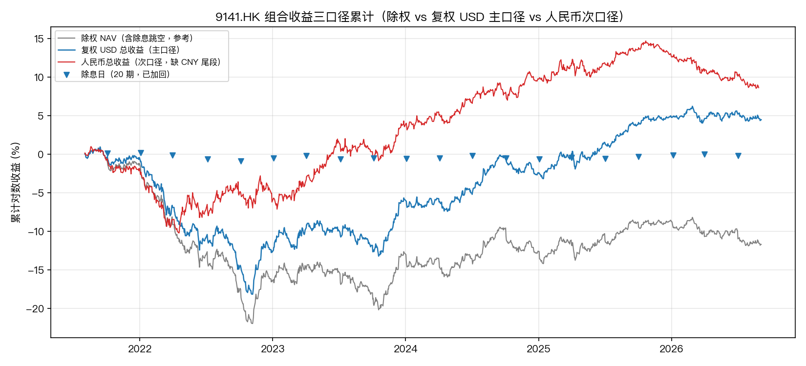

该图给出主日历上三类因子的日度序列走势，用于核对对齐后是否还有断点。可见汇率项在尾部缺 5 个交易日（2026-08-31 ~ 09-04，FRED 发布滞后所致），其余序列连续。这 5 天在因子表中留空、不做外推，阶段二的有效 FX 点位截至 2026-08-28。

### 2.3 异常值识别与事件校验

异常识别不用单一的全样本 3σ，因为金融序列的波动率本身随时间变化，全样本口径会把高波动期的大量正常值判成异常、又把低波动期的真实冲击漏掉。实际采用的是**多信号滚动 3σ**：对每条日变化序列同时计算四个 z 值，即全样本 z、最近 60 日滚动 z、最近 20 日滚动 z，以及以 t−1 为界的过去 60 日基线 z（这一支的标准差只用到 t−1、不含当日，避免当日极值自己把门槛抬起来）。四个信号任一命中，还要再过一道**绝对下限护栏**才算候选：5Y/10Y 美债日变化 8bp、9141.HK 对数收益 0.5%、CNY/USD 对数收益 0.45%、EM IG OAS 日变化 5bp。护栏的作用是滤掉低波动期里那些 z 值很大但绝对量微不足道的日子。

候选清单共 132 条，落在 103 个交易日。随后逐条与事件时间线做**双向校验**：一是看该日是否落在某个已知风险事件的 ±3 个自然日内，二是看 3141.HK 柜台当日是否同向变动。判定结果如下。

**表 2-3 异常候选的判定结果**

| 判定 | 条数 | 处置 |
|---|---|---|
| 真实冲击（有事件支撑） | 116 | 保留原始值，事件归因 |
| 存疑（无事件支撑） | 16 | 仅标注、不改数 |
| 确证下载错误 | 0 | — |

表 2-3 数据来源：`docs/outlier_check.md` §3、`clean_data/outlier_judgment.csv`。

清洗数据在这一步**零改动**。16 条存疑全部保留原值，只在 `results/doubtful_days.csv` 中登记（11 条 ETF、3 条 dOAS、2 条汇率）。存疑的大多是 0.5% 至 0.7% 量级的温和波动日，既找不到单一消息驱动，也与利差收窄的方向一致，属于投资级组合的正常噪音，不是数据错误。其中 2025-07-07 的 +1.23% 单日偏大且查无驱动，最值得在稳健性里复查。

**存疑日的默认处置规则**经导师反馈后定稿，是阶段二必须执行的动作：VaR 与回测一律做**「含存疑日 / 不含存疑日」两版对照**，这是必做项而非可选项；任一违规日命中存疑清单时，先核 3141 柜台的同向性与事件时间线再归因；任何结论都不允许只由个别存疑日驱动。

另有一处源数据特性需要记录：FRED 的 OAS 指数大约 T+1 发布。例如 2023-12-13 FOMC 转鸽当日的 OAS 指数跳升 15bp，实际对应的是**前一日**的走阔。因子表保留原始发布日、不做回移，使用这两列对齐事件时需要容忍一天的滞后。

### 2.4 三类风险因子的构建

需求文档要求把债券收益波动拆解为利率、信用利差、汇率三类因子。实际落成五个列。

**利率因子**取 5 年期与 10 年期美债收益率的日度变化（`d5y_bp`、`d10y_bp`，单位 bp），代表长端利率风险。

**信用利差因子**由残差剥离得到。用组合日收益对同日两档利率变化做回归：

```
ret(t) = α + β5·Δy5(t) + β10·Δy10(t) + ε
```

拟合值即利率贡献列（`etf_rate_attrib_pct`），残差 ε 即信用利差代理列（`etf_spread_proxy_pct`）。在官方 NAV 口径下，β5 = −0.0085、β10 = −0.0287、α = +0.0015，R² = 0.668，由系数反推的等效久期约 3.72 年。改用复权收益重做后 R² 升到 **0.757**，等效久期约 3.70 年（β5 = −0.0077、β10 = −0.0293）。两个 R² 对应两条不同的序列，不能混用：0.668 是除权 NAV，0.757 是复权 NAV。

**汇率因子**取 CNY/USD 的日对数收益乘 100（`fx_ret_pct`），符号约定为**正值表示人民币贬值**。

在复权基础上再定义两条组合收益列，构成后续全部风险计量的双口径基础：

| 列 | 定义 | 角色 |
|---|---|---|
| `etf_ret_tr_pct` | 复权美元总收益，含除息日股息加回 | **主口径** |
| `etf_ret_rmb_pct` | 人民币总收益 = `etf_ret_tr_pct` + `fx_ret_pct` | **次口径** |

对数收益直接相加即得到以人民币计的收益，这也是主口径汇率暴露 δ 取 0、次口径取 +1 的来源。因子暴露最终落成 `results/factor_exposure.csv`：

| 因子 | 暴露 δ | 说明 |
|---|---|---|
| Δ5Y | −0.00771447365642295 | %收益 / bp |
| Δ10Y | −0.02930312286948096 | %收益 / bp |
| 信用利差代理 | 1.0 | 与利率因子正交 |
| 汇率 CNY/USD | 0.0 | 主口径为 0；次口径为 +1 |

**图 2-2 组合收益的利率贡献与残差分解**

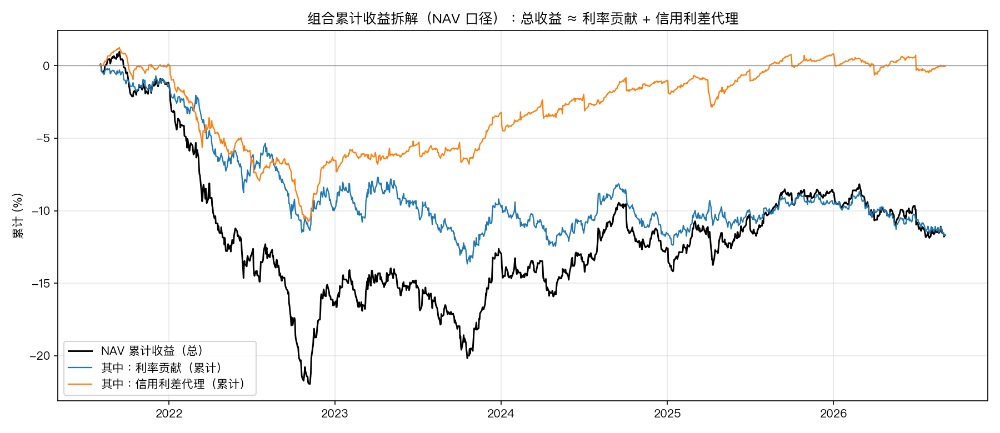

该图把组合日收益拆成利率贡献与残差两条，可见残差项的绝对值并不小，且在下行日往往集中出现。这张图也解释了为什么后续把残差单列为「未解释残差」而不是直接叫「信用风险贡献」。

**图 2-3 利差代理与外部 OAS 的对照**

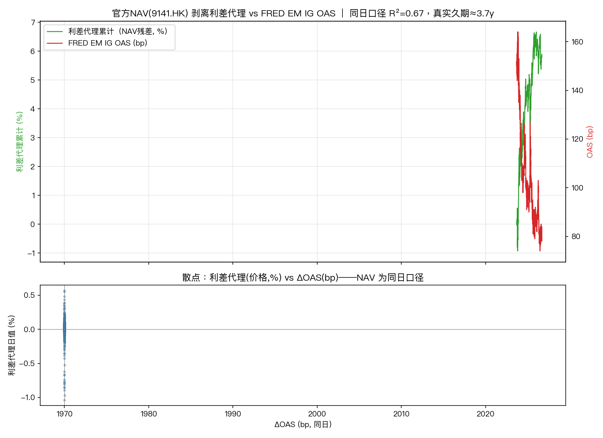

把剥离出的残差序列与 FRED 的新兴市场 IG OAS 变化放在一起看，两者的相关度很弱：NAV 同日口径的相关系数约 −0.18，市价口径取滞后一日约 −0.267、同向命中率 63.9%。这印证了残差的性质——它是一条拟合残差，不是某条真实利差曲线。

因子间的相关性落在 `results/factor_corr.csv`，为三阶矩阵，只含两档利率与利差代理：

**表 2-4 因子相关系数**

| | Δ5Y | Δ10Y | 利差代理 |
|---|---|---|---|
| Δ5Y | 1.0 | 0.943 | 0.0 |
| Δ10Y | 0.943 | 1.0 | 0.0 |
| 利差代理 | 0.0 | 0.0 | 1.0 |

表 2-4 数据来源：`results/factor_corr.csv`。两档利率的相关系数达 0.943，共线性明显偏高；利差代理与两者的相关系数都为 0，这是回归残差的构造性质，不是实测结果——正交性让 δ′Σδ 的展开保持自洽，代价是利差代理这一维里同时混着真实的利差变动与估值噪声。**该表不含汇率因子**，因此全书不给汇率的因子相关系数，只有汇率对组合收益的暴露 δ。

关于信用利差代理的局限，有四条需要一并交代：它的本质是残差而非可交易利差，混有费率、估值与采样误差；日度序列偏碎，标准差 0.164%、超额峰度 +10.5，单日值不能当利差点位使用；与外部 OAS 基准的交叉验证很弱；在 VaR 中它只作为「利率剥离后的残差风险」进入因子协方差，**不声称捕捉真实的信用利差敞口**。

### 2.5 报价陈旧问题与官方 NAV 口径的采用

这是第一阶段最有价值的一处发现，也是整个项目主口径的来源。

9141.HK 市价存在严重的报价陈旧：相邻两个交易日的真实报价有 **62.7%** 的情况完全不变，最长连续不变达 **17 个交易日**，平均每 **2.68 个交易日**才更新一次。把这样一条序列直接喂给日度 VaR，等于人为压低了波动率。同时，港股与美股存在一日的收盘相位差——9141.HK 的市价在港股时段先收盘，反映的是**前一**个美股交易日的利率变动。用同期口径做利率剥离回归会几乎完全失效：`corr(ETF_t, Δy10_t) ≈ −0.03`（近乎为零），而 `corr(ETF_t, Δy10_{t−1}) ≈ −0.39`。市价口径因此必须用 lag=1。

官方 NAV 则是基金管理人按美股收盘价估值的，**与美股同日**，因此用 lag=0。两者对利率变动的解释力差距很大：市价的 lag=1 回归 R² = 0.230，NAV 的同日回归 R² = 0.668；把市价强行按同期回归，R² 只有 0.003。

**表 2-5 五条候选价格口径的对照（全样本，VaR 已折算为 1 日、正态）**

| 方案 | n | 零收益占比 | 年化波动 | 1 日 99% VaR | 利率剥离 R² | 等效久期 |
|---|---|---|---|---|---|---|
| D1 市价 9141（原状） | 1273 | 64.7% | 3.66% | 0.536% | 0.230 | 1.74 年 |
| **D2 官方 NAV（日度）** | 1273 | **6.1%** | **4.52%** | **0.663%** | **0.668** | **3.72 年** |
| D3 真久期修正（日度，非观测） | 1273 | 0.7% | 4.30% | 0.630% | — | — |
| W1 市价周度 | 265 | 24.9% | 4.30% | 0.631% | 0.199 | 2.05 年 |
| W2 NAV 周度 | 265 | 0.0% | 4.87% | 0.714% | 0.749 | 4.47 年 |

表 2-5 数据来源：`docs/staleness_remedy.md` §3。

按市价口径算出的日度 VaR 是 0.536%，按 NAV 口径是 0.663%，前者**低估约 24%**。这是四种候选口径（市价 / NAV / 真久期修正 / 周度）横向比较后的结论，最终选用 D2，即官方 NAV 的日度序列，作为阶段二全部风险计量的正式输入。周度方案虽然消掉了零收益问题，但在港股与美股的一日相位差下会把等效久期低估到 2.05 年，只作后备。

**图 2-4 四条候选口径的对照**

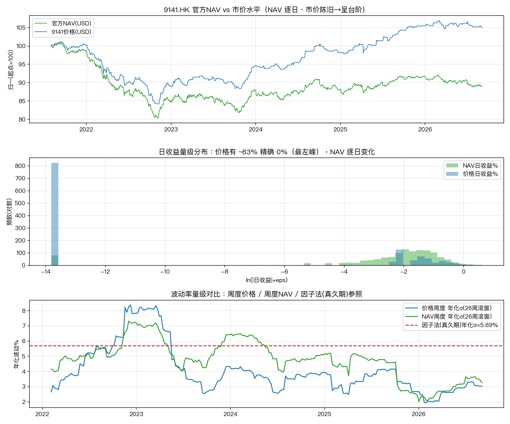

该图并列给出四条口径的波动率、零收益占比与久期估计。最直观的一列是零收益占比：市价日度 64.7% 对 NAV 日度 6.1%。这个对比是我判断「市价序列不能直接用于日度计量」的主要依据。

HKD 柜台 3141.HK 被否决，理由有两条。第一条是柜台噪声：在两个柜台同日都有真实变动的 403 天里，3141.HK 平均每天比 9141.HK 多动 **±0.47%**，年化约 7.5%，而联系汇率本身每天只动约 0.05%——这段多出来的波动是柜台层面的报价噪声。第二条是个别坏报价，例如 2022-04-14 单日 +5.13%，同日 9141.HK 只动了 0.32%。3141.HK 的报价陈旧度反而更低（15.3%），但这掩盖不了噪声更大的问题。

### 2.6 描述性统计与分布特征

**表 2-6 NAV 口径日度统计（除权，1273 行因子表）**

| 因子 | n | 日均 | 日σ | 年化σ | 偏度 | 超额峰度 | 最小 | 最大 |
|---|---|---|---|---|---|---|---|---|
| 组合收益 | 1273 | −0.0092% | 0.285% | 4.52% | −0.42 | +2.06 | −1.34% | +1.02% |
| 信用利差代理 | 1273 | ≈0 | 0.164% | 2.61% | **−1.51** | **+10.54** | −1.04% | +1.13% |
| 汇率 CNY/USD | 1268 | +0.0032% | 0.251% | 3.98% | −0.37 | +5.36 | −1.59% | +1.06% |
| 利率贡献 | 1273 | −0.0092% | 0.233% | 3.70% | +0.18 | +1.17 | −1.07% | +1.13% |
| Δ5Y | 1273 | +0.30bp | 6.85bp | — | −0.29 | +1.83 | −32bp | +31bp |
| Δ10Y | 1273 | +0.28bp | 6.17bp | — | −0.14 | +0.99 | −30bp | +28bp |
| 外部 ΔOAS | 749 | −0.09bp | 3.03bp | — | +0.04 | +3.09 | −15bp | +15bp |

表 2-6 数据来源：`docs/phase1_data_description.md` §4、`factors/descriptive_stats_nav.csv`。

三点与金融规律核对有关的观察。组合收益的超额峰度 +2.06、汇率 +5.36，且正态 QQ 图两端上翘，说明这两条序列的尾部比正态厚，这一点直接支持后续采用对厚尾更敏感的历史模拟法。信用利差代理的偏度 −1.51、超额峰度 +10.54，是本表最偏离正态的一列，但如上所述它是残差，这一形态有相当部分来自估值噪声而非真实的利差行为。日度均值 −0.0092%（折年约 −2.3%）与日标准差 0.285% 相差两个量级，说明样本期内的净值下跌主要由利率上行贡献，利差贡献累计近于零。

**图 2-5 收益分布直方图与正态 QQ 图**

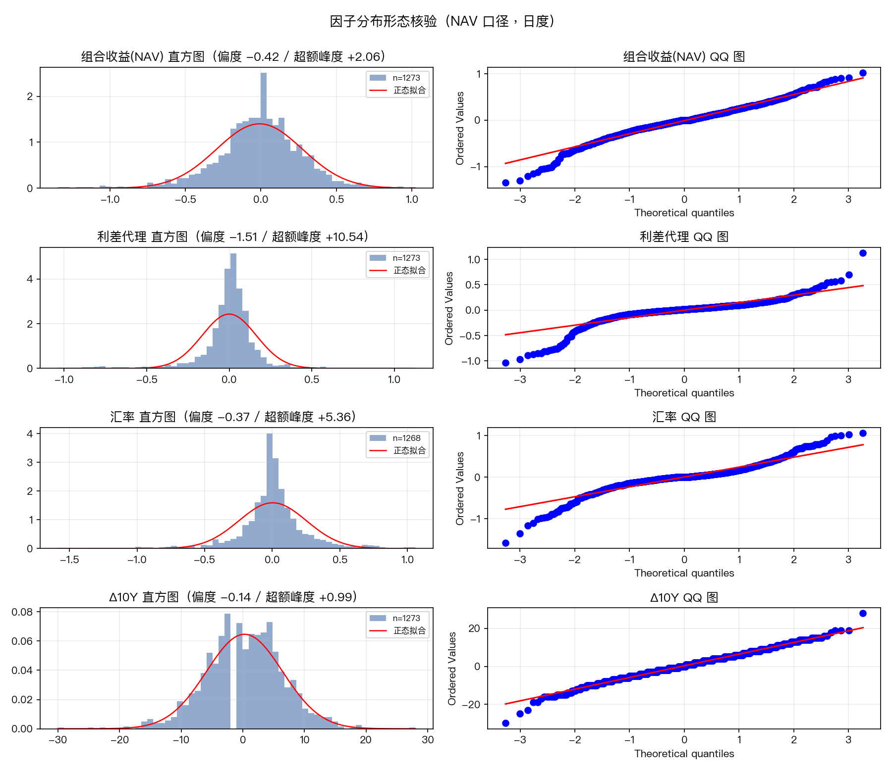

该图给出组合收益与信用利差代理两个分布形态。QQ 图上两端的偏离是本项目在模型选择上偏向历史模拟法的直接依据之一，但第三章的回测结果显示这一先验并未自动转化为更好的回测成绩，两端厚尾的证据强度需要按实际检验结果重新评估。

**关于除权与复权的差距。** 9141.HK 是派息型基金，样本窗内共发生 20 次除息，除息日全部落在 1、4、7、10 月的上旬。按除权口径计算，除息当日的价格跳空会被当成一次波动，导致年化波动被高估约 6%：复权后的年化波动由 4.52% 降至 4.22%，1 日 99% VaR 由 0.663% 降至 0.619%。因此阶段二的主口径一律使用复权收益，除权列只作参考。

**表 2-7 三条收益口径的基准统计**

| 口径 | n | 日均 | 日σ | 年化σ | 1 日 95% VaR | 1 日 99% VaR |
|---|---|---|---|---|---|---|
| 除权 USD（参考） | 1273 | −0.0092% | 0.2849% | 4.522% | 0.4686% | 0.6627% |
| **复权 USD（主口径）** | 1273 | +0.0035% | 0.2660% | 4.223% | 0.4376% | 0.6189% |
| 人民币总收益（次口径） | 1268 | +0.0068% | 0.3221% | 5.113% | 0.5298% | 0.7493% |

表 2-7 数据来源：`results/baseline_var_tr.csv`，均为忽略均值（μ=0）的日度 VaR，正态假设。

### 2.7 数据边界

进入后续计量之前，需要把数据侧的限制一次说清，这些限制在第三、四章会反复出现：

**信用利差基准短两年。** `doas_bp` 自 2023-09-05 起才有值，此前两年空白。这是源数据的起点限制而非缺失，无法通过任何清洗手段补齐。

**汇率序列尾部缺 5 个交易日。** 2026-08-31 至 09-04 这五天 FRED 尚未发布，因子表留空。次口径的有效样本因此是 1268 行而非 1273 行。

**信用利差代理是残差。** 它不等于信用风险贡献，精确的利差敞口需要 iBoxx Asia 或 JACI 这类亚洲/中资紧基准，本项目未获取，已列入遗留问题。

**事件时间线后段的置信度较低。** 2025 至 2026 年的条目来自公开检索，置信度标注在 `note` 列，压力测试复用前建议再人工核一遍极少数低置信条目。

**外部数据的用途限制。** Yahoo Finance 下载的数据仅供个人研究使用，不入库、不对外分发。

---

## 三、风险计量模型实现与验证结果

### 3.1 两个模型族

需求文档要求实现参数法与历史模拟法两类主流 VaR 模型，并覆盖 95% 与 99% 两个置信水平。实际落成八个可对照的配置。

**参数法**基于因子暴露与协方差矩阵。组合波动按 σ_p = √(δ′Σ_w δ) 计算，其中 δ 是 §2.4 给出的因子暴露向量，Σ_w 是滚动 250 日窗内的因子协方差矩阵，然后按 VaR_c = z_c · σ_p 取分位数（z₉₅ = 1.6449、z₉₉ = 2.3263，不做去均值处理）。这个方法的核心特征是 **δ 固定为全样本估计值，不逐窗重估**——它衡量的是「假设因子暴露不变，只看波动率如何演化」。

**历史模拟法**直接取窗内收益的经验分位数，VaR_c = −quantile(r_win, 1−c)，窗口 250 个交易日，滚动步长 1 日，逐日样本外前推。分位用线性插值，窗内 1% 位置落在第 3、4 小观测之间（n=250 时插值位置 2.49）。

围绕这两个主干，另设三组对照，全部并列输出、不参与基准评选：

| 代号 | 做法 | 与主干的差别 |
|---|---|---|
| M1 | δ-normal，250 日滚动窗 | 参数法主干 |
| M1g | GARCH(1,1) 条件波动 | 扩展窗逐日重估，一步向前 σ_t 替代窗口 σ |
| M1e | EWMA（λ = 0.94） | 指数加权，衰减更快 |
| M2 (HS250/500/750) | 经典历史模拟 | 窗口 250 / 500 / 750 |
| M2f (FHS-E / FHS-G) | 滤波历史模拟 | 窗内收益先除 σ̂ 再乘当日 σ_t，σ̂ 分别取 EWMA 与 GARCH |

### 3.2 波动率估计的三种做法

三种波动率估计都保留在结果里，它们的差别不在平均水平，而在时点。

| 做法 | 定义 | 关键实测值 |
|---|---|---|
| 无条件 σ | 滚动 250 日窗内估计三因子协方差 | 平均 σ 0.2674%，σ_max 0.3750% |
| GARCH(1,1) | 扩展窗逐日重估，取一步向前条件 σ_t | 平均 σ 0.2643%，σ_max **0.4496%** |
| EWMA(λ=0.94) | 指数加权 | 平均 σ 0.2441% |

GARCH 全样本拟合的主口径参数为 α = 0.03995、β = 0.95602，α+β = 0.99597；次口径 α = 0.04206、β = 0.95476，α+β = 0.99682。两者都极接近 1，说明波动率的持续性很强、冲击衰减得很慢。平均来看 GARCH 与无条件几乎持平（99% 平均 VaR 0.6149% 对 0.6220%），差别集中在峰值：GARCH 的 σ_max 抬到 0.4496%，比无条件的 0.3750% 高出一截，也就是它更早、更快地对高波动期做出反应。

**图 3-1 三种波动率估计的路径对比**

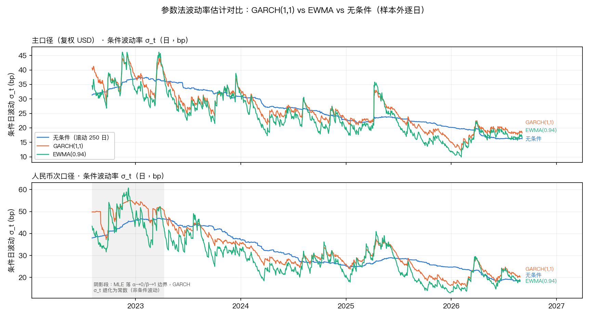

该图把无条件 σ、GARCH 条件 σ 与 EWMA σ 叠在一条时间轴上。可以看到三者在样本中段的平静期几乎重合，分歧全部出现在 2022 年与 2025 年初两段高波动期，GARCH 的峰更高、回落也更慢。这张图解释了为什么后面回测中 GARCH 与无条件的平均 VaR 差不多，但分段的失败率不同。

### 3.3 回测框架与检验方法

回测的设定与需求文档的执行参考一致：估计窗 250 个交易日，滚动步长 1 日，样本外从数据的第 251 个收益日开始。主口径的样本外区间为 2022-08-03 至 2026-09-04，共 **1023 个预测日**。每个估计量都以 `shift(1)` 收尾，保证用 [t−250, t−1] 的窗口预测第 t 天的 VaR，第 t 天的实际收益严格在预测之后。这条防前视的处理在参数法、历史模拟法与因子回归三处都做了对齐。

判违规的规则只有一条：第 t 天实际收益小于负的预测 VaR 即记一次违规。这条判定在本项目中只有一个定义点，参数法、历史模拟法、压力测试与因子传导验证共用同一个函数，不存在多处各写一套的隐患。

名义期望违规数按 1023 天算，95% 档约 51 次、99% 档约 10 次。实际统计时要剔除零收益日：主口径有 **64 天（6.26%）** 的复权收益恰为 0.0000%，这些天机械上不可能违规，因此有效期望值略低（95% 档 47.95、99% 档 9.59）。次口径的有效天数是 1018 天，比主口径少 5 天，原因就是 §2.7 提到的汇率序列尾部缺失；**两个口径横比时一律取公共样本，不能直接拿 1023 和 1018 的比较结果对比。**

三个检验统计量都在 `code/var_common.py` 中实现：失败率检验看实际违规比例偏离名义值多远；**Kupiec LR_uc** 检验无条件覆盖率，服从 χ²(1)；**Christoffersen LR_ind** 检验违规是否独立（用 n00/n01/n10/n11 四个转移计数，服从 χ²(1)），**LR_cc** 是前两者之和，服从 χ²(2)。独立性检验的 p 值另外用条件蒙特卡洛法算了一版（B = 20000，固定随机种子），报告以蒙特卡洛 p 值为准。

有一处检验本身的水平需要先说明，否则会误读后面的结果。用蒙特卡洛（B = 20000，固定随机种子）实测两个统计量的实际拒绝率：

**表 3-1 检验统计量的实测拒绝率（B = 20000）**

| 有效天数 N | p = 5% 时 LR_uc | p = 5% 时 LR_ind | p = 1% 时 LR_uc | p = 1% 时 LR_ind |
|---|---|---|---|---|
| 1023 | 5.49% | **7.73%** | 4.10% | **1.56%** |
| 773 | 4.97% | **7.12%** | 4.33% | **1.85%** |
| 523 | 4.57% | 3.87% | 5.17% | 1.39% |
| 299（高波动段） | 6.39% | 2.16% | 8.32% | **1.29%** |
| 133（次口径 GARCH 边界段） | — | — | 1.17% | 0.82% |

表 3-1 数据来源：`docs/phase2_spec.md` §7.4。

读这张表要先看清它的构造：**临界值在全部四列里都是 χ²(1) 的 5% 分位 3.8415，p 一列是模拟时设定的真实违规率，不是检验的名义水平。**所以后两列的读法是「假如真实的违规率是 1%，用一个 5% 的检验去判，会拒绝多少次」，而不是「1% 检验自身的水平」。要把临界值也换到 1% 分位，需要另算一次：在 1023 天、违规 10 次的条件零分布下，χ²(1) 的 1% 分位对应的实际拒绝率只有 0.34%。

按这个读法，LR_uc 的表现贴近名义值，可以照常使用。LR_ind 偏离得明显：真实违规率 5% 时 5% 检验的拒绝率是 7.73%，偏宽松；真实违规率 1% 时同一检验只拒绝 1.56%，而换成 1% 临界值后更是只有 0.34%。**两个方向都说明 99% 档的独立性检验几乎没有检验力**，「未拒绝」不能读成「没有聚集」。这个限制在 §3.5 还会用到。

考虑到同时做了大量检验，另设了多重比较门槛：主比较集 32 次检验的 Bonferroni 门槛为 0.05/32 = 0.00156，全表 262 行的门槛为 0.05/262 = 0.00019。

### 3.4 回测结果

**表 3-2 主口径回测结果（样本外 1023 日）**

| 模型 | 置信度 | 违规数 / 有效日 | 失败率 | LR_uc | p_uc | LR_ind | p_ind(MC) | LR_cc | 判定 |
|---|---|---|---|---|---|---|---|---|---|
| M1 | 95% | 29 / 1023 | 2.83% | 11.888 | 0.00057 | 0.038 | 0.871 | 11.926 | 拒绝 |
| M1g | 95% | 30 / 1023 | 2.93% | 10.743 | 0.00105 | 0.016 | 0.923 | 10.760 | 拒绝 |
| M1e | 95% | 45 / 1023 | 4.40% | 0.810 | 0.368 | 0.000 | 0.996 | 0.810 | 通过 |
| HS250 | 95% | 44 / 1023 | 4.30% | 1.102 | 0.294 | 0.006 | 0.949 | 1.108 | 通过 |
| HS500 | 95% | 20 / 773 | 2.59% | 11.417 | 0.00073 | 0.376 | 0.825 | 11.793 | 拒绝 |
| HS750 | 95% | 9 / 523 | 1.72% | 15.686 | 0.00008 | 0.316 | 0.568 | 16.002 | 拒绝 |
| FHS-E | 95% | 44 / 773 | 5.69% | 0.748 | 0.387 | 0.130 | 0.727 | 0.878 | 通过 |
| FHS-G | 95% | 42 / 773 | 5.43% | 0.298 | 0.585 | 0.270 | 0.619 | 0.568 | 通过 |
| M1 | 99% | 8 / 1023 | 0.78% | 0.531 | 0.466 | 0.126 | 0.555 | 0.657 | 通过 |
| M1g | 99% | 9 / 1023 | 0.88% | 0.156 | 0.693 | 0.160 | 0.555 | 0.316 | 通过 |
| M1e | 99% | 15 / 1023 | 1.47% | 1.964 | 0.161 | 0.447 | 0.579 | 2.411 | 通过 |
| HS250 | 99% | 9 / 1023 | 0.88% | 0.156 | 0.693 | 0.160 | 0.555 | 0.316 | 通过 |
| HS500 | 99% | 4 / 773 | 0.52% | 2.208 | 0.137 | 0.042 | 0.564 | 2.249 | 通过 |
| HS750 | 99% | 1 / 523 | 0.19% | 5.186 | 0.023 | 0.004 | 0.629 | 5.189 | 拒绝 |
| FHS-E | 99% | 11 / 773 | 1.42% | 1.235 | 0.266 | 0.318 | 0.572 | 1.553 | 通过 |
| FHS-G | 99% | 11 / 773 | 1.42% | 1.235 | 0.266 | 0.318 | 0.572 | 1.553 | 通过 |

表 3-2 数据来源：`results/backtest_results.csv` 的 `full` 范围；判定列取自 `docs/phase2_model_validation.md` §7.1。Kupiec 接受区间在 95% 档为 [39, 65]、99% 档为 [5, 17]。表中 `p_uc` 是 χ²(1) 的 p 值，`p_ind(MC)` 是条件蒙特卡洛 p 值，全表以 `p_ind(MC)` 为准、χ² 值并列作对照。

**表 3-3 次口径回测结果（样本外 1018 日）**

| 模型 | 置信度 | 违规数 / 有效日 | 失败率 | LR_uc | p_uc | LR_ind | p_ind(MC) | LR_cc | 判定 |
|---|---|---|---|---|---|---|---|---|---|
| M1 | 95% | 41 / 1018 | 4.03% | 2.165 | 0.141 | 0.075 | 0.799 | 2.240 | 通过 |
| M1g | 95% | 40 / 1018 | 3.93% | 2.644 | 0.104 | 0.258 | 0.630 | 2.901 | 通过 |
| M1e | 95% | 52 / 1018 | 5.11% | 0.025 | 0.875 | 0.197 | 0.676 | 0.222 | 通过 |
| HS250 | 95% | 44 / 1018 | 4.32% | 1.030 | 0.310 | 1.965 | 0.224 | 2.994 | 通过 |
| HS500 | 95% | 24 / 768 | 3.13% | 6.522 | 0.011 | 4.485 | 0.013 | 11.007 | 拒绝 |
| HS750 | 95% | 10 / 518 | 1.93% | 13.275 | 0.00027 | 0.395 | 0.574 | 13.670 | 拒绝 |
| FHS-E | 95% | 41 / 768 | 5.34% | 0.181 | 0.670 | 0.010 | 0.916 | 0.192 | 通过 |
| FHS-G | 95% | 43 / 768 | 5.60% | 0.559 | 0.455 | 1.089 | 0.319 | 1.649 | 通过 |
| M1 | 99% | 14 / 1018 | 1.38% | 1.296 | 0.255 | 0.391 | 0.575 | 1.687 | 通过 |
| M1g | 99% | 8 / 1018 | 0.79% | 0.509 | 0.476 | 0.127 | 0.560 | 0.636 | 通过 |
| M1e | 99% | 15 / 1018 | 1.47% | 2.012 | 0.156 | 0.449 | 0.578 | 2.461 | 通过 |
| HS250 | 99% | 13 / 1018 | 1.28% | 0.726 | 0.394 | 0.337 | 0.574 | 1.062 | 通过 |
| HS500 | 99% | 4 / 768 | 0.52% | 2.159 | 0.142 | 0.042 | 0.565 | 2.201 | 通过 |
| HS750 | 99% | 1 / 518 | 0.19% | 5.104 | 0.024 | 0.004 | 0.630 | 5.108 | 拒绝 |
| FHS-E | 99% | 10 / 768 | 1.30% | 0.646 | 0.421 | 0.264 | 0.564 | 0.911 | 通过 |
| FHS-G | 99% | 11 / 768 | 1.43% | 1.279 | 0.258 | 0.320 | 0.570 | 1.599 | 通过 |

表 3-3 数据来源：`results/backtest_results.csv`；判定列取自 `docs/phase2_model_validation.md` §7.2。

这两张表最需要留意的一点是**所有被拒绝的配置，方向都是过度覆盖**。全表 262 行共 59 处 Kupiec 拒绝，没有一处是风险低估——也就是说，凡是不合格的配置，毛病都是 VaR 算得偏高、资本占用过多，而不是把风险看小了。这与「新兴市场工具在尾部容易低估」的先验恰好相反。

次口径还有一个值得单独提的现象：**M1 在次口径 95% 档反而比主口径更准**，失败率 4.03% 对 2.83%，主口径被 Kupiec 拒绝而次口径没有。这是全表少见的「换个口径反而更贴合名义值」的情形。

### 3.5 四处与直觉相反、需要额外说明的结果

有四处结果与事先预期相反或容易被读错，逐条说明。

**第一，M1δ 与 M1 是同一个模型，不能当作两个证据。** 参数法还有一条「因子暴露形式」的写法（M1δ），它和 M1 的违规日集合逐一完全相同。原因是信用利差代理这一维被定义为同一次回归的残差，于是任意窗口内 δ′Σ_w δ ≡ var_w(r) 是一条代数恒等式，两者的 σ 最大只差 4.4e-06（纯浮点误差）。结果表里它已标注为「恒等式-不作独立证据」，两张相关图也都不含它。举这个例子的意义在于：**残差被当作因子塞回去做验证，必然得到零偏差的漂亮结论，那是循环论证。**

**第二，厚尾的先验被实测证伪。** 上项目前曾预注册过一条预期：本资产尾部偏厚，历史模拟的 99% VaR 应该高于正态参数法。实测相反——HS250 平均 99% VaR 是 0.6125%，低于 M1 的 0.6220%（比值 0.985），95% 档差距更大（0.4080% 对 0.4398%）。原因是 250 个观测的经验 1% 分位按构造约等于 2.3σ，与正态的 2.3263σ 几乎同值（隐含 z 的均值 2.309、中位 2.350），而日收益的超额峰度只有约 1.3，厚尾程度不足以把这个分位推上去。这条在 `docs/phase2_spec.md` 里是**就地标注**的，原文没有事后改写。

**第三，滤波没有改善历史模拟。** 直觉上先除波动率再乘当日条件 σ 应该更好，但在这份样本上没有观察到改善。公共 773 日的头对头比较里，经典 HS250 的 95% 失败率 4.92%、99% 1.03%；FHS-E 是 5.69% / 1.42%，FHS-G 是 5.43% / 1.42%，两版都比经典 HS 差一点。不过这个差异落在两倍标准误的带宽内（±1.57% / ±0.72%），所以**只能说「未观察到改善」，不能说滤波有害**。两版滤波彼此的差异也很小（均值差 3.8%），滤波方式的选择不构成一个重要变量。

**第四，没有发现稳健的违规聚集证据。** 全表 262 行中有 11 行 LR_ind 名义显著，但全部落在 95% 档、无一落在 99% 档，且集中在小样本与次口径。主口径里没有任何一处名义显著（最小 p 值 0.555）。主比较集 32 次检验里唯一名义显著的是次口径 HS500 的 95% 档，p = 0.0134，远达不到 Bonferroni 门槛 0.00156；全表门槛 0.00019、全局最小 p 值 0.00735 同样达不到。结论是**本样本不足以分辨条件化模型与无条件模型在聚集性上的差异**——这是检验力问题，不是模型优劣的证据。前面 §3.3 说的 99% 档独立性检验几乎没有检验力，在这里正好接上。

**图 3-2 回测突破点标注**

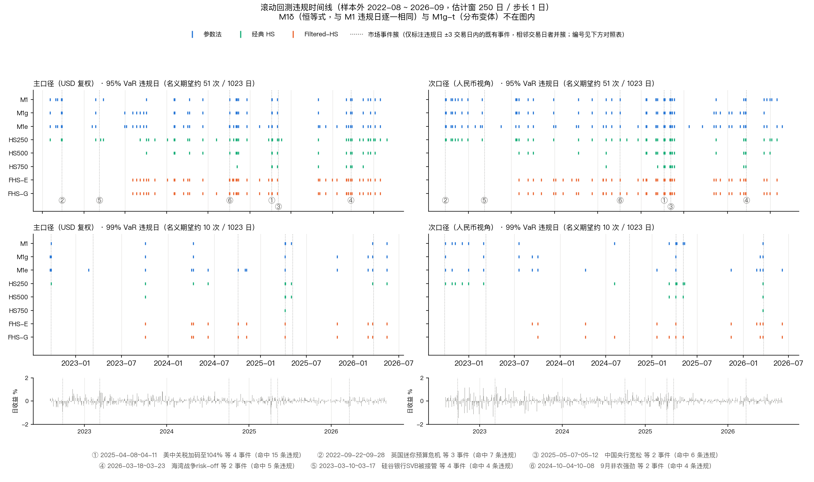

该图把每个模型的违规日标注在收益序列上，并按是否落在存疑清单里做了区分。可以看出违规点几乎全部集中在 2022 年与 2025 年初两段高波动期，平静期基本空白。图上同时标出的存疑日与违规日的重合情况，对应 §2.3 的存疑日两版对照。

**图 3-3 覆盖率路径**

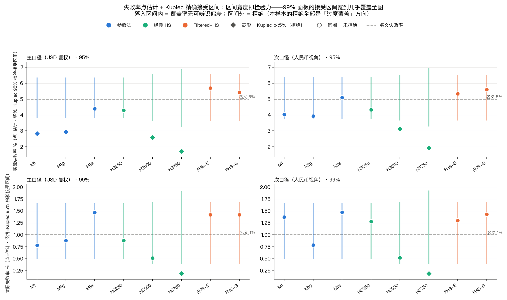

该图给出各模型的滚动覆盖率随时间的变化。参数法的覆盖率曲线在 2022 年一段明显偏低（VaR 偏高、覆盖过厚），而 HS250 全程更贴近名义线，这是基准选择偏向它的直接视觉依据。

**关于存疑日的两版对照。** 预先登记的结论是「含存疑日与不含存疑日两版结果相同」，**实测未成立**：有 15 个配置的违规计数发生变化，把存疑清单放宽到全部 16 条则是 24 个。不过 **Kupiec 判定翻转数为 0**——计数会动，合格与否不变。44 条违规落在存疑清单的 4 个日期上（2024-02-02、2024-06-07、2025-01-21、2025-03-24），其中 2025-03-24 在 250 日窗内排在升序第 11 位（约 4.4% 分位），是最接近阈值的那一条。

### 3.6 基准口径定案

**定案结果是：主口径与次口径、95% 与 99% 这四个配置，统一采用 HS250 一个模型。** 选一个模型统管四档，理由是如果 95% 用一版、99% 用另一版，两档的损失读数就不可比。

**表 3-4 基准口径定案的三项判据**

| 判据 | 主口径 | 次口径 |
|---|---|---|
| Kupiec 通过的核心范围数（95% / 99%） | 5 / 5 | 5 / 5 |
| 基准样本 95% 失败率（名义 5%） | 4.92% | 4.30% |
| 基准样本 99% 失败率（名义 1%） | 1.03% | 0.91% |
| 资本占用（相对 M1，95% / 99%） | 0.896× / 0.958× | 0.947× / 1.092× |
| 条件覆盖落差（95% / 99%） | 0.88pp / 0.77pp | 1.38pp / 1.03pp |
| 基准样本 99% VaR / ES | 0.5361% / **0.6659%** | 0.7260% / **0.7024%** |

表 3-4 数据来源：`docs/phase2_model_validation.md` §7.4、`results/baseline_decision.csv`。

判定规则是先写死再跑数的：硬门槛要求该模型在所有可达的核心范围上 Kupiec 全不拒绝，且不存在显著风险低估，95% 与 99% 两档都要满足；通过后再按两档校准偏差的均值排序。按这套规则，主口径只有 HS250 一个模型全过；次口径另有 M1 与 M1g 通过，但它们相对 HS250 的校准偏差分别差 34% 与 148%，且参数法在主口径 95% 档被拒，不能统管四档。

之所以不选资本占用更低的 FHS 类，是因为它们省资本是靠放低覆盖率换来的：95% 失败率 5.69% / 5.43%、99% 档 1.42%，都超出名义 42%。HS750 则在两档、全部可达范围被拒。**基准取 HS250 不是因为最省资本，而是因为它在两个置信度上都准，且这一表现跨口径成立。**

定案给出的 99% 期望损失是后续压力测试的判定线：主口径 **0.6659%**、次口径 **0.7024%**。这两个数在第四章会反复出现，来源是 `results/backtest_results.csv` 中 HS250 × `common773` 那一行，由 `code/stress_impact.py` 读入。

**图 3-4 基准选择的权衡**

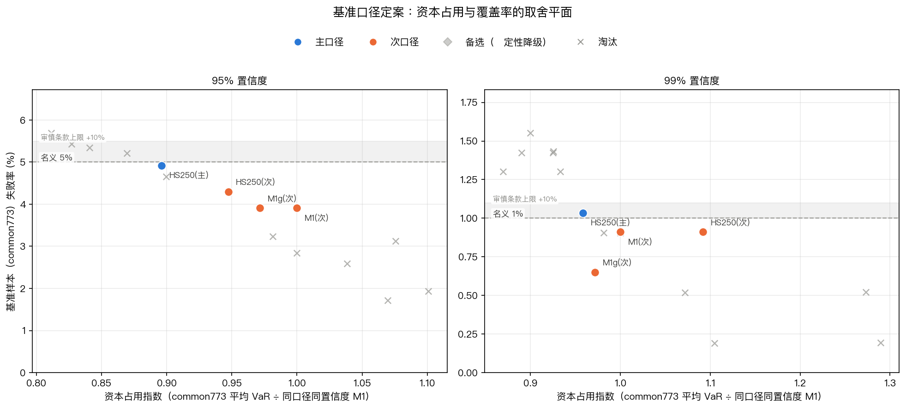

该图把各模型的两档校准偏差与资本占用画在同一张散点图上。HS250 落在左下角附近，即偏差小、资本占用也不高；FHS 类在横轴上更靠左（更省资本）但纵轴位置明显更差，这条权衡线是定案判据的视觉版本。

**图 3-5 参数法与历史模拟法的 VaR 序列对比**

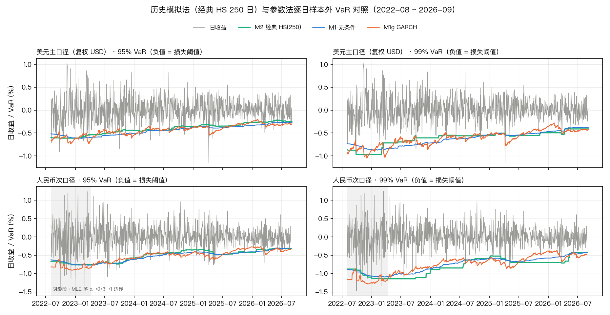

该图叠出两条 99% VaR 路径。平静期两者几乎重合，高波动期参数法抬得更早、更高，这正是它 95% 档被 Kupiec 拒绝（覆盖过厚）的形态来源。

### 3.7 δ 传导精度的独立验证

压力测试要把因子冲击映射成组合损失，映射靠的是因子暴露 δ。这一环的精度必须单独验证，否则第四章的损失读数没有落脚点。验证的做法是用事件前的 δ 去预测事件期间的实际损失，再看偏差。

**一处必须说清的口径问题：汇率传导不存在精度问题。** 次口径的构造是 r_rmb ≡ r_tr + fx_ret，预测端也以 +1.0 的系数加入同一项汇率收益，于是汇率项在「实际 − 预测」中精确对消——实测两口径偏差的最大逐值差为 0.000e+00。主口径 δ_fx = 0、次口径 +1 不是一个需要拟合的参数，而是**口径搬运**。两个口径的绝对传导误差相同，差别只在相对量级。

**表 3-5 δ 传导偏差（主口径）**

| 窗口 | 绝对偏差均值 | 90 分位 | 最大 |
|---|---|---|---|
| 1 日 | 0.1554pp | **0.3365pp** | 1.1595pp |
| 3 日 | 0.2737pp | 0.6548pp | 1.4991pp |

表 3-5 数据来源：`docs/phase2_model_validation.md` §7.3。

偏差的构成里，88.1% 来自信用残差项（|23.30| 对参数差异的 |3.13|）。用样本外 δ 去预测几乎不放大误差（放大倍数 1.00），说明 δ 本身的估计是稳的，问题出在信用维度上。偏差与利率冲击幅度的相关系数只有 +0.151，即偏差不随冲击变大而系统性恶化。

偏差的方向需要单独看。取 1 日窗，实际亏损的 42 个事件窗中有 **59.5%（25/42）低估了损失**，平均低估 0.0689pp。3 日窗的对应数字是 33 个亏损事件窗里 58% 低估、平均低估 0.1219pp。**正负偏差在均值上相互抵消，掩盖了亏损侧的实际误差量级**，而压力测试只关心亏损侧，所以必须按方向拆开看。

据此设定的偏差缓冲取 1 日窗绝对偏差的 90 分位，即 **0.3365 个百分点**。这个缓冲只施加于假设情景——历史情景的损失是已经发生的实现值，不含 δ 的估算误差，给它加缓冲等于对已知结果重复计一次模型误差。施加上按情景一次，不按路径累加。

**图 3-6 δ 传导偏差分布**

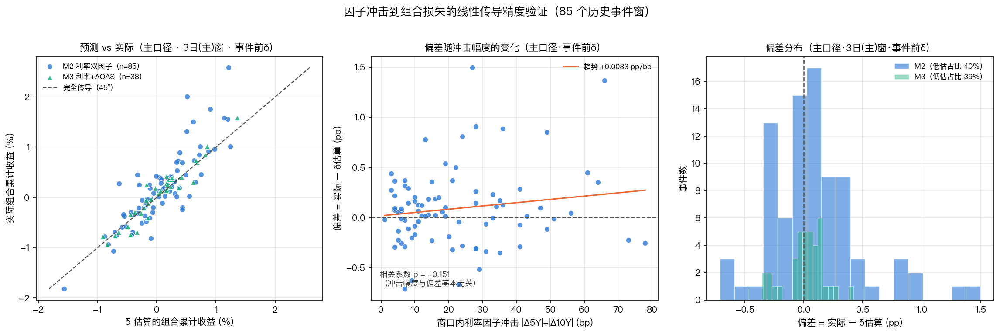

该图给出偏差随时间的分布与事件标注。2022 年的几个事件点偏差最大，而这一年恰是信用数据完全缺失的年份，这条对应关系是第四章「2022 年残差只能作代理量」那条边界的数据依据。

### 3.8 模型对比与适用性

**表 3-6 各模型的适用性**

| 模型 | 适用场景 | 局限 |
|---|---|---|
| **HS250** | 两档失败率几乎正中名义（4.92% / 1.03%），跨口径成立；资本占用较低 | 尾部只由约 2 个观测决定，极值日进出窗时有明显的 ghost effect（单日 VaR 跳变最大 −0.1520 / +0.0952） |
| M1 无条件 | 可作保守上界使用，但须同时声明其资本成本 | 窗口陈旧导致系统性过宽，95% 档被 Kupiec 拒绝；资本占用最高 |
| M1g GARCH | 主口径下是货真价实的条件化，对波动率变化反应更早 | 主口径 95% 档五个核心范围全被拒；次口径有 133 次重估落到边界 |
| M1e EWMA | 在次口径 95% 档表现良好 | 99% 档严重失守，失败率 1.55% 为全部模型最高 |
| FHS-E / FHS-G | 资本占用最低 | 以覆盖率为代价换取资本，两档失败率都超出名义约 42% |
| HS500 / HS750 | — | 窗宽与样本长度不匹配；HS750 两档、全部可达范围被拒 |

三条可以直接引用的判断。第一，**日度 95% 与 99% VaR 在本样本上没有出现风险低估**，所有被拒绝的配置都是过度覆盖；同时样本证据不支持「条件化模型在本资产上优于无条件模型」。第二，**模型之间的可分辨差异主要来自窗宽与分布假设**（HS250 优于 HS500、HS750），而不是来自条件化。第三，基准取 HS250 的理由是它两档都准且跨口径成立，不是因为最省资本。

还有一处次口径 GARCH 的细节必须记住，否则会误读它的成绩：**次口径 GARCH 在 2022-08 至 2023-04 有 133 次重估落到 α→0、β→1 的边界**（主口径 0 次），这一段 σ_t 退化成常数，等于没有条件化。该段恰好是人民币贬值的高波动段，回测对比时**不能把这段当作 GARCH 条件化优势的证据**。

**图 3-7 波动状态划分**

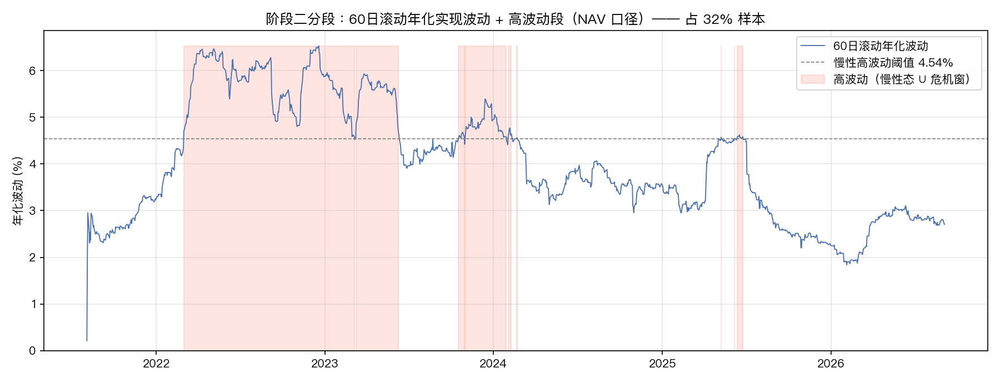

该图按 60 日滚动年化实现波动把全样本划成平稳期与高波动期，阈值取全样本三分之二分位（4.54%），高波动段共 405 天（约占 32%）。图上也标出了急性危机窗（|日收益| ≥ 1.2%，实测仅 2022-06-06 至 06-22 共 12 天）。需要提醒的是，**这个分段标志是含当日的滚动量，不是事前可知的信号**，不能表述为「事前可识别的高波动段」；而且这 12 天整体落在估计窗内，样本外命中 0 天。

**图 3-8 历史模拟的分位数路径**

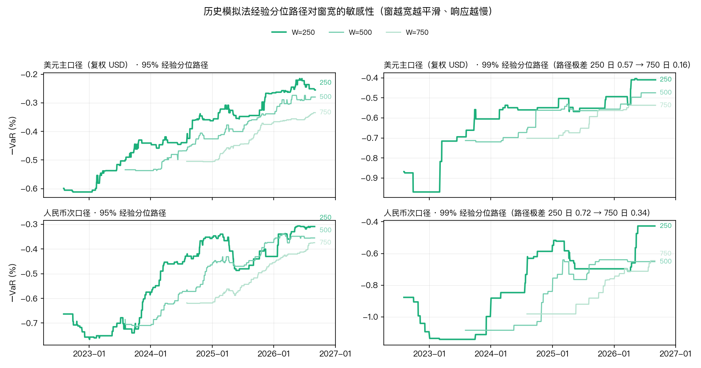

该图给出 250 日窗内 1% 与 5% 分位随时间的移动，尾部只由窗内最极端的两三个观测决定这一点在图上看得最清楚——这也解释了 HS250 的 ghost effect 从何而来。

**图 3-9 滤波历史模拟与经典历史模拟的对比**

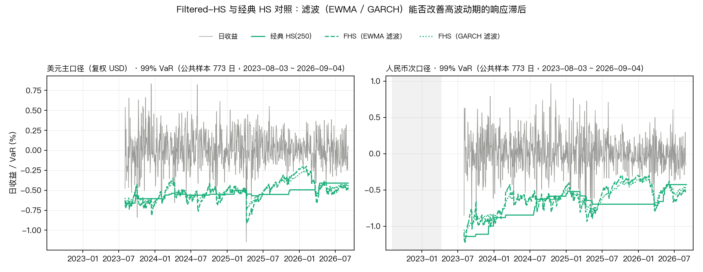

该图把 FHS-E、FHS-G 与经典 HS250 的 VaR 路径叠在一起。三者在平静期贴合，FHS 两版在高波动期略微更高，但差异不足以把失败率拉回名义值——这就是 §3.5 第三条「滤波未改善」的视觉形态。

---

## 四、压力测试框架设计与核心发现

压力测试这一章最重要的一段不是损失读数本身，而是三条结论在被验证之后发生的方向翻转。它们分别是缓冲敏感性、信用区间口径与次口径尾部方向。三条翻转的触发原因各不相同，但都是同一个机制在起作用：**一个口径参数沿传导链往下走，足以让最终结论整块翻面。** 先给对照表，再分节展开。

**表 4-1 三条被翻转的结论**

| 结论 | 翻转前 | 翻转后 | 触发翻转的是什么 |
|---|---|---|---|
| 缓冲敏感性 | **稳健**：0 ~ 0.8390pp 四档超限名单完全不变（均 16/30、10 个情景），只有人为加到的 1.0000pp 压力档才多出 S06 一条，故判定为数据驱动 | **不稳健**：名单对缓冲档位敏感 | 缓冲占判定阈值的比例由 **40.2%** 升至 **50.5%** |
| 信用路径区间 | **口径依赖**：平静样本口径未触及（①1.2743% < 阈值 1.6274%），并入 2022 残差后触及（②2.0549%），两者相反 | **双口径同向**：两条路径都越过阈值 | 阈值降幅 **59%** 大于信用损失降幅 **33%**，尺子变了而非证据变强 |
| 次口径尾部 | 三个期限都成立（次口径尾部更薄） | **只在多日期限成立**，1 日档相反 | 统计性质随期限变化，汇率与债券收益相关系数 −0.225，方差削减需多日累积 |

表 4-1 数据来源：`docs/phase3_stress_testing.md` §一、`docs/week3_revision_formal.md` §4。

### 4.1 情景库

情景库共 15 个情景，落成长表 `results/stress_scenarios.csv`，112 行 × 15 列。构成是 3 个历史情景、2 个补充情景、10 个假设情景。历史情景从 `events/risk_events_timeline.csv` 的 85 条事件中筛出，标准是「对组合三类因子都有实际冲击、且事件本身有公开记录可查」。

**表 4-2 情景库构成**

| 类别 | 编号 | 情景 | 事件窗 / 冲击参数 |
|---|---|---|---|
| 历史 | H1 | 2022 美联储快速加息 | 2022-06-09 ~ 06-16，Δ5Y +32bp、Δ10Y +25bp、汇率 +0.3063% |
| 历史 | H2 | 2023 美国银行业风波 | 2023-03-10 ~ 03-17，Δ5Y −78bp、Δ10Y −54bp、汇率 −1.0975% |
| 历史 | H3 | 2025 关税冲击 | 2025-04-07 ~ 04-11，Δ5Y +43bp、Δ10Y +47bp、ΔOAS +3bp |
| 补充 | X1 | 2022 离岸人民币贬值 | 2022-11-29 ~ 12-05，Δ5Y −8bp、Δ10Y −9bp、汇率 −3.4785% |
| 补充 | X2 | 2022 俄乌与加息周期开启 | 2022-03-08 ~ 03-15，Δ5Y +39bp、Δ10Y +37bp、汇率 +0.7912% |
| 假设 | S01–S03 | 利率上行 · 轻 / 中 / 极端 | Δ5Y +31 / +46.5 / +62bp，Δ10Y +28 / +42 / +56bp |
| 假设 | S04–S06 | 信用利差走阔 · 轻 / 中 / 极端 | ΔOAS +15 / +22.5 / +30bp |
| 假设 | S07–S09 | 离岸汇率贬值 · 轻 / 中 / 极端 | 汇率 −1.5854% / −2.3781% / −3.1708% |
| 假设 | S10 | 利率与信用同时恶化 · 极端 | Δ5Y +62bp、Δ10Y +56bp、ΔOAS +30bp |

表 4-2 数据来源：`results/stress_scenarios.csv`。

假设情景的锚点全部取**全样本单日极值**，这是 1 日持有期口径的直接结果：利率取 5 年期美债单日峰值 +31bp（2022-06-13，取同向的上行极值，而非绝对值最大的 −32bp）、10 年期 +28bp（同日）；信用取新兴市场投资级公司债利差单日峰值 +15bp（2023-12-13）；汇率取人民币兑美元单日贬值 1.5854%（2022-11-14）。三档梯度按 1、1.5、2 倍线性施加在单日锚点上。

历史情景每个都同时给出六种幅度测度：单日极值、3 日累计峰值、窗内累计、窗内实现、**窗内最差单日**、窗内最大回撤。之所以并列给出，是因为需求文档里「最大波动幅度」没有指定测度口径，只给一个测度容易被误读。其中单日极值供假设情景作锚点，**窗内最差单日供历史情景作损失基准**，3 日峰值保留作附录对照。

有两处构造选择需要说明。**H2 的方向与其他情景相反**：2023 年美国银行业风波中 5 年期美债收益率累计下行 78bp，组合主口径的实际收益是正 1.9981%，也就是说这个情景对本组合是收益而不是损失。这是真实结果，照实记录，没有做符号翻转去充作损失。**汇率不叠加到利率与信用情景上**，因为汇率在这三条路径中是独立的一维，叠加会造出一个历史上并未同时出现的组合事态；汇率方向单独设三档，主要供人民币次口径使用。

**图 4-1 情景库三方向幅度**

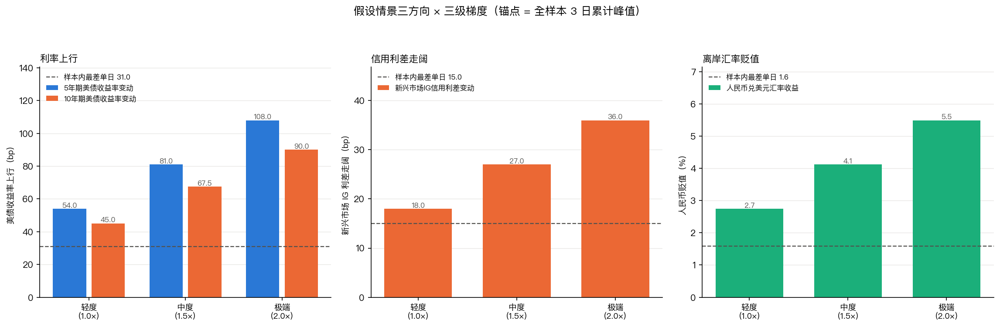

该图把历史情景的实际幅度与假设情景的三档梯度画在同一量纲上。可以直观看到假设情景的极端档确实落在历史实际幅度之外，但超出幅度并不夸张，这也是后文说「极端档按定义无法验证」的依据。

**图 4-2 三条映射路径**

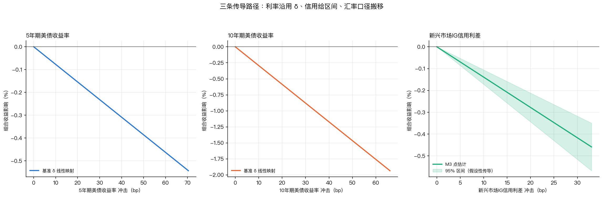

该图给出利率、信用、汇率三条冲击到组合损失的映射路径。三条路径不共用同一套系数：利率走 δ 线性映射且系数来自全样本，信用走区间形式而非点估计，汇率在次口径下以固定系数 1.0 计入。

### 4.2 三条翻转的机制

**缓冲敏感性。** 重做前的判定是「数据驱动、与缓冲无关」：在 0、0.1997、0.3365、0.8390pp 四档缓冲下，超限名单完全一致，都是 16/30、同样 10 个情景，只有把缓冲人为加到 1.0000pp 才多出 S06 一条。这个判定的根据看上去很扎实。

翻转到 1 日口径后，五档缓冲（0 / 0.1997 / 0.3365 / 0.8390 / 1.0000pp）给出的超限条数变成 **17 / 17 / 19 / 23 / 23**，情景数变成 **11 / 11 / 12 / 14 / 14**。名单随缓冲档位明显扩张。原因不在缓冲本身，而在分母：缓冲随持有期缩小（3 日 0.6548pp 降至 1 日 0.3365pp，降幅 49%），但判定阈值缩小得更快（3 日 1.6274% 降至 1 日 0.6659%，降幅 59%），于是缓冲占阈值的比例由 0.6548 / 1.6274 = 40.2% 升到 0.3365 / 0.6659 = 50.5%，放大约 1.6 倍。**1 日口径下判定线的一半由缓冲构成**，判定自然对它的取值敏感。

这里要说清楚的是，这不说明缓冲取错了，而是说明 1 日口径下「超限 / 未超限」这个二值判定比 3 日口径更脆弱。这也是主张改用「相当于几倍 99% 期望损失」作主导统计量的直接理由（见 §4.4）。

**信用区间。** 重做前，信用利差三个方向的传导区间有两个口径，结论相反：平静样本口径下加缓冲后的损失是 1.2743%，低于当时的阈值 1.6274%，判定为「未触及」；并入 2022 年残差标定后的外推口径是 2.0549%，越过了阈值。于是结论写成「依赖是否计入外推假设」。

1 日重做后，两条路径都越过了阈值：平静样本口径 **0.8528%**、并入 2022 残差口径 **1.6310%**，阈值降到 **0.6659%**。口径依赖消失了。同样要说清楚的是，**这不代表信用维度变得更危险**。判定阈值随持有期同步下降 59%，而 S06 的平静强传导加缓冲损失由 1.2743% 降到 0.8528%，只降了 33%——阈值降得比损失快，原本被挡在门外的信用极端档因此越线。真正决定这个结果的量是缓冲占比 50.5%（对应 3 日口径的 40.2%）。信用维度整体仍然标注为**参考项**：项目的核心验证维度是利率与汇率，2022 年残差受制于数据缺失只能作代理量。

**次口径尾部方向。** 重做前，次口径在 1 日、5 日、6 日三个期限上都表现为尾部更薄。1 日重做后，统计性质随期限变化这一点暴露出来：**1 日档上次口径的尾部反而更厚**，99% 期望损失 1.0646% 高于主口径的 0.8573%，日标准差 0.3221% 也高于 0.2660%。到了 5 日档就反转（1.7419% 对 2.0671%），6 日档同样是主口径更高（1.8447% 对 2.3002%）。机制是汇率与债券收益的相关系数为 −0.225，负相关带来的方差削减需要多日累积才能显现，单日看还来不及起效。因此这条结论现在只在多日期限成立，不能再说「次口径尾部一致更薄」。

### 4.3 损失测算结果

**表 4-3 各情景损失读数（%，正值 = 损失）**

| 编号 | 基准口径 | 主口径基准损失 | 次口径基准损失 | 主口径窗内累计 | 次口径窗内累计 | 主口径窗内最大回撤 | 次口径窗内最大回撤 | 含缓冲主口径 |
|---|---|---|---|---|---|---|---|---|
| H1 | 窗内最差单日 | 1.3449 | 0.8019 | 1.5368 | 1.2305 | 2.6784 | 1.9115 | 1.3449 |
| H2 | 窗内最差单日 | 0.5620 | 0.5576 | −1.9981 | −0.9006 | 0.5604 | 0.5560 | 0.5620 |
| H3 | 窗内最差单日 | 1.1491 | 0.7680 | 2.2896 | 2.1359 | 2.2636 | 2.1133 | 1.1491 |
| X1 | 窗内最差单日 | 0.3084 | 1.1382 | −1.4370 | 2.0415 | 0.3079 | 2.0208 | 0.3084 |
| X2 | 窗内最差单日 | 1.0349 | 0.6388 | 3.0008 | 2.2096 | 2.9562 | 2.1854 | 1.0349 |
| S01 | δ 映射（1 日） | 1.0596 | 1.0596 | 1.0596 | 1.0596 | 1.0540 | 1.0540 | 1.3961 |
| S02 | δ 映射（1 日） | 1.5895 | 1.5895 | 1.5895 | 1.5895 | 1.5769 | 1.5769 | 1.9260 |
| S03 | δ 映射（1 日） | 2.1193 | 2.1193 | 2.1193 | 2.1193 | 2.0970 | 2.0970 | 2.4558 |
| S04 | δ 映射（1 日） | 0.2085 | 0.2085 | 0.2085 | 0.2085 | 0.2083 | 0.2083 | 0.5450 |
| S05 | δ 映射（1 日） | 0.3128 | 0.3128 | 0.3128 | 0.3128 | 0.3123 | 0.3123 | 0.6493 |
| S06 | δ 映射（1 日） | 0.4171 | 0.4171 | 0.4171 | 0.4171 | 0.4162 | 0.4162 | 0.7536 |
| S07 | δ 映射（1 日） | 0.0000 | 1.5854 | 0.0000 | 1.5854 | 0.0000 | 1.5729 | 0.0000 |
| S08 | δ 映射（1 日） | 0.0000 | 2.3781 | 0.0000 | 2.3781 | 0.0000 | 2.3500 | 0.0000 |
| S09 | δ 映射（1 日） | 0.0000 | 3.1708 | 0.0000 | 3.1708 | 0.0000 | 3.1211 | 0.0000 |
| S10 | δ 映射（1 日） | 2.5363 | 2.5363 | 2.5363 | 2.5363 | 2.5044 | 2.5044 | 2.8728 |

表 4-3 数据来源：`results/stress_impact.csv`。历史与补充情景的基准为「窗内最差单日」，假设情景为「δ 映射的 1 日值」；缓冲 0.3365pp 只施加于假设情景。

读这张表有四件事要同时记住。**第一**，主口径出现 0.0000% 只出现在纯汇率情景上（S07–S09），这是口径事实：美元计价组合在美元本位下不含汇率项，不是算漏了。**第二**，历史情景的损失读数与最大回撤是两把不同的尺子。H1 的窗内最差单日 1.3449% 明显小于它的窗内最大回撤 2.6784%，因为该窗口先深跌后反弹，单日最深的那一天并不是净值最低的那一天；反过来 H2 主口径的 0.5620% 略大于回撤 0.5604%，这是对数收益与净值回撤的换算差（1 − exp(−0.5620%) = 0.5604%，两者在该位上恒等）。**第三**，H2 与 X1 的窗内累计是负值（整窗净收益），但它们的损失读数都是正数。这不矛盾，是「避险窗口中途也走过一段下跌」的如实记录。**第四**，假设情景的最大回撤是退化值：1 日锚点路径只有一天，回撤 ≡ 1 − exp(损失)，与损失是同一信息的单调换形。该列按需求文档要求保留落库，但在 `mdd_note` 列显式标注为退化、不参与严重度解读。

X1 是全表唯一主次口径方向相反的情景（主口径 0.3084%、次口径 1.1382%），原因也简单：它是一次纯粹的离岸人民币贬值事件，对美元本位组合几乎没有影响，对人民币本位投资者却是一次实打实的损失。

**图 4-3 损失读数与判定线的关系**

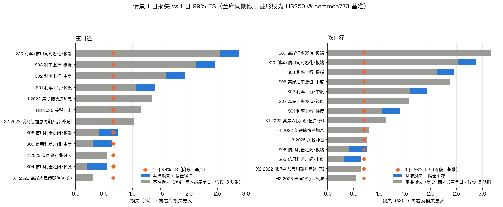

该图把各情景的基准损失与两条判定线（主口径 0.6659%、次口径 0.7024%）画在一起。汇率方向的三档在次口径下明显跳出判定线，而利率与信用方向则密集分布在判定线附近——判定名单的边际成员之所以脆弱，原因就在这个密集区。

### 4.4 判定阈值与超限名单

判定线取阶段二登记的主判定线 `es_1d_99_pct`，即滚动 250 日的 1 日 99% 期望损失：主口径 **0.6659%**、次口径 **0.7024%**。另设一条同源交叉核对列 `es_hd_99_pct`，取全样本无条件的经验 1 日 99% 期望损失：主口径 0.8573%、次口径 1.0646%。两者相差主口径 +28.7%、次口径 +51.6%。

**这两条线不是同一个统计量。** 前者是滚动 250 日的条件量，只由 8 个（主）/ 7 个（次）违规日支撑；后者是全样本的无条件分位数。差别这么大，根源是样本不同，不是哪个算错了。

主判定线下的超限名单是 **19 / 30** 条。改用交叉核对列后降为 **15 / 30**，移出 4 条：H1 次口径（0.8019 < 1.0646）、H3 次口径（0.7680 < 1.0646）、S06 主口径（0.7536 < 0.8573）、S06 次口径（0.7536 < 1.0646）。需要特别说明的是 **X1 的次口径并没有被移出**（1.1382 > 1.0646），这一条在修订前的名单里曾写错。

换线之后名单长度变了，但**头部不变**：S07–S09 次口径与 S10 在两条线下都超限。所以这条结论的准确表述是「名单长度敏感、头部不敏感」。

**表 4-4 六项稳健性检验**

| # | 检验 | 变动范围 | 结论 |
|---|---|---|---|
| 1 | 情景覆盖度 | 上报 1 日期限后，主口径库内最深 S10 2.5363% > 实测最差单日 1.3449%；次口径 S09 3.1708% > 1.4739% | 1 日期限的库级覆盖**成立**，双口径都成立 |
| 2 | 窗口敏感性（±1 / ±2 日平移） | 窗内最差单日极差 0.0000 ~ 0.5766pp，十个组合中有三个读数完全不动 | 1 日口径比窗内最大回撤更抗平移；H3 主口径仍需以区间引用 |
| 3 | 缓冲敏感性 | 0 / 0.1997 / 0.3365 / 0.8390 / 1.0000pp 五档，超限 17 → 17 → 19 → 23 → 23 条 | **不稳健** |
| 4 | 信用路径区间敏感性 | ① 0.8528%、② 1.6310%，均已越过 0.6659% | 由口径依赖变为双口径同向；参考项定性未变 |
| 5 | 锚点窗长敏感性（1 / 3 / 5 / 6 日） | 极端档极差：利率 1.8262pp、信用 0.2224pp、汇率 3.9580pp | 1 日锚点未选错，但假设情景绝对水平只能作量级参考 |
| 6 | 阈值口径交叉核对 | 超限条数 19 → 15 条 | 长度敏感、头部不敏感 |

表 4-4 数据来源：`docs/phase3_stress_testing.md` §6。

第 1 项值得单独说一句。1 日口径下情景库的覆盖是成立的：主口径库内最深 2.5363% 高于样本内实测最差单日 1.3449%（2022-06-13，正落在 H1 窗内），次口径 3.1708% 高于 1.4739%（2022-09-29）。至于此前报告里 5 日、6 日口径下算出的缺口，那是拿 3 日锚点的情景去比 5 日、6 日的历史分布，1 日重做后情景侧已经没有对应期限的量，**这个比较不再成立**，已移入附录并标注为不同量纲。这里只陈述事实，不主张缺口「已修补」或「已消失」。

**图 4-4 库级覆盖度**

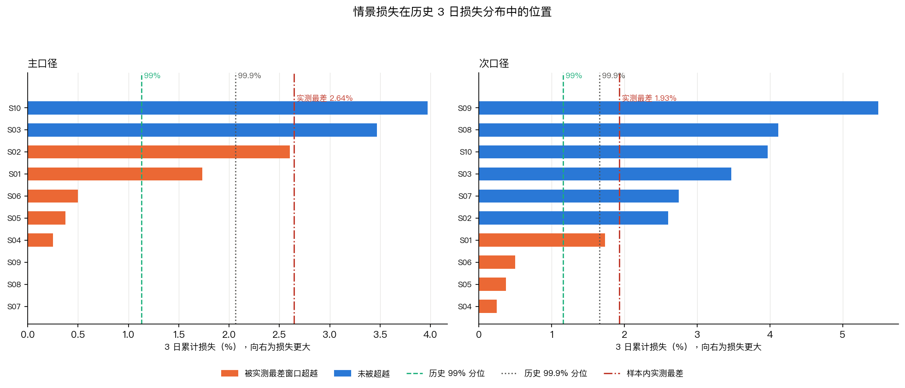

该图把库内最深情景与样本内实测最差单日并列。1 日口径下两者的关系是库内更深，覆盖成立；图上同时给出多期口径的对照，可以看到那几条并不落在同一量纲上。

### 4.5 因子贡献度与两条边界

**表 4-5 历史与补充情景的因子贡献度（按绝对值归一，%）**

| 情景 | 口径 | Δ10Y | Δ5Y | ΔOAS | 汇率 | 未解释残差 |
|---|---|---|---|---|---|---|
| H1 | 主 | 61.0 | 17.8 | 0.0 | 0.0 | 21.2 |
| H1 | 次 | 21.9 | 4.8 | 0.0 | 25.0 | 48.3 |
| H2 | 主 | 46.9 | 13.7 | 0.0 | 0.0 | 39.4 |
| H2 | 次 | 26.3 | 18.0 | 0.0 | 10.4 | 45.3 |
| H3 | 主 | 35.7 | 6.7 | 3.6 | 0.0 | 54.0 |
| H3 | 次 | 26.8 | 5.0 | 2.7 | 24.9 | 40.5 |
| X1 | 主 | 62.9 | 23.9 | 0.0 | 0.0 | 13.3 |
| X1 | 次 | 21.1 | 8.0 | 0.0 | 66.4 | 4.5 |
| X2 | 主 | 39.6 | 10.4 | 0.0 | 0.0 | 49.9 |
| X2 | 次 | 36.7 | 10.9 | 0.0 | 4.0 | 48.5 |
| S10 | 主 / 次 | 64.7 | 18.9 | 16.4 | 0.0 | 0.0 |

表 4-5 数据来源：`results/stress_factor_contrib.csv` 的 `share_pct` 列。

假设情景的贡献度是构造出来的、双口径数值相同：利率三档为 Δ10Y 77.4% / Δ5Y 22.6%，信用三档为 ΔOAS 100.0%，汇率三档在主口径下为 0、次口径下为 100.0%，组合档 S10 为 64.7 / 18.9 / 16.4。假设情景的未解释残差恒为 0，这是构造使然，不是拟合得好。

**图 4-5 因子贡献度分解**

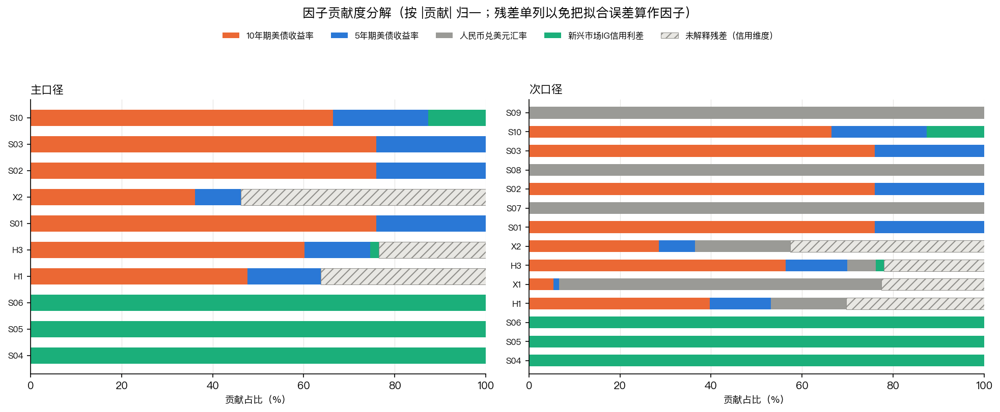

该图用堆叠柱给出各情景的因子贡献占比。读这张图必须同时带上下面两条边界，否则会得出偏乐观或偏悲观的结论。

**边界一：历史情景的未解释残差是模型拟合误差，不等于信用风险贡献。** 残差的口径是「窗内累计实际损失 − δ 模型隐含损失」，占比高主要受两个因素影响：信用因子数据覆盖不足（`doas_bp` 起于 2023-09），以及窗口边界的截断。实测残差（累计口径）为 H1 +0.5574pp、H2 +0.1860pp、H3 +0.5389pp、X1 −1.1116pp、X2 +1.6157pp。**残差占比高不代表真实信用风险高**，这两件事必须分开说。

**边界二：纯汇率情景在次口径下汇率贡献 100%，是口径定义的结果。** 汇率情景本身只含汇率一个分量，贡献自然是 100%，不代表组合里汇率风险的占比有这么高。参照多因子历史情景，**汇率的实际贡献大致在 20% 到 25% 区间**（H1 次口径 25.0%、H3 次口径 24.9%）；其余几个情景分别是 H2 10.4%、X1 66.4%、X2 4.0%。

### 4.6 1 日持有期重做与缺陷处理

**持有期口径的来源。** 主情景库统一到 1 日持有期，是老师口头给出的指示，需求文档全文没有出现「持有期」一词、也未规定持有期。这一点在修订前后被反复核对过：逐字检索需求文档，「持有期」出现 0 次；与计量口径有关的唯一一处是「计算 95%、99% 两个置信水平下的日度 VaR」，约束对象是 VaR 而不是压力情景。把这条如实标注出来，是因为它属于自定口径而非合规要求，答辩时应当能被追问。

**重做改了什么。** 假设情景的锚点由全样本滚动 3 日累计极值改为单日极值；历史与补充情景的基准损失由窗内最大回撤改为窗内最差单日；判定阈值与偏差缓冲同步降到 1 日档；信用路径区间上端标定用的 2022 年残差由 3 日窗的 1.4354pp 改为 1 日窗的 1.1147pp；多期（3 / 5 / 6 日）结果移入附录并标注不参与判定。重做后情景库与 VaR 处在同一期限上，**两者因此可以直接比较**，这正是 §3.6 定下的判定线能直接用于压力测试的前提。

**28 处缺陷。** 随重做一并做了一轮全量回溯核对，标准是「文档里的每个数字都必须能指到具体 CSV 的某列某行，或某个已发布的 commit，指不到的一律删改」。共查出并纠正 28 处，分五类。

**表 4-6 已纠正缺陷的分类**

| 类别 | 处数 | 典型表现 |
|---|---|---|
| 归属错误 | 1 | 把老师口头指示写成需求文档要求 |
| 数字对不上来源 | 19 | 其中编造 9 处（把修订前基线写成「18/30、11 个情景」，实测为 16/30、10 个情景）、无法复算的缺口值 2 个（直接删除）、引错文件或列 3 处、重做后未同步若干 |
| 两把尺子当一把 | 5 | 窗内最大回撤口径的数被当成窗内累计口径引用 |
| 表头与列名不符 | 2 | 表头写「期限」，实为事件窗长度 |
| 交叉核对条数不一致 | 1 | 移出名单列了 5 条、总数写 15，实际移出 4 条 |

表 4-6 数据来源：`docs/week3_revision_formal.md` §5。

成因值得记一笔。重做改变了几乎所有正文数字，回填是批量做的，批量回填的错误率不可控，而且**错误会以读起来很顺的形式存在**；加上口径会被下游搬运，一个人把 3 日读数写成 1 日的，后一个人引用时不会再回看原始列。按性质排序，轻的是未同步与表格标签，重的是编造与归属错误——数字错了是能力问题，归属错了是另一个层面的问题。

**尾部判定改用连续统计量。** 重做后 30 条「情景 × 口径」组合里有 19 条命中判定线，二值区分度明显下降，而 §4.4 又显示名单对缓冲档位敏感。两件事指向同一个结论：**「超限 / 未超限」这个二值判定在 1 日口径下不够稳**。因此主张以「相当于几倍 99% 期望损失」这个连续量作主导统计量，二值名单降为辅助。倍数不会因为缓冲的档位选择而整块翻面。

### 4.7 压力测试的边界

进入结论之前，把压力测试一侧的限制集中说清：

**信用路径系数不可外推。** δ(ΔOAS) 的估计样本自 2023-09-06 起，这个子样本完全不含 2022 年的信用冲击，而阶段二里偏差最大的事件恰恰落在 2022 年 3 月与 11 月。M3 的六个配置全部收敛（−17.6% ~ −33.7%）只能说明「在较平静的近期样本上加入 ΔOAS 能改善传导」，**不能外推成「加入 OAS 就能扛住信用危机」**。

**2022 年残差只能作代理量。** `doas_bp` 序列在 2022 年整年缺失（首值 2023-09-06），2022 年的残差无法拆解出纯信用维度，只能用「未解释残差（信用维度）」作代理。表述上不能说成「已用 2022 年信用维度残差标定」。这个加项 1.1147pp 本身就是对偏差的修正，所以区间上端不再叠加 0.3365pp 的缓冲；该参考项不参与尾部判定。

**极端档按定义无法验证。** S03、S06、S09、S10 是历史极值的 2 倍，样本内不存在可对照的实现值。

**历史情景只是个案描述。** 历史情景 3 次（其中 1 次窗内净收益）、补充情景 2 次，事件窗之间并不独立，样本量根本不足以支撑统计推断。

**汇率路径不提供幅度判断。** 汇率这一维在次口径下以固定系数计入，能给方向，不能给幅度的可靠性判断。

---

## 五、研究结论与方法优化建议

### 5.1 研究结论

结论分三层给出，分层标准是「对自选参数的敏感程度」。第一层可以直接引用，第二层要带条件，第三层是明确划出的边界。

**第一层：稳健的结论。** 

利率是主口径下最主要的尾部风险来源。依据来自全样本估计的因子暴露：复权口径下利率双因子对组合日收益的 R² 为 0.757，反推的等效久期约 3.70 年，与外部久期数据互相印证；这条在所有稳健性检验下方向不变。

汇率是次口径下最主要的尾部风险来源。汇率方向的三档假设情景（S07–S09）在次口径下全部越过判定线，极端档（S09）的次口径损失 3.1708% 是判定线 0.7024% 的 **4.51 倍**，为全表最高。需要说明的是纯汇率情景不加缓冲，这一档的 4.51 倍是未加缓冲的读数。

1 日持有期下情景库的库级覆盖成立，且双口径都成立。主口径库内最深的 S10 为 2.5363%，高于样本内实测最差单日 1.3449%（2022-06-13，落在 H1 窗内）；次口径最深的 S09 为 3.1708%，高于实测最差单日 1.4739%（2022-09-29）。

组合档的损失是线性累加的。S10（利率与信用同时极端，2.5363%）相对 S03（利率单方向极端，2.1193%）多出的部分，等于 S06（信用极端档）的映射损失 0.4171%。这是一个恒等式而非估计结果，说明两条路径在本模型下不发生交互放大。这件事本身值得记录，因为真实的利率与信用冲击同时来临时未必如此。

**第二层：参考的结论。** 

信用维度整体归入这一层。原因有两条：ΔOAS 的估计样本起于 2023-09，不覆盖 2022 年的信用冲击；2022 年的残差受制于数据缺失只能作代理量。信用方向的两条路径读数（平静样本口径 0.8528%、并入 2022 残差口径 1.6310%）都只在这个有限范围内成立。

假设情景的绝对水平归入这一层。锚点窗长敏感性检验显示，极端档在三类方向上的极差分别是利率 1.8262pp、信用 0.2224pp、汇率 3.9580pp，汇率方向最甚。档与档之间的 1 : 1.5 : 2 倍比例关系不受影响，可以照用；绝对数值只能当量级参考。

历史情景的个别读数归入这一层。窗口 ±2 日平移下，窗内最差单日的极差达 0.5766pp（H3 主口径最大）。十个「情景 × 口径」组合中有三个读数在平移下完全不动（H1 双口径、H2 主口径），这三个可以放心引用，其余的需要带区间。

**第三层：不可外推的结论。** 

δ 线性传导对信用情景不可外推，理由是估计样本不含 2022 年信用冲击。2022 年残差只能作为信用维度的代理量，不是真实信用风险贡献。压力情景的极端档按定义无法验证，因为它们本身就是历史极值的 2 倍，样本内不存在可对照的实现值。汇率路径只给方向、不给幅度判断的可靠性。

### 5.2 方法优化建议

**把主导统计量从二值判定换成连续量。** 这是本次研究给出的一条最具体的建议。1 日口径下超限名单对缓冲档位的选择敏感（17 条到 23 条），而缓冲又占了判定线的一半（50.5%），二值判定的稳健性因此下降。改用「相当于几倍 99% 期望损失」这个连续读数，倍数不会因为缓冲档位的变化而整块翻面。建议保留二值名单作为辅助披露，但严重度排序与跨情景比较都用倍数。

**解决 99% 口径的检验力不足。** 实测 LR_ind 在名义 1% 下的真实拒绝率只有 1.56%（N=1023），「未拒绝」不能读成「无违规聚集」。可行的方向是拉长样本外区间，或改用加权型、平滑型的检验（例如 Berkowitz 变换检验），而不是继续依赖低违规率下的 LR_ind。

**补充尾部深度的检验。** 目前只有 ES 的点估计，没有它的显著性检验。可加 ES 回归检验（Acerbi-Szekely 型）来补这一块，这样尾部结论才不止于「ES 是多少」。

**窗宽自适应。** HS250 在本样本上优于 HS500 与 HS750，但这是单一窗宽的结果，没有回答「什么状态下该用多长的窗」。可试验按波动状态在 250 与 750 之间切换的混合窗，并在高波动段单独验证，不过要留意段落本身很小：全样本划出的高波动段是 405 天，落到样本外只剩 299 天，检验力依然有限。

**从 VaR 走向 ES。** 结果表里的 `es` 与 `es_ratio` 两列已经可以直接作为下一阶段的基线，不必再走一遍 VaR 到 ES 的换算。

### 5.3 局限

**样本量是根本性的限制。** 压力测试侧只有 3 次历史情景与 2 次补充情景，且事件窗之间不独立，所有历史情景结论只能作个案描述，不能做统计推断。

**信用维度受制于数据覆盖。** ΔOAS 自 2023-09 才有值，这一条贯穿全书，无法通过任何清洗手段弥补。

**分段标志不是事前信号。** 平稳期与高波动期的划分用的是含当日的 60 日滚动波动，不是事前可知的变量，不能表述为「事前可识别的高波动段」。

**危机窗在样本外为空。** 急性危机窗的 12 天（2022-06-06 至 06-22）整体落在估计窗内，样本外命中 0 天，因此模型在真正危机期间的表现并未被检验到。

**两个口径的样本长度不同。** 主口径 1023 天、次口径 1018 天，横比时必须取公共样本。

**一处存疑报价。** 2025-04-10 的 NAV 疑似陈旧（复权收益 0.0000% 而次口径为 −0.4896%），保留原值并登记在存疑清单中。

---

## 六、需求文档与实现的偏差及原因

本章逐条列出实现与需求文档原文不一致的地方。设立这一章是为了正面回应验收标准中「数据来源合规可追溯」一条：与其让这些差异散落在各章，不如集中列明，每一条都给出核实方式。

**表 6-1 需求文档与实现的偏差**

| # | 需求文档原文 | 实际实现 | 原因与核实方式 |
|---|---|---|---|
| 1 | §3.2 标的行情：iShares 中国投资级美元债 ETF，代码 `MCHB` | **9141.HK（美元柜台）** | 经 Yahoo 官方接口核实，`MCHB` 实为 Mechanics Bancorp（美国银行股，EQUITY/Nasdaq），并非债券 ETF；该代码在真实市场上不存在对应的中国投资级美元债产品。误导的数据已弃用并单独留档标注（`raw_data/mchb_MechanicsBancorp_WRONG_弃用.csv`，不进版本库）。标的于 2026-09-07 改用 9141.HK 的美元柜台 |
| 2 | §3.4 信用利差基准：`BAMLEMIBHGLCPIEYPI` | **`BAMLEMIBHGCRPIOAS`** | 需求文档给出的是扫描件 OCR 结果，该代码在 FRED 上查不到。以实取代码为准。该系列自 2023-09 才有数据，历史偏短，属源数据限制而非本项目取舍 |
| 3 | 第三阶段历史情景举例含「2020 年疫情冲击」 | 以样本内同级冲击（2025-04 关税冲击）替代 | 2020 年早于因子表起点 2021-08-03，该期间的因子波动无法提取。不伪造数据，也不用近似事件冒充 |
| 4 | 全文未出现「持有期」一词，未规定持有期 | 主情景库取 1 日持有期 | **老师口头给出的指示**（主情景库保持 1 日持有期，与 VaR 口径对齐），不是需求文档的要求。逐字检索需求文档，「持有期」出现 0 次；与计量口径有关的唯一表述是「计算 95%、99% 两个置信水平下的日度 VaR」，约束对象是 VaR 而非压力情景。已作为自定口径如实标注来源 |
| 5 | 第四阶段交付物 3：结项汇报 PPT | 逐页大纲 + 讲稿（`docs/final_ppt_outline.md`），不产出 `.pptx` | 预研项目的汇报重点是方法与结论的取舍过程，PPT 的文件格式不影响信息传递；大纲逐页给出标题、配图、口播要点与时长，可直接据此制作幻灯片。此处如实标注形式上的差异 |
| 6 | §3.5 宏观基准数据（`FEDFUNDS`、`CPIAUCSL`）「用于宏观环境分析与压力情景参数设定」 | 已按要求获取（各 100% 完整），但未进入计量链路 | 压力情景的冲击参数取自三类风险因子自身的历史极值（需求文档第三阶段执行参考即如此要求），宏观序列未参与参数设定。数据保留在 `raw_data/` 与 `clean_data/` 中可追溯 |

表 6-1 中前四条是标的、数据代码与口径层面的实质偏差，第 5 条是交付形式，第 6 条是数据使用范围。六条的共同处理原则是：不静默替换，也不让差异散落在各处，一律在此集中说明并注明核实方式。

需要补充一点的是第 1 条与第 2 条的连带影响。需求文档 §3.2 与 §3.4 指定的两个代码都与实际不符，但这并不影响方法论层面的结论——底层的利率、汇率、事件三类数据来源与需求文档一致，标的与利差基准的替换都在文档中留有出处，全部可追溯。
