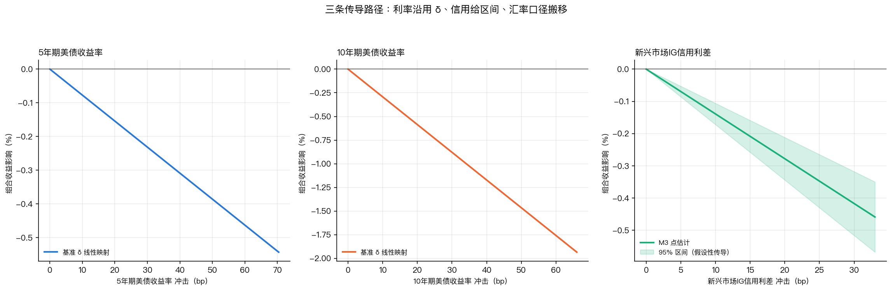
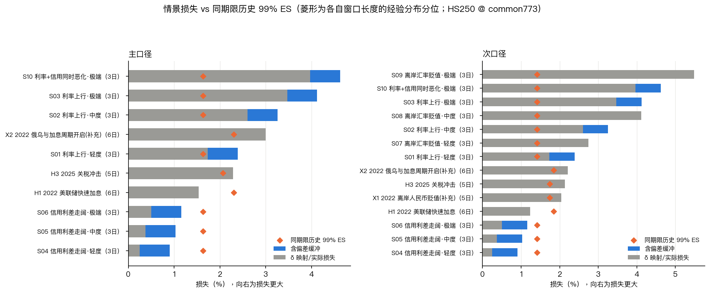
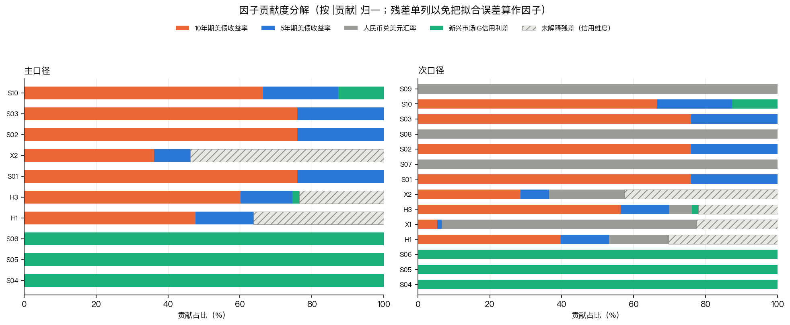
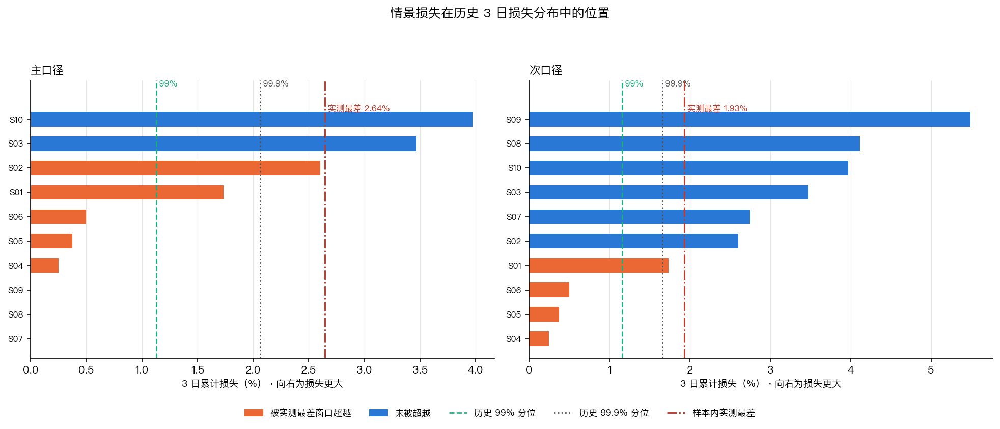

# 压力测试分析报告（第三阶段交付物 2）

本报告是第三阶段两项交付物中的**压力测试分析报告**，对《压力情景库》中的 15 个情景
逐一套算潜在损失、最大回撤、因子贡献度，并给出风险承受能力评估与尾部风险点识别。
全部数字由 `code/stress_impact.py` 从 `results/stress_scenarios.csv`
与 `factors/factor_table_nav_tr.csv` 一键重算，落表为
`results/stress_impact.csv`（30 行 × 30 列）与 `results/stress_factor_contrib.csv`（150 行 × 10 列）。

第五节另做五项稳健性检验，由 `code/stress_robustness.py` 从 `results/stress_impact.csv` 重算。
该节包含一项**对情景库本身的检验结果**——覆盖度检验查出第一版情景库漏掉了样本内最差的一段冲击，
补入补充情景 X2 后缺口才收窄，全过程记录在《压力情景库》§2.4 与本文 §5.1。

---

## 一、测算方法

### 1.1 三条映射路径

情景的因子冲击要变成组合损失，需要一套传导关系。本报告对三个方向**分别建立映射路径**，
而不是共用同一套系数——理由是：三个方向的系数在统计性质上完全不同，
共用会把其中一个的性质错误地赋予另外两个。

**表 1　三条映射路径及其性质**

| 方向 | 系数来源 | 数值 | 可外推性 | 报告方式 |
|---|---|---|---|---|
| 利率 | 基准 δ 线性映射 | Δ5Y −0.007714、Δ10Y −0.029303 %/bp | 有实测支持 | 点估计 |
| 信用 | 重新估计 M3（利率 + ΔOAS） | ΔOAS −0.013902 %/bp | **无** | **给区间** |
| 汇率 | 口径恒等式 | 次口径恒为 +1，主口径恒为 0 | 不涉及外推 | 精确值 |

表 1 的第二行是本报告在方法上最需要强调的一条。阶段二构建的基准 δ 中有一个
「信用利差代理」项，但该项实际上是**利率双因子回归的残差本身**，其系数恒等于 1，
属代数恒等式而非估计出来的暴露（实测 `max|估算 − 实际| = 8.79e-05 pp`）。
用一个恒等式去外推信用冲击是无效的，因此本报告**重新估计了一个含 ΔOAS 的三因子模型**
作为信用路径。

该模型的结果为：**δ(ΔOAS) = −0.013902 %/bp，95% 置信区间 [−0.017208, −0.010596]，
R² = 0.8087，样本 749 个观测（2023-09-06 ~ 2026-09-03）**。
系数符号为负符合经济直觉（利差走阔、债券价格下跌）。

但这个系数**只能作假设性传导使用，且必须与区间一并给出**。原因是它的估计样本
自 2023-09-05 起，而**该子样本完全不含 2022 年的信用冲击**——
阶段二 δ 传导验证中偏差最大的事件全部落在 2022-03 与 2022-11。
用一个未经历危机的平静期估出的系数去预测危机情景，是把「未验证」说成「已验证」。
给出 95% 区间是对这一不确定性的最低限度披露，而不是对该系数可靠性的背书。

第三行的汇率路径不涉及估计：组合的美元口径收益不含汇率项（系数恒为 0），
人民币口径收益恒等于美元口径收益加汇率收益（系数恒为 +1）。
因此汇率情景对主口径的损失**恒为 0**，这不是测算遗漏，而是口径本身的事实。

**图 1　三条传导路径**



图 1 三个面板分别对应三条路径，横轴为因子冲击幅度、纵轴为组合收益影响。
左右两栏是利率路径：直线斜率即表 1 中的 δ，Δ10Y 的斜率（−0.029303）明显陡于 Δ5Y
（−0.007714），约 3.8 倍，反映组合久期集中在长端。

中间面板的信用路径带阴影带，即 95% 置信区间。**注意阴影带的宽度在整个横轴上是恒定的**——
这是线性模型置信区间的固有性质，它只反映系数估计误差，不随冲击幅度变大而加宽。
这正是 §1.1 所说「区间无法覆盖外推风险」的可视化：
把横轴拉到样本外的极端幅度时，图上的阴影带**不会**相应变宽，
但真实的预测不确定性必然变大。读图时不应把这条带子理解为「极端情景的可信范围」。

汇率路径未绘入图 1，因为它是恒等式：主口径影响恒为 0、次口径影响恒等于冲击本身，
没有需要可视化的估计关系。

### 1.2 亏损侧偏差缓冲

假设情景的损失由 δ 映射得出，因而带有估算误差。本报告为这类情景预留缓冲，
量级取自阶段二实测的偏差分布，而非主观设定的安全垫。

**表 2　缓冲量级的来源**

| 项目 | 数值 | 来源 |
|---|---|---|
| 偏差中位数（全部 85 个事件窗） | +0.0550 pp | `delta_transmission_summary.csv` |
| 偏差均值（全部 85 个事件窗） | +0.0896 pp | 同上 |
| 低估事件占比（**实际亏损的 33 个事件窗**） | 58% | `docs/phase2_model_validation.md` §7.3 |
| 平均低估幅度（同子样本） | 0.1219 pp | 同上 |
| **本报告采用的缓冲（90 分位绝对偏差）** | **0.6548 pp** | `delta_transmission_summary.csv` |

表 2 体现了缓冲取值的一个关键判断：**不用中心趋势，用亏损侧分位**。
全部 85 个事件窗上偏差中位数仅 +0.0550pp、均值 +0.0896pp，看似几乎没有误差；
但正负两侧的相互抵消掩盖了真实误差量级——收敛到实际发生亏损的 33 个事件窗上，
**58% 的事件低估了损失，平均低估 0.1219pp**。压力测试只关心亏损侧，
故取 90 分位绝对偏差 0.6548pp，而不用那个近乎为零的中心趋势值。

缓冲的**施加规则**有三条：

1. **只施加于假设情景。** 历史情景的损失取窗内实际收益，**不含模型误差**，
   给它加偏差缓冲等于对已知结果重复计一次模型误差。故历史情景的缓冲列恒为 0。
2. **按情景施加一次，不按路径累加。** 缓冲是「δ 估算值 vs 实际损失」这一整体偏差的保证金，
   不是每条因子路径各留一份。故取适用路径中较大的那一档，而非相加。
3. **汇率路径不施加缓冲。** 汇率是口径恒等式搬运，实测主次口径传导偏差的
   最大逐值差为 **0.000e+00**（汇率项在偏差中精确对消），对恒等式再叠一层缓冲无依据。

信用路径的缓冲虽然按规则 2 可以取 M3 自己的 0.2927pp，但本报告**仍取利率侧的 0.6548pp**。
理由是 M3 偏差更小这一改善，只在 2023-09 之后的平静子样本上成立；
而信用情景恰恰要外推到该子样本从未见过的冲击幅度，
用一个「没见过危机的样本」估出的偏差给危机情景定缓冲，方向是反的。

**表 3　各方向情景的缓冲取值**

| 情景方向 | 适用缓冲 | 取值 (pp) | 依据 |
|---|---|---|---|
| 利率上行（S01–S03） | 利率侧 | 0.6548 | 表 2 |
| 信用利差走阔（S04–S06） | 信用侧 | 0.6548 | 取保守侧，不用 M3 的 0.2927 |
| 离岸汇率贬值（S07–S09） | 无 | 0.0000 | 口径恒等式 |
| 组合档（S10） | 利率/信用较大者 | 0.6548 | 不累加 |
| 全部历史情景 | 无 | 0.0000 | 实际路径，无模型误差 |

### 1.3 最大回撤的口径

**最大回撤与潜在损失是两个不同的量**：前者是路径上的峰谷差，后者是情景终点相对起点的变动。
一个先跌后涨的情景，其回撤远大于终点损失。本报告分别计算两者。

- **历史情景与补充情景**用窗内的**实际逐日路径**；
- **假设情景**把该方向锚点日的**实际 3 日因子路径**按倍数放大后映射回组合收益路径。

假设情景之所以不复用「单点冲击」，是因为单点冲击会使路径退化为一个点、
回撤恒等于损失，该指标就失去了信息量。

回撤在净值曲线上计算，且**必须包含事件前的起点净值 1.0**。
只从窗内首个收益起算会漏掉「事件首日即最高点」的情形——
实测这会把 H3 的回撤低估一半以上（不含起点 −1.14% vs 含起点 −2.26%）。
收益为对数收益，故累计收益直接求和，不做复利。

### 1.4 与基准口径对标的口径警告

对标基准为阶段二定案的 **HS250 @ common773**（`results/backtest_results.csv`），
其 VaR/ES 是 **1 日** horizon，而情景损失是 **3 日及以上** horizon。
两者**不同期限，不能直接比较**。

本报告**不做 √t 缩放**对齐：本样本的 GARCH(1,1) 持续性参数 α+β
在末期达 0.99597（主口径）/ 0.99682（次口径），全样本中位数为 0.99212 / 0.99399，
均已接近 IGARCH，且存在波动聚集，√t 的独立同分布前提不成立，
缩放会把一个未经验证的换算当成可比性依据。

取而代之的是**同期限经验分布**：从历史收益中直接取 h 日累计损失的经验分布，
h 与情景窗口长度一致。这与情景损失同为「h 日对数收益之和」，是同类比较，
且不依赖任何分布假设。1 日 VaR/ES 仍保留在测算表中作为**严重度直觉**
（「相当于多少倍日 VaR」），但不作为判定阈值。

需要说明这与阶段二做法并不冲突。阶段二在验证 δ 传导精度时，
用 `1 日 VaR × √窗口长度` 得到一个「窗口 VaR」作为**分母**，
目的是把不同长度窗口上的偏差归一到同一量纲后比较大小（`docs/phase2_model_validation.md` §7.3）。
那里 √t 承担的是**相对归一**的角色，其结论（偏差占比 0.44–1.07）对缩放方式并不敏感。
本报告的用途不同——要拿一条线去**判定**情景是否构成尾部风险，
阈值本身必须可信，此时 √t 的 iid 前提就不能再被忽略。

---

## 二、潜在损失测算

**表 4　分情景潜在损失（% ，正值为损失）**

| 编号 | 情景 | 窗口 | 主口径损失 | 次口径损失 | 主口径回撤 | 次口径回撤 | 缓冲 | 含缓冲主口径 |
|---|---|---|---|---|---|---|---|---|
| H1 | 2022 美联储快速加息 | 6 日 | +1.5368 | +1.2305 | −2.6784 | −1.9115 | 0 | +1.5368 |
| H2 | 2023 美国银行业风波 | 6 日 | **−1.9981** | **−0.9006** | −0.5604 | −0.5560 | 0 | −1.9981 |
| H3 | 2025 关税冲击 | 5 日 | +2.2896 | +2.1359 | −2.2636 | −2.1133 | 0 | +2.2896 |
| X1 | 2022 离岸人民币贬值 | 5 日 | **−1.4370** | **+2.0415** | −0.3079 | −2.0208 | 0 | −1.4370 |
| X2 | 2022 俄乌与加息周期开启 | 6 日 | +3.0008 | +2.2096 | −2.9562 | −2.1854 | 0 | +3.0008 |
| S01 | 利率上行 · 轻度 | 3 日 | +1.7352 | +1.7352 | −1.7203 | −1.7203 | 0.6548 | +2.3900 |
| S02 | 利率上行 · 中度 | 3 日 | +2.6028 | +2.6028 | −2.5693 | −2.5693 | 0.6548 | +3.2576 |
| S03 | 利率上行 · 极端 | 3 日 | +3.4704 | +3.4704 | −3.4109 | −3.4109 | 0.6548 | +4.1252 |
| S04 | 信用利差走阔 · 轻度 | 3 日 | +0.2502 | +0.2502 | −0.2499 | −0.2499 | 0.6548 | +0.9050 |
| S05 | 信用利差走阔 · 中度 | 3 日 | +0.3754 | +0.3754 | −0.3747 | −0.3747 | 0.6548 | +1.0302 |
| S06 | 信用利差走阔 · 极端 | 3 日 | +0.5005 | +0.5005 | −0.4992 | −0.4992 | 0.6548 | +1.1553 |
| S07 | 离岸汇率贬值 · 轻度 | 3 日 | 0.0000 | +2.7459 | 0.0000 | −2.7085 | 0 | +0.0000 |
| S08 | 离岸汇率贬值 · 中度 | 3 日 | 0.0000 | +4.1189 | 0.0000 | −4.0352 | 0 | +0.0000 |
| S09 | 离岸汇率贬值 · 极端 | 3 日 | 0.0000 | +5.4918 | 0.0000 | −5.3437 | 0 | +0.0000 |
| S10 | 利率 + 信用同时恶化 · 极端 | 3 日 | +3.9709 | +3.9709 | −3.8931 | −3.8931 | 0.6548 | +4.6257 |

表 4 有五处需要在解读时特别留意。

**第一，H2 与 X1 的主口径损失为负，即收益。** H2 是避险行情（《压力情景库》§2.4），
X1 的人民币贬值被债券价格上涨抵消。两者均如实保留，不并入损失统计。

**第二，X1 出现双口径符号分离。** 主口径 +1.4370% 收益、次口径 −2.0415% 损失。
这是全表唯一一处两个口径**方向相反**的情景，也是汇率风险最直观的演示：
美元计价的组合在人民币贬值期间按人民币衡量是亏的，而按美元衡量是赚的。
只看主口径会完全遗漏这类损失。

**第三，S07–S09 的主口径损失恒为 0。** 这不是测算失败。组合以美元计价，
其美元收益不含汇率项，故人民币贬值对主口径没有影响。这三个情景的全部风险
体现在次口径上，且量级不小——极端档次口径损失 **5.4918%**，是全表最大。

**第四，主次口径之差精确等于窗口汇率收益。** 逐值核对：
H1 +0.3063、H2 −1.0975、H3 +0.1537、X1 −3.4785、X2 +0.7912、S07 −2.7459（%），
与 `fx_ret_pct` 的窗口累计完全一致。这印证了对数收益的可加性，
也说明双口径的差异**完全且仅由汇率解释**，没有其他来源的污染。

**第五，X2 是全部 15 个情景中按实际路径测算损失最深的一个**（主口径 +3.0008%），
超过历史情景 H3（+2.2896%）与假设情景中的利率轻度档 S01（+1.7352%）。
它的加入过程见《压力情景库》§2.4：这是 9/24 的情景覆盖度检验查出的**选型遗漏**，
不是预先设计的。X2 的重要性在于它给出了本报告的一个下限校准——
**样本内 6 日期限上真实发生过的最深损失（−3.0629%）与它相差仅 0.06pp**，
说明「历史上已经发生过的坏情况」比第一版情景库呈现的更接近极端档的量级。

**表 5　损失梯度的等比性检验**（假设情景，含缓冲）

| 方向 | 轻度 | 中度 | 极端 | 中度/轻度 | 极端/轻度 |
|---|---|---|---|---|---|
| 利率上行 | 2.3900 | 3.2576 | 4.1252 | 1.363 | 1.726 |
| 信用利差走阔 | 0.9050 | 1.0302 | 1.1553 | 1.138 | 1.277 |
| 离岸汇率贬值（次口径） | 2.7459 | 4.1189 | 5.4918 | 1.500 | 2.000 |

表 5 暴露了一个必须说明的性质：**利率与信用方向的梯度不是等比的**。
汇率方向严格等比（1.500 / 2.000），因为它不含缓冲；
而利率方向为 1.363 / 1.726，信用方向为 1.138 / 1.277，
原因是**缓冲是固定金额（0.6548pp）而非比例**，它与随梯度等比放大的映射损失相加后，
稀释了比值。

这带来一个解读上的陷阱：**不能由表 5 的比值推断「信用风险的边际放大效应较小」**。
剥离缓冲后，三个方向的映射损失都是严格等比的（S03 = 2 × S01、S06 = 2 × S04、S09 = 2 × S07），
**这是线性映射的必然结果，不构成任何关于「非线性放大」的发现**。
真正的非线性只能从历史情景中观察，而样本内只有 3 次历史冲击，不足以支撑此类结论。

**表 6　最大回撤与潜在损失的差异**

| 情景 | 主口径损失 | 主口径回撤 | 回撤/损失 |
|---|---|---|---|
| H1 | +1.5368 | −2.6784 | 1.74 |
| H3 | +2.2896 | −2.2636 | 0.99 |
| X1 | −1.4370 | −0.3079 | 0.21 |
| S02 | +2.6028 | −2.5693 | 0.99 |
| S09（次口径） | +5.4918 | −5.3437 | 0.97 |

表 6 显示两者的差距可以很大。H1 的回撤是终点损失的 1.74 倍——
窗口内组合先大幅下跌再部分修复，若只看终点损失会低估**期间的最大账面压力**，
而这正是触发追加保证金或止损的时点。X1 的比值仅 0.21，因为该窗口整体上行，
终点收益掩盖了一次小幅回调。

对风险承受能力评估而言，**回撤比终点损失更贴近「能否扛住」这个问题**，
故本报告在尾部风险点识别中一并给出回撤（表 8）。

**图 2　情景损失与同期限 99% ES 的对照**



图 2 左右两栏为主、次口径，每个情景画出两个量：灰色条为该情景的映射损失或实际损失，
蓝色条为叠加偏差缓冲后的损失，橙色菱形为**同期限**历史 99% ES（即判定阈值）。
条形越过菱形即构成尾部风险点（§3.2）。

读图有两个要点。其一，**信用方向（S04–S06）的条形明显短于其菱形**，
三个情景在两栏中都不构成尾部风险点，这是 §3.2 判断二的图形依据。
其二，**次口径栏中汇率情景（S07–S09）的菱形落在 x 轴约 1.41 处，
而条形延伸至 2.75 ~ 5.49**，是图中超出倍数最大的一组，
直观印证了判断一「汇率是次口径下最大的尾部风险来源」。
此外，历史情景（H1、H3、X2）的灰色条为其**实际发生的损失**，不含缓冲、也没有蓝色段，
与假设情景在图上可通过有无蓝色段直接区分。

---

## 三、风险承受能力评估与尾部风险点

### 3.1 同期限经验分布参照线

**表 7　历史 h 日累计损失的经验分布**（重叠窗口，正值为损失）

| 口径 | 期限 | 95% VaR | 99% VaR | 99% ES |
|---|---|---|---|---|
| 主口径 | 3 日 | 0.7443 | 1.1308 | 1.6274 |
| 主口径 | 5 日 | 1.0010 | 1.6006 | 2.0671 |
| 主口径 | 6 日 | 1.0846 | 1.8332 | 2.3002 |
| 次口径 | 3 日 | 0.7697 | 1.1596 | 1.4111 |
| 次口径 | 5 日 | 0.9606 | 1.5224 | 1.7419 |
| 次口径 | 6 日 | 1.0620 | 1.5369 | 1.8447 |

表 7 是判定的基准。取重叠窗口意味着相邻观测高度自相关、
有效样本量小于名义条数，故该分布**只作参照线，不做统计检验**。

一个值得注意的现象是**次口径的 ES 在三个期限上都低于主口径**：
3 日 1.4111 对 1.6274、5 日 1.7419 对 2.0671、6 日 1.8447 对 2.3002。
这与「次口径包含了额外的汇率风险，尾部应当更高」的直觉相反。
可测的原因是汇率收益与组合美元收益在本样本中呈**负相关**
（实测 `corr(fx, 主口径) = −0.2250`）：人民币贬值期间债券往往上涨，
两个分量在尾部相互抵消，压低了叠加后的极端损失。

需要限定的是，这只是一个**样本内的相关关系**，而非稳定的结构关系。
汇率与债券收益的相关性会随宏观环境改变符号（美元流动性收紧时两者可能同向下跌），
一旦转为正相关，次口径的尾部将高于主口径。
**目前的资料不足以判断该负相关能维持多久**，故本报告不把「次口径 ES 较低」
作为任何风险判断的依据，只作事实陈述。

### 3.2 尾部风险点识别

判定规则：**含缓冲损失超过同期限历史 99% ES** 即为尾部风险点。

**表 8　尾部风险点**（按超出倍数排序）

| 编号 | 情景 | 口径 | 期限 | 含缓冲损失 | 同期限 99% ES | 超出倍数 | 回撤 |
|---|---|---|---|---|---|---|---|
| S09 | 离岸汇率贬值 · 极端 | 次 | 3 日 | 5.4918 | 1.4111 | **3.89** | −5.3437 |
| S10 | 利率 + 信用同时恶化 · 极端 | 次 | 3 日 | 4.6257 | 1.4111 | 3.28 | −3.8931 |
| S08 | 离岸汇率贬值 · 中度 | 次 | 3 日 | 4.1189 | 1.4111 | 2.92 | −4.0352 |
| S03 | 利率上行 · 极端 | 次 | 3 日 | 4.1252 | 1.4111 | 2.92 | −3.4109 |
| S10 | 利率 + 信用同时恶化 · 极端 | 主 | 3 日 | 4.6257 | 1.6274 | 2.84 | −3.8931 |
| S03 | 利率上行 · 极端 | 主 | 3 日 | 4.1252 | 1.6274 | 2.54 | −3.4109 |
| S02 | 利率上行 · 中度 | 次 | 3 日 | 3.2576 | 1.4111 | 2.31 | −2.5693 |
| S02 | 利率上行 · 中度 | 主 | 3 日 | 3.2576 | 1.6274 | 2.00 | −2.5693 |
| S07 | 离岸汇率贬值 · 轻度 | 次 | 3 日 | 2.7459 | 1.4111 | 1.95 | −2.7085 |
| S01 | 利率上行 · 轻度 | 次 | 3 日 | 2.3900 | 1.4111 | 1.69 | −1.7203 |
| S01 | 利率上行 · 轻度 | 主 | 3 日 | 2.3900 | 1.6274 | 1.47 | −1.7203 |
| X2 | 2022 俄乌与加息周期开启 | 主 | 6 日 | 3.0008 | 2.3002 | 1.30 | −2.9562 |
| H3 | 2025 关税冲击 | 次 | 5 日 | 2.1359 | 1.7419 | 1.23 | −2.1133 |
| X2 | 2022 俄乌与加息周期开启 | 次 | 6 日 | 2.2096 | 1.8447 | 1.20 | −2.1854 |
| X1 | 2022 离岸人民币贬值 | 次 | 5 日 | 2.0415 | 1.7419 | 1.17 | −2.0208 |
| H3 | 2025 关税冲击 | 主 | 5 日 | 2.2896 | 2.0671 | 1.11 | −2.2636 |

表 8 共列出 16 个尾部风险点（30 条口径 × 情景中的一半强）。
以下五条是表 8 支持的主要判断。

**判断一：汇率是次口径下最大的尾部风险来源。**
S07–S09 三个汇率情景在次口径下全部超限，且极端档以 3.89 倍高居首位，
回撤达 −5.34%。这是本报告最强的单一结论。其含义很直接：
**对一个以人民币计价的投资者，中资美元债组合的尾部风险主要由汇率而非债券本身驱动。**

**判断二：三个信用情景全部未触及尾部。** S04–S06 含缓冲损失最高 1.1553%，
低于同期限 99% ES（主 1.6274 / 次 1.4111）。即使把历史 OAS 极值放大到 2 倍，
损失量级仍比尾部阈值低约三成至四成。

这个结果**不能读作「信用风险不重要」**，理由有三条：其一，
δ(ΔOAS) 只在 2023-09 之后的平静子样本上估出，不含 2022 年信用冲击（§1.1）；
其二，OAS 代理是 EM 级广义指数，不是中资投资级紧基准，
阶段一实测其与组合利差代理的相关约 **−0.18**（绝对值仅 0.18，符号正确但强度很弱）；
其三，该指数约 T+1 发布，对当日冲击的反映存在滞后。
三条共同指向同一个结论：**信用路径的测算值不足以支撑「信用风险可控」的判断，
只能说明在现有代理与现有系数下、在样本内极值范围内，信用冲击的测算损失量级较小。**

**判断三：利率方向是主口径下最主要的尾部风险。** S01–S03 在主口径下全部超限，
极端档 2.54 倍、回撤 −3.41%。与判断二相反，利率路径的系数有较强的实测支持
（《压力情景库》§6 第 2 条），故这一判断的可信度显著高于信用方向的测算。

**判断四：组合档的增量有限但不可忽略。** S10（4.6257）相比纯利率极端档 S03（4.1252）
高出 0.5005pp，恰好等于信用极端档 S06 的映射损失——因为叠加是线性的。
这说明现行框架下**叠加带来的不是非线性放大，而是风险来源的简单累加**。
现实中两者可能存在非线性关联，但本框架无法刻画（§六 局限性第 4 条）。

**判断五：历史情景中唯一按实际路径就超限的深度，来自 X2。**
X2 主口径含缓冲损失 3.0008%（6 日期限 99% ES 为 2.3002%），超出 1.30 倍，
是历史与补充情景中**唯一在主口径上大幅超限**的一条。
其余超限的历史条（H3、X1）超出倍数都在 1.11 ~ 1.23 之间，属刚刚越线。
这个对比有实际含义：**「已经发生过的最坏情况」在主口径上尚未接近极端档的量级**
（X2 的 3.0008% 对 S03 的 4.1252%），但已经足以越过 99% ES 参照线。
换句话说，把 99% ES 当作风险容忍度的下限，样本内的历史已经够得着；
把它当作需要留出安全边际的上限，则当前组合在样本内最坏情况下尚有约 1.1pp 的余量。

### 3.3 判定的期限敏感性

若改用 **1 日** 99% ES 作阈值，超限情景从 16 条升至 **24 条**（共 30 条）。
这个对照本身就是一条方法层面的结论：**期限不匹配的阈值会使几乎全部情景被判为超限，
判定随之失去区分度**。本报告采用同期限参照线，正是为了避免这种「全红」的假阳性。
测算表中仍保留了 `x_var95` / `x_var99` / `x_es99` 三列 1 日倍数，
用途限于「相当于几倍日 VaR」的严重度直觉，**不作判定**。

---

## 四、因子贡献度分析

因子贡献度按 **|贡献| 归一化**，并把**未解释残差单列**。

**表 9　历史情景的因子贡献占比**（%，主口径）

| 情景 | Δ10Y | Δ5Y | ΔOAS | 汇率 | 未解释残差 |
|---|---|---|---|---|---|
| H1 | 47.7 | 16.1 | — | 0.0 | **36.3** |
| H2 | 66.8 | 25.4 | — | 0.0 | 7.8 |
| H3 | 60.2 | 14.5 | 1.8 | 0.0 | **23.5** |
| X1 | 18.4 | 4.3 | — | 0.0 | **77.4** |
| X2 | 36.1 | 10.0 | — | 0.0 | **53.8** |
| S10 | 66.4 | 21.0 | 12.6 | 0.0 | 0.0 |

表 9 中历史情景的汇率列均为 0.0，这是主口径的定义使然（美元收益不含汇率项），
汇率贡献只在次口径中显现。

**残差列必须单列，不能摊入各因子。** 历史情景的实际损失与 δ 模型隐含损失并不相等：
实测残差为 H1 +0.5574pp、H3 +0.5389pp、X1 −1.1116pp。
若只把损失拆成「Δ5Y + Δ10Y + 汇率」三项，这些残差会被按比例摊进各因子的份额，
等于把模型的拟合误差伪装成因子贡献。

残差的量级值得注意，且**呈现明显的规律**：亏损越深的情景，残差占比越高——
X1 的残差占 **77.4%**、X2 占 **53.8%**、H1 占 36.3%，而 H2（唯一获益情景）仅 7.8%。
即在真正造成损失的那些窗口，利率双因子只能解释一半上下，
这与阶段二的结论一致——δ 传导偏差的 88.1% 来自利率双因子之外的信用维度。
**H1、H2、X1、X2 四个窗口的 OAS 数据全部缺失**（OAS 自 2023-09 起），
故这一残差在现有数据下无法进一步拆解，只能如实标注为「未解释」。

残差集中出现在亏损窗口这一现象本身，与 §5.4 的 H3 检验指向同一方向：
**δ 模型在亏损侧系统性偏低**。H3 的实际损失比模型区间上界高 0.5290pp，
残差占比 23.5%；X1、X2 因缺信用数据而残差更大。这不能归因于某一个因子，
但也不应被当作随机噪声处理。

**图 3　因子贡献度分解**（按 |贡献| 归一，残差单列）



图 3 左右栏分别为主、次口径，每一条形为一个情景的贡献占比分解，
最右侧的斜纹段为未解释残差。两栏最显著的差别在汇率段：
主口径栏中汇率贡献全为 0（口径使然），次口径栏中 X1、X2、H1 的灰色汇率段清晰可见，
其中 X1 的汇率段占据了绝大部分宽度。

**图 3 也解释了 §3.1 的反直觉现象**——次口径的 ES 在三个期限上都低于主口径。
原因是：汇率日收益与债券美元收益的相关系数为 **−0.225**，
两者方向系统性相反，叠加后**尾部变薄**。这一点可用 ES/VaR 比值直接读出：
3 日期限上主口径为 1.4391、次口径为 1.2169；偏度也从 −0.122 降到 −0.290，
峰度从 2.66 降到 1.16。即加入汇率项之后，分布的**方差未必变小**
（3 日 99% VaR 反而由 1.1308 升到 1.1596），但**超出 VaR 之后的尾部被削薄了**，
而 ES 正是对这段尾部的平均。这再次说明 ES 与 VaR 回答的不是同一个问题。

假设情景的残差恒为 0，因为其损失本身就是模型输出，不存在「实际值」可比。
这不意味着假设情景更可靠，而只是说明残差指标对假设情景没有定义。

**表 10　假设情景的因子贡献占比**（%，主口径）

| 情景 | Δ10Y | Δ5Y | ΔOAS |
|---|---|---|---|
| S01–S03（利率上行） | 76.0 | 24.0 | — |
| S04–S06（信用走阔） | — | — | 100.0 |
| S10（组合） | 66.4 | 21.0 | 12.6 |

表 10 显示利率情景内部 Δ10Y 的贡献是 Δ5Y 的约 3.7 倍。
这直接来自两者的系数比（−0.029303 / −0.007714 = 3.80）在近似幅度的冲击上作用的结果，
反映组合的久期集中在长端。信用情景为单因子故贡献恒为 100%，不提供额外信息。

---

## 五、稳健性分析

前四节给出的是「在某一组构造选择下，损失是多少」。本节回答另一半问题：
**这些数字在多大程度上依赖于我做的选择？** 共五项检验，全部由
`code/stress_robustness.py` 从 `results/stress_impact.csv` 重算，产出五张对照表与一张图。

检验的共同判据是：**若结论随某个自选参数大幅摆动，该结论就不能作为判断依据提交**；
若不摆动，则该结论对参数选择不敏感，可信度提高。逐项如下。

### 5.1 情景覆盖度检验

**这是本节最重要的一项，因为它查出了实际缺陷。** 问题是：情景库是否包含
至少与样本内**实际发生过的最差情况**同等严重的冲击？若不包含，
则库中「极端档」的量级就缺少来自自身数据的下限校准。

做法：对每个期限 h ∈ {3, 5, 6} 日 × 主/次口径，计算样本内滚动 h 日累计损失的
最差窗口，与情景库中同期限情景的损失逐一对照。

**表 11　情景库覆盖度：库内最深损失 vs 样本内实测最差**（正值为损失）

| 口径 | 期限 | 库内最深情景 | 库内最深损失 | 实测最差窗口 | 实测最差损失 | 缺口 |
|---|---|---|---|---|---|---|
| 主 | 3 日 | S10 | +3.9709 | 2022-06-14 | +2.6448 | −1.3261 |
| 次 | 3 日 | S09 | +5.4918 | 2022-06-14 | +1.9300 | −3.5618 |
| 主 | 5 日 | H3 | +2.2896 | 2022-06-14 | +2.8226 | **+0.5330** |
| 次 | 5 日 | H3 | +2.1359 | 2025-04-11 | +2.1359 | −0.0000 |
| 主 | 6 日 | X2 | +3.0008 | 2022-03-14 | +3.0629 | **+0.0621** |
| 次 | 6 日 | X2 | +2.2096 | 2022-03-14 | +2.3423 | **+0.1327** |

表 11 的读法是：缺口为正表示实测最差比库内最深情景更深，即**库未覆盖**。

3 日期限上覆盖是充分的（假设情景的极端档远超实测最差），
但 **5 日与 6 日期限上存在 0.06 ~ 0.53pp 的缺口**。逐条查明后是两个不同的原因：

**6 日期限的缺口是窗口边界造成的，且已修补。** 该缺口在补入 X2 之前为 1.5261pp
（库内最深 H1 仅 1.5368%）。加上 X2 后收窄至 0.06pp；
若把 X2 的窗口整体平移 −1 个交易日，损失恰为 **3.0629%，与实测最差完全相等**（见 5.2）。
即：**最差的那一段已经在库里了，只是边界差一天。**

**5 日期限的缺口是真实的，未修补。** 库内最深是 H3 的 2.2896%，
而样本内 5 日最差 2.8226%（2022-06-14，与 H1 同一轮）来自一个**库中没有对应 5 日情景**的窗口。
H1 覆盖同一轮事件但采用 6 日窗，其 ±2 日平移最优为 2.5639%，仍差 0.26pp。
原因是 H1 的窗口按事件完整性取到 06-16（FOMC 决议后），而组合在 06-15、06-16 两日回吐逾 1%。
**这条缺口的处理方式是不修补、如实披露**：不为了凑数再造一个 5 日窗，
因为那会变成按结果选窗口。它记录在 §六 局限性第 3 条。

**图 4　情景损失在历史 3 日损失分布中的位置**



图 4 左右两栏分别为主、次口径，横轴为 3 日累计损失，纵向每条为一个情景。
红色条为**被样本内实测最差窗口超越**的情景。图中三处参照线的含义：
绿色虚线为历史分布的 99% 分位、灰色点线为 99.9% 分位、红色点划线为样本内实测最差。
读图可见两点：其一，信用方向三个情景（S04–S06）的条形**远短于 99% 分位线**，
这与 §3.2 判断二一致；其二，次口径栏中汇率情景（S07–S09）
的条形长度与利率极端档（S03）相当甚至更长，视觉上印证了判断一。

### 5.2 窗口敏感性

历史情景的窗口是人工选定的。把每个窗口的起止**同时**平移 −2 ~ +2 个交易日
（保持窗长不变），重算窗内累计损失，得到该情景的损失区间。

**表 12　历史与补充情景的窗口敏感性**（各平移 5 档，正值为损失）

| 情景 | 期限 | 主口径基准 | 主口径区间 | 主口径极差 | 次口径基准 | 次口径区间 | 次口径极差 |
|---|---|---|---|---|---|---|---|
| H1 | 6 日 | +1.5368 | [+1.1470, +2.5639] | 1.4169 | +1.2305 | [+1.2305, +1.4471] | 0.2166 |
| H2 | 6 日 | −1.9981 | [−1.9981, +0.3223] | 2.3204 | −0.9006 | [−1.1027, −0.2240] | 0.8787 |
| H3 | 5 日 | +2.2896 | [+0.2177, +2.2896] | 2.0719 | +2.1359 | [+0.4029, +2.1359] | 1.7330 |
| X1 | 5 日 | −1.4370 | [−2.0471, −1.4370] | 0.6101 | +2.0415 | [−0.4190, +2.0415] | 2.4605 |
| X2 | 6 日 | +3.0008 | [+0.9427, +3.0629] | 2.1202 | +2.2096 | [+0.4926, +2.3423] | 1.8497 |

表 12 的结论是明确的：**历史情景的损失点估计不应被当作精确值。**
五个情景的极差在 0.22 ~ 2.46pp 之间，与损失本身同量级；
其中 H3 主口径的下界仅 0.2177%，是基准值 2.2896% 的**十分之一**——
窗口边界挪两天，损失读数就差一个数量级。

这不会推翻任何结论（所有情景的**取值范围**依然落在相应量级上），
但它确立了一条解读纪律：引用历史情景的损失时，
应连同区间一并给出，而不能只报基准点。特别地，
**H3 的信用贡献仅 1.8% 这一读数尤其不稳健**——
它本就来自窗口边界对 OAS 走阔段的截断（《压力情景库》§2.3），
表 12 显示该窗口的损失本身对边界也高度敏感（极差 2.07pp）。

基准值普遍落在区间上界附近而非中部，原因是窗口统一按「事件完整性」选取，
倾向于把冲击段完整包住——这对报告损失是有利的，但属于**口径偏向**，应予记明。

### 5.3 缓冲敏感性

缓冲 0.6548pp 是本报告自选的量级。在两个方向上做检验：
若选得偏小甚至不设缓冲，判定会怎样？若选得更大呢？

**表 13　五档缓冲下的尾部判定**（假设情景加缓冲，历史情景不加）

| 缓冲档位 | 缓冲值 (pp) | 超限条数 | 被判定为尾部风险的情景 |
|---|---|---|---|
| 不缓冲 | 0.0000 | 16 / 30 | H3, X1, X2, S01, S02, S03, S07, S08, S09, S10 |
| M3 自身 | 0.2927 | 16 / 30 | 同上 |
| **本报告取值** | **0.6548** | **16 / 30** | **同上** |
| M2 五日 | 0.8390 | 16 / 30 | 同上 |
| +1pp 压力档 | 1.0000 | 17 / 30 | 增加 S06 |

表 13 是本节**最强的稳健性证据**：在 0 ~ 0.8390pp 的整个区间内，
**超限情景的条数与名单完全不变**（16 条，且是同一批情景）。
直到把缓冲拉到 1.0000pp（超过任何由实测偏差算出的分位值），
才新增一个信用极端档 S06。

这说明**尾部判定的结论不是缓冲驱动的**——它由映射损失与经验分布参照线的关系决定，
缓冲只是让已经超限的情景超得更多。这条证据直接回应了「缓冲是自选参数、
结论会不会是凑出来的」这一质疑。

对照之下，缓冲对**数值**的影响确实不小：S04 的映射损失 0.2502% 低于缓冲 0.6548pp，
即该情景含缓冲损失中缓冲占七成以上。故缓冲的定位是
**为映射损失不可靠而设的保守裕量**，不能反过来把含缓冲数值当作精细估计使用。

### 5.4 信用路径区间敏感性

δ(ΔOAS) 的 95% 置信区间为 [−0.017208, −0.010596]（点估计 −0.013902）。
区间下限对应**最强的信用传导**，上限对应最弱。

**表 14　信用传导区间下的损失**（模型路径，%）

| 情景 | 口径 | 强传导 | 点估计 | 弱传导 | 强传导 + 缓冲 | 同期限 99% ES |
|---|---|---|---|---|---|---|
| S04 信用 · 轻度 | 主 | +0.3098 | +0.2502 | +0.1907 | 0.9646 | 1.6274 |
| S05 信用 · 中度 | 主 | +0.4646 | +0.3754 | +0.2861 | 1.1194 | 1.6274 |
| S06 信用 · 极端 | 主 | +0.6195 | +0.5005 | +0.3815 | 1.2743 | 1.6274 |
| S10 组合 · 极端 | 主 | +4.0899 | +3.9709 | +3.8519 | 4.7447 | 1.6274 |
| H3（历史情景） | 主 | +1.7606 | +1.7507 | +1.7408 | — | 2.0671 |

表 14 需分两类读，因为**历史情景的区间与假设情景的区间不是同一个量**：
假设情景的损失本身就是模型输出，区间直接包住点估计；
H3 是历史情景，表中的区间是**模型路径**下的测算，而它**实际发生的损失是 2.2896%**，
比模型区间上界还高 0.5290pp。

H3 的这一处**独立性检验**很重要，它不依赖阶段二那套自身样本内的偏差统计：
在一个真实的多因子冲击窗口里，δ 模型的预测（1.75%）低于实际（2.29%），
**低估方向与阶段二「亏损侧 58% 低估」的结论一致**。这是从历史情景一侧得到的旁证。

结论层面：**信用情景在区间最不利的一端仍未触及尾部。**
S04–S06 在强传导 + 缓冲下的最高损失为 1.2743%，低于主口径 99% ES（1.6274%）。
但必须与 §3.2 判断二的三条保留意见一并读——**置信区间只反映估计误差，
不反映「平静期系数外推到危机」这一更主要的风险**，区间上下限是在同一份平静期样本上算出的。
因此这条结论的正确表述是：**在现有代理与现有系数下、在样本内极值范围内，
信用冲击的测算损失在区间最不利端仍小于尾部参照线**；它不构成「信用风险可控」的判断。

### 5.5 锚点窗长敏感性

假设情景的「1 倍」取 3 日累计峰值，这是本报告自选的口径（需求文档未规定窗长）。
表 4b（《压力情景库》§3.1）给出实测结果：极端档损失在 3/5/6 日三种窗长下的极差，
利率 0.4751pp、信用 0.1390pp、**汇率 1.6370pp**。
其中汇率的 5 日贬值比 3 日深 26.7%，使极端档从 5.49% 抬到 6.96%。

**结论：三档梯度的绝对水平带有自选口径成分，但档间倍数（1 : 1.5 : 2）
是需求文档直接规定的，不受此影响。** 本报告保留 3 日口径以维持三方向的一致性，
并在《压力情景库》表 4b 给出该平移的幅度供复核。

### 5.6 小结：哪些结论稳健，哪些不稳健

按本节的检验结果给结论分级：

**稳健（对自选参数不敏感，可直接引用）**

1. 汇率是次口径下最大的尾部风险来源（S07–S09 全部超限，极端档 3.89 倍）——
   不依赖缓冲档位，不依赖窗口边界（汇率情景为假设路径，无窗口）。
2. 尾部判定的情景名单——在 0 ~ 0.8390pp 五档缓冲下完全不变。
3. 信用情景在区间最不利端仍未触及尾部——在置信区间全区间上成立。
4. 利率是主口径下最主要的尾部风险——系数来自全样本，有 R² 与外部验证支持。

**不稳健（应连同区间或限定条件引用）**

5. 历史情景损失的**具体数值**——窗口 ±2 日平移即摆动 0.22 ~ 2.46pp（表 12），
   必须连同区间给出。
6. 历史情景的**因子贡献占比**——依赖窗口边界，H3 的信用贡献 1.8% 尤其如此。
7. 信用方向的**绝对量级**——系数来自平静期子样本，区间不覆盖外推风险（§5.4）。
8. 假设情景的**绝对水平**——依赖锚点窗长，汇率方向尤甚（§5.5）。

**样本量对结论强度的总限制。** 历史情景 3 次（其中 1 次为收益），补充情景 2 次。
**事件窗之间不独立**（同一时期的多个事件高度重叠），
故本报告不对情景之间的差异做任何显著性检验，
所有历史情景的结论都应读作**个案描述**而非统计推断。

---

## 六、方法局限

1. **信用路径的系数不可外推。** δ(ΔOAS) 估计自 2023-09 之后的平静子样本，
   该子样本不含 2022 年信用冲击。本报告以「给区间 + 标注为假设性传导」的方式披露，
   但**区间本身无法覆盖外推风险**。凡涉及信用方向的具体数值，
   均应理解为「在现有系数下、样本内极值范围内的测算」，而非风险判断。

2. **极端档按定义无法验证。** S03、S06、S09、S10 的极端档为历史极值的 2 倍，
   样本内不存在可比观测。本报告验证的是**构造规则的透明性与可复现性**，
   而非这些幅度将会实现。

3. **汇率路径不提供幅度判断。** 汇率情景的幅度完全来自锚点值的倍数，
   传导系数是口径恒等式（+1）。因此本报告能回答「若人民币贬值 X%，组合损失多少」，
   但**不能回答「人民币会贬值多少」**——后者不是本框架的问题，也不应由本框架回答。

4. **因子相关性未建模。** 假设情景为单方向孤立冲击，组合档 S10 由人工相加构造。
   现实中因子存在时变相关（2022 年利率上行与人民币贬值同时发生即为实例），
   直接相加既可能高估也可能低估。本报告不对此修正。

5. **情景损失与 VaR 的期限口径不同。** 情景为 3–6 日，基准 VaR 为 1 日。
   本报告用同期限经验分布替代 √t 缩放以回避 iid 假设，
   但**重叠窗口的自相关**使该分布的有效样本量小于名义条数，
   故它只作参照线，未做统计检验。

6. **未覆盖的风险维度。** 流动性风险、发行人个体信用事件、
   市场准入受限等地缘政治冲击，均不在三因子框架内，本报告不作量化。

7. **对冲安排未纳入。** 本测算基于组合的当前持仓结构（以 9141.HK 为代理），
   未考虑任何对冲工具的影响，也未评估对冲的有效性。

8. **情景库的覆盖度不是完全的。** §5.1 的覆盖度检验显示，在 3 日期限上情景库
   覆盖了样本内实测最差，但在 **5 日期限上仍有 0.5330pp 的缺口**——
   样本内 5 日最差为 2.8226%（2022-06-14），而库内该期限最深情景为 H3 的 2.2896%。
   该缺口**未修补**，理由是不愿按结果再补造一个窗口（那会使情景选择变成对结果的事后拟合）。
   因此本报告的全部历史情景损失都应理解为**样本内已发生事件的代表值，而非样本内极值本身**。

9. **历史情景的窗口边界口径带有偏向。** §5.2 显示五个历史/补充情景的窗口平移极差达
   0.22 ~ 2.46pp，且**基准值普遍落在区间的偏上沿**——因为窗口统一按「事件完整性」选取，
   倾向于把冲击段包住。这一偏向对报告损失有利，不是保守偏差，应予记明。

---

## 七、结论

1. **汇率是人民币投资者面临的最大尾部风险来源。** 三个汇率情景在次口径下全部超限，
   极端档（人民币贬值 5.49%）损失 5.4918%、回撤 −5.3437%，为全库最高。
   对以人民币计价的投资者，中资美元债组合的尾部风险主要由汇率而非债券本身驱动。

2. **利率方向是主口径下最主要的风险，且结论最稳健。** 三个利率情景在主口径下全部超限，
   极端档（Δ5Y +108bp）损失 4.1252%、回撤 −3.4109%。该方向的系数有实测的外推支持。

3. **信用方向的测算结果不足以支撑风险判断。** 三个信用情景全部未触及同期限 99% ES，
   但这一结果受制于代理指标口径（EM 级广义指数而非中资紧基准）、
   系数样本期（不含 2022 年信用冲击）与发布滞后三重限制。
   应理解为「现有工具无法识别信用尾险」，而非「信用风险可控」。

4. **多因子叠加在本框架下是线性累加的。** S10 相比 S03 的增量恰等于 S06 的映射损失，
   说明框架既未捕捉到因子间的非线性放大，也未捕捉到相互抵消。
   真实的多因子情景风险可能高于或低于本测算值。

5. **历史情景的残差无法解释，且集中于亏损窗口。** H1、H2、H3、X1、X2 五个窗口的
   未解释残差占比分别为 36.3%、7.8%、23.5%、77.4%、53.8%（主口径）。
   残差主因是信用维度的数据缺失（OAS 自 2023-09 起），在现有数据条件下无法进一步拆解。
   值得记录的是残差占比与情景盈亏的**明显关联**：唯一获益的情景 H2 残差仅 7.8%，
   而损失最深的 X1（77.4%）与 X2（53.8%）残差最高，说明 δ 模型在亏损侧的解释力系统性更弱。

6. **压力测试结果与 VaR 结果在方向上并不矛盾。** 阶段二的结论是本样本上日度 VaR
   没有出现风险低估、主要问题是过度保守；本报告的结论是显著超出 VaR 阈值的情景确实存在。
   两者可以并存：VaR 刻画的是**常规期间**的风险水平，压力测试刻画的是**极端情景**下的损失，
   前者保守不等于后者安全。

7. **尾部判定的结论经五项稳健性检验后仍然成立，但数值层面存在已知的不确定性。**
   §5 的五项检验中，缓冲敏感性（五档下判定名单完全不变）与信用区间敏感性
   （区间最不利端仍不超限）支持判定的稳健性；而窗口敏感性（±2 日摆动 0.22 ~ 2.46pp）
   与锚点敏感性（汇率极端档摆动 1.6370pp）说明**数值层面不应被精细解读**。
   实际使用时的建议是：**判定结论可以引用，具体数值应连同区间引用**。

8. **情景覆盖度检验查出了一处实际遗漏，已修补并记录。** 第一版情景库漏掉了
   样本内 6 日期限上最差的一段冲击（2022-03-08 ~ 03-15），原因是历史情景按
   「3 日累计峰值日」挑窗，而该事件是「幅度中等、持续更久」的形态。
   补入 X2 后 6 日期限的覆盖缺口由 1.5261pp 收窄至 0.0621pp。全过程见《压力情景库》§2.4。
   这条记录在结论中的意义是：**本报告的覆盖度不足处是被主动检验出来的，而非未被发现**。

---

## 八、复现方式

```
stress_scenarios.py → stress_impact.py → stress_robustness.py
```

依赖顺序：`stress_impact.py` 读 `results/stress_scenarios.csv`，
`stress_robustness.py` 读 `results/stress_impact.csv`，缺上游文件会直接报错退出。
三者只读因子表与阶段二结果 CSV，**不重算 VaR**，可独立于阶段二管线重跑。

三处**硬断言**，任一不满足即中断：

1. `stress_scenarios.py`——主次口径收益差须逐值等于汇率项（`max|rmb − tr − fx| < 1e-9`）。
   该恒等式是「双口径之差 = 汇率折算项」与「累计收益直接求和」两处结论的共同前提。
2. `stress_impact.py`——HS250 @ common773 的四个基准配置（主/次 × 95%/99% 的 VaR 与 ES）
   须与阶段二交付报告 §7.2 登记值一致，防止阶段二的基准定案在阶段三被静默改动。
   四个登记值为：主口径 95% 0.3544% / 0.4473%、99% 0.5361% / 0.6659%；
   次口径 95% 0.4454% / 0.5554%、99% 0.7260% / 0.7024%（VaR / ES）。
3. `stress_impact.py`——**情景库中的每个情景都须进入测算**，缺一个即中断。
   该断言是 9/24 补入的：此前情景清单在脚本内被硬编码为 4 个历史情景，
   导致新增的 X2 被静默漏算，直到覆盖度检验才暴露。现在漏算无法再静默通过。

产出文件：

| 文件 | 规模 | 内容 |
|---|---|---|
| `results/stress_impact.csv` | 30 行 × 30 列 | 逐情景 × 口径的损失、回撤、缓冲、区间、参照线 |
| `results/stress_factor_contrib.csv` | 150 行 × 10 列 | 逐情景 × 口径 × 因子的贡献与占比 |
| `results/stress_coverage.csv` | 30 行 × 11 列 | 情景损失在历史分布中的分位数与覆盖判定 |
| `results/stress_worst_windows.csv` | 60 行 × 6 列 | 样本内各期限实测最差窗口榜（前 10） |
| `results/stress_window_sens.csv` | 50 行 × 9 列 | 历史情景窗口平移 ±2 日的敏感性 |
| `results/stress_shift_coverage.csv` | 6 行 × 8 列 | 平移感知的库级覆盖度 |
| `results/stress_buffer_sens.csv` | 150 行 × 8 列 | 五档缓冲下的尾部判定 |
| `results/stress_anchor_sens.csv` | 9 行 × 8 列 | 锚点窗长 3/5/6 日的敏感性 |

配套图四张：`figures/stress_mapping.png`（图 1）、`figures/stress_loss_vs_var.png`（图 2）、
`figures/stress_factor_contrib.png`（图 3）、`figures/stress_coverage.png`（图 4）。
CSV 一律 `utf-8-sig`。全链重跑两次产出文件的 md5 一致（已验证）。
