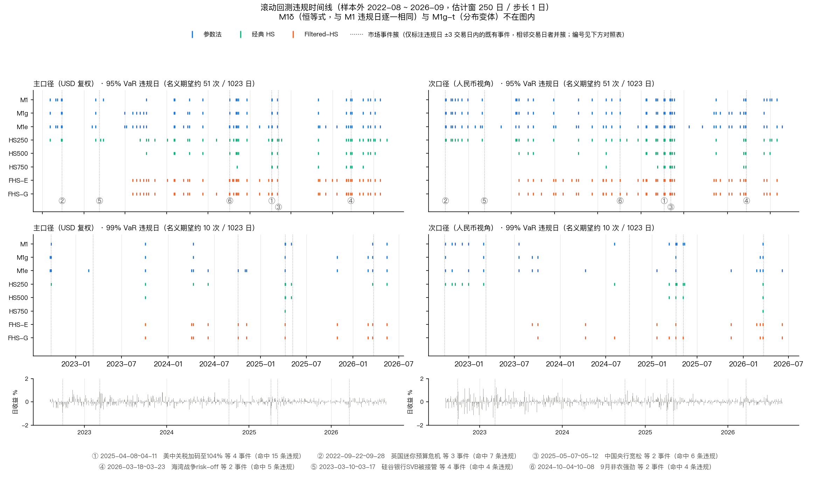
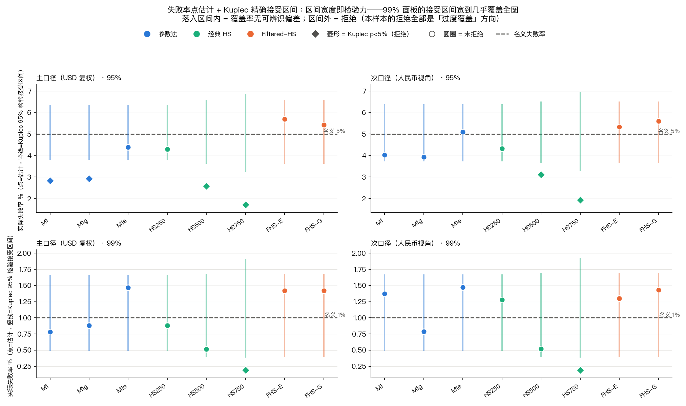
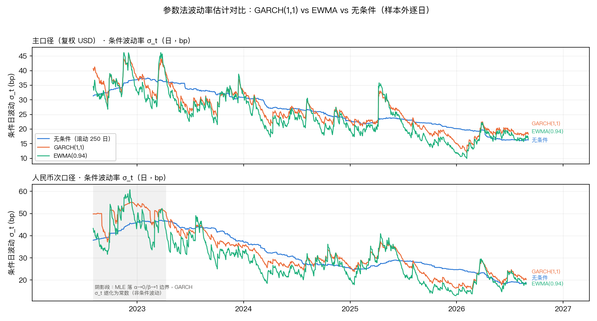

# 实习周报（第 2 周）

**项目**：中资投资级美元债市场风险计量与压力测试预研工具
**阶段**：第二阶段 · 风险计量模型开发与回测验证
**周期**：2026 年 9 月 14 日 — 9 月 18 日
**样本外区间**：2022-08-03 — 2026-09-04，共 1023 个交易日

---

## 一、本周工作概述

本周完成第二阶段的主体工作：为组合代理（华夏亚洲美元投资级债券 ETF，9141.HK）搭建日度 VaR 计量与回测验证框架。

具体分为四部分：一是按导师反馈把 VaR 输入从除权 NAV 切换到复权（总收益）口径，并增设人民币次口径；二是实现参数法与历史模拟法两类共 11 个模型变体，逐日产出样本外预测；三是搭建滚动回测框架，出具失败率、Kupiec LR_uc 与 Christoffersen LR_ind 三件套检验；四是针对检验结果做稳健性分析，形成模型适用性结论与第 3 阶段的参数交接清单。

本周的核心结论有两条。第一，VaR 在本样本上没有出现风险低估，被统计检验拒绝的配置全部是过度覆盖方向，即 VaR 系统性偏高。第二，条件化模型（GARCH、Filtered-HS）相较无条件模型未表现出可验证的改善。

---

## 二、本周主要工作内容

### 2.1 VaR 计量口径定稿与双口径输入构建

**工作背景**：阶段一交付的 VaR 输入是除权 NAV 日收益。导师在 9/14 指出两个问题：一是 9141.HK 为派息型 ETF，除息跳空被计入了日收益，会系统性高估波动率；二是汇率不应简单置零，否则第 3 阶段无法在统一的收益框架下做全维度压力测试。

**工作目标**：把 VaR 输入切换到复权（总收益）口径，同时构建美元主口径与人民币次口径两条序列；把口径决策写成文档固定下来，避免后续三个建模脚本各写各的。

**具体实施**：

1. 从基金公司官方派息公告整理 9141.HK 的除息记录，样本窗内共 20 期，逐期映射到主交易日历。复权收益按 `log[(nav_{t-1}·e^{r_t} + D_t) / nav_{t-1}]` 计算，`D_t` 仅在除息日非零。
2. 人民币次口径按对数相加构建：`etf_ret_rmb_pct = etf_ret_tr_pct + fx_ret_pct`。
3. 在复权收益上重做因子剥离（利率 Δ5Y/Δ10Y + 利差代理残差），重新估计组合因子暴露 δ。
4. 撰写《VaR 计量口径与回测协议》固定全部口径决策，后续每日在实验完成后回填。

**实际结果**：

**表 2-1 复权前后波动率与 VaR 对照**

| 指标 | 除权口径（调整前） | 复权口径（调整后） | 变化 |
|---|---:|---:|---:|
| σ 日 | 0.2849% | 0.2660% | −6.6% |
| σ 年化 | 4.522% | 4.223% | −6.6% |
| 1 日 95% VaR | 0.4686% | 0.4376% | −6.6% |
| 1 日 99% VaR | 0.6627% | 0.6189% | −6.6% |
| 复权收益恰为 0 的交易日占比 | 6.13% | 6.13% | 0 |

表 2-1 数据来源：`results/baseline_var_tr.csv`（9/14 产出）。表中显示，复权后 σ 与 VaR 均下降 6.6%，方向与「除息跳空高估波动」的预期一致。需要说明的是，这一差值应理解为两种口径下的实际差异，而非「被修正的误差量」——本周没有对复权方式本身设置对照实验。零收益日占比不变，说明复权过程没有引入新的数据缺口。

另外，复权后利率对组合收益的解释力有所提高：利率剥离 R² 从除权口径的 0.668 上升到 0.757，等效久期由 3.72 年微降至 3.70 年。原因是除息跳空与利率变动无关，属于噪声，将其从收益中剔除后，利率因子的解释力相应增强。

### 2.2 参数法 VaR 实现

**工作目标**：实现参数法族的多个变体，覆盖无条件与条件波动两类假设，并在双口径上并行产出。

**具体实施**：

| 变体 | 方法 |
|---|---|
| M1 | 滚动 250 交易日无条件 σ，正态分位 |
| M1g | GARCH(1,1) 扩展窗逐日重估，条件 σ_t |
| M1e | EWMA(λ=0.94) 条件 σ |
| M1δ | 因子协方差重构，σ_p = √(δ′Σ_wδ) |
| M1g-t | 对照项：t 似然估计 σ |

所有估计量严格遵守时序纪律：位置 t 的估计只能使用 t−1 及之前的信息，统一以 `.shift(1)` 收尾。

**实际结果**：产出 1023 行 × 29 列的逐日预测表。主口径样本外均值：M1 的 σ 为 0.2674%、99% VaR 为 0.6220%；GARCH 为 0.2643% / 0.6149%；EWMA 为 0.2441% / 0.5679%。数据来源：`results/var_parametric.csv`。

**过程中发现两个需要披露的问题**：

其一，M1δ 与 M1 的数值几乎完全一致（σ 最大差 4.4e-06）。追查后确认这是**代数恒等式**：由于利差代理因子被定义为同一次 OLS 回归的残差，任意窗口上都有 `δ′Σ_wδ ≡ var_w(r)`。因此 M1δ 不构成独立模型证据，其价值仅在于风险归因与压力情景映射。

其二，M1g-t 实测为 `garch_t_var / sig_garch_t ≡ 1.6449 / 2.3263`，即**用 t 似然估计 σ、但仍配正态分位**，并不是 t 分布 VaR。为保证已有产物的可复现性，未修改该模型，而是在结果表与报告中如实披露。

### 2.3 历史模拟法 VaR 实现

**工作目标**：实现不依赖分布假设的对照方法，并检验窗宽敏感性与滤波的有效性。

**具体实施**：经典 HS 采用三档窗宽（250/500/750）；Filtered-HS 采用两版滤波（EWMA 与 GARCH），做法是先用 `z = r/σ` 标准化、取窗内经验分位、再乘以当前 σ_t。

**一个主动放弃的方案**：曾考虑用「序列首日播种的 EWMA」把 FHS 补满 1023 天。实测发现首日种子 σ² = 0.00185，而前 250 日实际样本方差为 0.0983，相差 53 倍。这会使最初约 30 个 σ 被低估 5~7 倍，z 值相应虚高约 5 倍；而 1% 分位由窗内最差观测决定，这批虚高的 z 会滞留窗内直到 t≈450，导致 t=250 时的 1% z 分位达到 3.462（成熟滤波为 2.377），FHS99 被虚高约 85%。因此改用成熟种子，FHS 如实少 250 个预测日，不补齐。

需要记录的一点是，最初用于验证该方案的一个检查是无效的：「两种播种方式在第 250 日的 σ 差异仅 2.4e-08」并不能说明种子无害，因为分位数消费的是整段窗内的 z 值，而非当日 σ。

**实际结果**：产出 1023 行 × 26 列的预测表。HS250 平均 99% VaR 为 0.6125%，FHS-E 为 0.5174%，FHS-G 为 0.4979%。数据来源：`results/var_historical.csv`。

### 2.4 滚动回测框架与三件套检验

**工作目标**：回答两个问题——整体覆盖率是否准确（Kupiec LR_uc），以及违规是否聚集（Christoffersen LR_ind，按导师要求列为必做项）。

**具体实施**：

1. 滚动 250 交易日估计窗、步长 1 日、纯样本外；违规定义为 `r_t < −VaR_t`。
2. 为使三个脚本共用同一套判定，把违规判定下沉为公共模块 `var_common.py` 中的 `hit_series`，三天的工作全部调用同一定义。
3. 设置 7 种评估范围：各模型全样本、公共 773 日、公共 523 日、平稳段、高波动段、剔除存疑日两版。
4. 脚本内置硬断言，将前一天已登记的每个违规计数写死为期望值，不符即中断。
5. 同时输出平均 VaR、ES 与超损倍数（ES / 平均 VaR）。

**实际结果**：

**表 2-2 主口径回测结果与 Kupiec 检验（各模型全样本）**

| 模型 | 置信度 | 违规数 / 样本 | 失败率 | 期望违规 | Kupiec p 值 | 判定 |
|---|---|---:|---:|---:|---:|---|
| M1 | 95% | 29 / 1023 | 2.83% | 48.0 | 0.00057 | 拒绝 |
| M1g | 95% | 30 / 1023 | 2.93% | 48.0 | 0.00105 | 拒绝 |
| M1e | 95% | 45 / 1023 | 4.40% | 48.0 | 0.368 | 通过 |
| HS250 | 95% | 44 / 1023 | 4.30% | 48.0 | 0.294 | 通过 |
| HS500 | 95% | 20 / 773 | 2.59% | 36.1 | 0.00073 | 拒绝 |
| HS750 | 95% | 9 / 523 | 1.72% | 24.4 | 0.00008 | 拒绝 |
| FHS-E | 95% | 44 / 773 | 5.69% | 36.1 | 0.387 | 通过 |
| FHS-G | 95% | 42 / 773 | 5.43% | 36.1 | 0.559 | 通过 |
| M1 | 99% | 8 / 1023 | 0.78% | 9.6 | 0.466 | 通过 |
| HS250 | 99% | 9 / 1023 | 0.88% | 9.6 | 0.693 | 通过 |
| HS750 | 99% | 1 / 523 | 0.19% | 4.9 | 0.023 | 拒绝 |

表 2-2 数据来源：`results/backtest_results.csv`（9/17 产出），范围为 `scope = full`、`caliber = 主口径`。表中期望违规数为剔除零收益日后的口径——主口径样本外有 64/1023 日（6.26%）复权收益恰为 0，这些日子在数学上不可能构成违规，因此分母口径需要明确声明；若按全部交易日计，95% 的期望违规为 51.2 次。

表 2-2 的关键观察是：**全部被拒绝的配置，其违规数都远小于期望值**，即 VaR 系统性偏高、资本占用过多，而不是风险低估。这一现象集中在窗宽较宽、样本较短的配置上（HS750 最严重：523 天里只违规 9 次，期望 24.4 次），与「估计窗口陈旧导致 VaR 系统性过宽」的预期一致。

**图 2-1 违规时间线与市场事件标注**



图 2-1 数据来源：`results/backtest_exceptions.csv`（832 条违规记录）与 `events/risk_events_timeline.csv`。图中为 2×2 分面（口径 × 置信度），底部灰色柱为日收益，上方每一行是一个模型在该口径与置信度下的违规点位置，竖虚线标注数据驱动筛选出的市场事件窗口。

从图 2-1 可以看出，样本外 1023 个交易日中的违规并非均匀分布，而是集中在少数几个可解释的市场冲击窗口，其中以 2025 年 4 月的关税冲击序列最为密集（命中 15 条违规），其后依次为 2022 年 9 月英国迷你预算危机（7 条）、2025 年 5 月央行宽松（6 条）。同时可以观察到，历史模拟类模型（HS/FHS）在 95% 口径下的违规点明显多于参数法类模型，这与表 2-2 中 HS250 通过、M1/M1g 被拒绝的结论一致。

**图 2-2 覆盖率点估计与 Kupiec 精确接受区间**



图 2-2 数据来源：`results/backtest_results.csv` 的 `x`、`T`、`x_lo`、`x_hi` 四列。横轴为模型，纵轴为实际失败率；每个模型的圆点为点估计，竖线为 Kupiec 检验 95% 水平下的精确接受区间，横线为该置信度下的名义失败率。

图 2-2 中，竖线长度代表 Kupiec 检验的接受区间，区间越宽说明该口径下能检出偏差的能力越弱。可以清楚看到 99% 面板（下图）的接受区间宽度远大于 95% 面板（上图），这意味着 99% 置信度下的「未拒绝」是一个较弱的结论。落在名义线上方的模型属于过度覆盖（VaR 偏高），落在下方的才属于风险低估——本样本中不存在落在下方的模型。

### 2.5 稳健性分析与模型适用性结论

**工作目标**：避免把单点显著的检验结果误读为发现，并检验结论是否被个别异常日绑架。

**其一，检验水平的实测。** Christoffersen 检验的 LR_ind 统计量服从 χ²(1) 是渐近结果，而本样本 99% 置信度下期望违规仅约 10 次，近似是否可用需要验证而非假设。为此用蒙特卡洛方法（B=20000，固定随机种子）实测 χ²(1) 临界值对应的真实拒绝率：

**表 2-3 检验统计量的实际水平（名义水平 5%）**

| 样本量 N | 违规概率 p | LR_uc 实际水平 | LR_ind 实际水平 | 方向 |
|---:|---:|---:|---:|---|
| 1023 | 0.05 | 5.49% | 7.73% | 偏宽松 |
| 523 | 0.05 | 4.57% | 3.87% | 略保守 |
| 299（高波动段） | 0.05 | 6.39% | 2.16% | 保守 |
| 1023 | 0.01 | 1.68% | 1.56% | 保守 |
| 299（高波动段） | 0.01 | 1.40% | 1.29% | 保守 |

表 2-3 数据来源：`code/var_common.py` 的 `lr_null` / `lr_ind_null_conditional`，蒙特卡洛重复次数 B=20000，随机种子固定为 20260917。

表 2-3 说明，在本样本的样本量下，Christoffersen 检验的 χ²(1) 近似在 95% 口径下偏宽松（名义 5% 实际约 7~8%），在 99% 口径下偏保守（实际仅约 1.3~1.9%），且两个方向不一致，无法用统一的修正系数处理。这意味着 99% 口径下的「不显著」应理解为**检验能力不足的弱结论**，而不能读作「已证明不存在聚集」。为此结果表在 χ² p 值之外并列给出条件蒙特卡洛 p 值 `p_ind_mc_cond`，报告以后者为准。

**其二，多重比较的处理。** 全部检验共 262 次，其中主比较集为 32 次。在 5% 水平下纯随机也会期望出现约 13 次假阳性，因此单看某个 p 值小于 0.05 不构成证据。按三种家族定义分别设置 Bonferroni 门槛后：

**表 2-4 名义显著聚集在多重比较下的检验**

| 家族定义 | 检验次数 | Bonferroni 门槛 | 全局最小 p 值 | 结论 |
|---|---:|---:|---:|---|
| 主比较集（8 主模型 × 2 置信度 × 2 口径） | 32 | 0.00156 | 0.00735 | 不成立 |
| 含对照模型 | 38 | 0.00132 | 0.00735 | 不成立 |
| 全表 | 262 | 0.00019 | 0.00735 | 不成立 |

表 2-4 数据来源：`results/backtest_results.csv` 的 `p_ind_mc_cond` 列。

表 2-4 表明，全表 262 行中有 11 行 p 值小于 0.05，但这 11 行全部落在 95% 口径，其中 6 行是次口径 HS500 在六种高度重叠的评估范围下的重复出现（并非六次独立发现），其余 5 行是小样本段（违规数仅 2~6 次）。在任一多重比较口径下均不构成证据。本周结论为：**未发现稳健的违规聚集证据**。

**其三，存疑日敏感性。** 按「只标注不改数」的政策，仅从评估样本中剔除 16 条存疑日（VaR 与收益序列一字不动），做含/不含两版对照。结果是 15 个配置的违规计数发生变化（放宽剔除范围则为 24 个），但 **Kupiec 判定翻转数为 0**，即覆盖率结论对存疑日的处理方式不敏感。落在存疑清单上的 44 条违规记录中，dOAS 与 FX 两类本就不在剔除集内（判定对象是 ETF 收益）。

对每一条落入存疑清单的违规日做了 3141.HK（港币柜台）同向性核对：2025-03-24 同向（9141 为 −0.3426%，3141 为 −0.3454%，且 5Y/10Y 各上行 9bp），属真实市场波动；2025-01-21 同向，且主口径当日为正收益 +0.2349%，违规仅存在于人民币口径（−0.5009%，其中汇率贡献 −0.7358%），是纯汇率折算损失；另有两条不同向，已标注并按「结论不以个别存疑日为准」处理。

**其四，极端日模型反应。** 取 6 个最差 |r| 交易日，读取每个模型当日 VaR 在其自身前 250 日 VaR 分布中的分位。结果显示其中两日（2025-04-07、2023-10-03）的低分位是**跳变点效应的机械结果**——大额亏损在次日才进入估计窗口，因此这两日不能读作「模型没有反应」。唯一干净的一日（2023-02-21）上，M1 已升至 68 分位（提前抬升），而 M1g 反降至 2 分位、M1e 降至 1 分位并在 99% 上违规，即条件化模型当日反而把 VaR 压低了。样本仅一日，只作现象记录，不足以下结论。

**图 2-3 GARCH 条件波动率与边界解分布**



图 2-3 数据来源：`results/garch_refit_trace_main.csv` 与 `results/garch_refit_trace_rmb.csv`。图中为双口径分面，实线为 GARCH(1,1) 逐日重估的条件 σ_t，虚线为 EWMA(λ=0.94)，点线为滚动 250 日无条件 σ；阴影区标注落入参数边界的重估段。

从图 2-3 可以看出，主口径 GARCH 估计全程落在内点，条件波动率随市场变化明显；而人民币口径在 2022 年 8 月至 2023 年 4 月期间有 133 次重估落到 α→0、β→1 的边界，此时 σ_t 退化为常数，等于无条件波动率，GARCH 失去条件化作用。因此该段不得作为「GARCH 条件化有效」的证据。

---

## 三、关键技术实现

### 3.1 公共机制层的抽取与数值等价验证

本项目的一个具体风险是：同一个概念（「什么叫一次违规」）在三个建模脚本里都要出现。如果各写一份，即使每份单独看都正确，也可能出现判定不一致，导致最终结论无法归因。

为此把 σ 估计器、历史模拟分位、违规判定抽成公共模块 `var_common.py`，三个脚本统一 import。改造参数法脚本后重跑，四个产物 CSV 的 md5 逐字节不变，以数值等价的方式确认了重构没有改变任何结果。

**代码 3-1：单一违规定义点**

```python
def hit_series(ret, var):
    """逐日违规指示：`r_t < -VaR_t` → True。任一侧 NaN 记 NaN，不填补。"""
    d = pd.concat([ret.rename("r"), var.rename("v")], axis=1).dropna()
    return (d["r"] < -d["v"]).rename("hit")

def count_violations(ret, var):
    """返回 (违规数, 有效日数, 失败率%)。"""
    h = hit_series(ret, var)          # 委托，不重复实现
    n, x = int(len(h)), int(h.sum())
    return x, n, (x / n * 100.0 if n else float("nan"))
```

代码 3-1 的作用是把「违规」的定义收敛到一个函数。这样做的直接效果是：自 9/15 至 9/17 三天，跨脚本的违规计数没有出现任何分叉。

### 3.2 条件蒙特卡洛有限样本 p 值

由于 Christoffersen LR_ind 的 χ²(1) 近似在本样本下水平失真且方向不一致，无法用统一的修正系数处理。解决方案是按观测到的违规次数生成条件零分布：

**代码 3-2：条件蒙特卡洛 p 值**

```python
def lr_ind_null_conditional(n, x, p=float("nan"), B=20000, seed=20260917):
    """按【观测到的违规数 x】生成 Bernoulli(x/N) 序列，
    取 LR_ind >= 观测值的比例。条件于实际发生的违规数，
    回答「给定违规了 x 次，这些违规是否异常地扎堆」。"""
    rng = np.random.default_rng(seed)         # 固定种子，不污染全局随机状态
    hits = rng.random((B, n)) < (x / n)       # 一次生成 B×n 矩阵（向量化）
    lr_null_vals, _ = _lr_vec(hits)
    observed, _ = christoffersen_from_counts(*transition_counts(hits_observed))
    return float((lr_null_vals >= observed).mean())
```

代码 3-2 的关键点是**条件化**——零分布按实际发生的违规次数生成，而非按名义概率。这样得到的是「在本样本的实际违规数下，这些违规是否异常扎堆」，正是 Christoffersen 检验要回答的问题，但在有限样本下比渐近近似更可靠。固定随机种子保证了 20000 次模拟的结果完全可复现。

值得记录的是，条件蒙特卡洛 p 值并非单调放大 p 值：当观测违规数低于期望时（本样本多处如此），它反而给出更小的 p 值。

### 3.3 跨日口径分叉的防线

回测脚本内置硬断言，把前一日已登记的违规计数写死为期望值：

**代码 3-3：回测验收断言**

```python
# 已登记的违规计数写死为期望值，不符即中断——
# 这是防止预览口径与正式回测口径分叉的主要防线。
assert R["M1|主|95|full"].x == 29
assert R["HS250|主|95|full"].x == 44
assert R["FHS-E|主|95|common773"].x == 44
assert R["HS750|主|99|full"].x == 1
```

代码 3-3 解决的是这样一类问题：如果判定口径因任何原因（缺列、NaN 处理变化、排序差异）发生改变，计数会变化，但**变化本身不会报错**，脚本会安静地产出一份看起来正常、实际与前一日不可比的结果。硬断言把这类静默失效变成了显式失败。

---

## 四、遇到的问题与解决

### 问题一：Filtered-HS 的分位数被错误的波动率种子污染

**问题现象**：为让 FHS 覆盖完整样本，拟用「序列首日播种的 EWMA」补出前 250 天的 σ。初查 σ_t 水平时，两种播种方式在第 250 日的差异仅 2.4e-08，看起来无害。

**原因分析**：该检查针对的量是错的。分位数消费的是整段窗口内的标准化残差 z，而非当日 σ。首日种子 σ² = 0.00185 与前 250 日实际方差 0.0983 相差 53 倍，导致最初约 30 个 σ 被低估 5~7 倍，对应的 z 值虚高约 5 倍。由于 1% 分位由窗内最差观测决定，这批虚高的 z 会滞留窗内直到 t≈450。

**解决过程**：在发现 σ 序列「一致」之后，转而比对 z 序列，发现前 20 日 max|z| 为 5.64（典型值 3.2~4.2），进而直接计算两种方式下的经验分位路径。实测 t=250 时的 1% z 分位为 3.462（成熟滤波为 2.377），FHS99 会被虚高约 85%。最终改用成熟种子，FHS 少 250 个预测日，如实记档不补齐。该量化过程已写入 `var_historical.py` 的模块注释。

### 问题二：预注册结论被实验证伪

**问题现象**：协议文档中事前写明「16 条存疑日在复权口径下不进任何窗口的尾部 1%，故含/不含两版结果相同」。实际执行两版后，15 个配置的违规计数发生变化。

**原因分析**：原推理存在缺口。存疑日不进窗内尾部 1%，推不出「不构成违规」，因为 95% 口径的尾部宽达 5%。以 2025-03-24 为例，该日在 250 日窗口内升序排第 11/250（约 4.4 分位），进入了 95% 尾部但未进入 99% 尾部，因此仅在 95% 口径下构成违规。

**解决过程**：协议中已写明「仍按规则执行两版并记录」，因此实际执行了两版而非以推断代替。发现不一致后逐条对账：列出 15 个变化的配置、44 条落在存疑日上的违规记录，并对每一条做 3141.HK 同向性核对与事件邻近性检查。按仓库惯例，保留原预注册表述不改写，就地标注实测结果。

### 问题三：唯一的显著结果经不起多重比较

**问题现象**：全部配置跑完后，次口径 HS500 在 95% 下的独立性检验 p 值为 0.0134，是全部配置中唯一名义显著者。

**原因分析**：本周共执行 262 次检验，在 5% 水平下纯随机也会期望出现约 13 次假阳性。直接采信单个 p 值等于把假阳性当作发现。

**解决过程**：统计全表 p 值小于 0.05 的行数（共 11 行），检查其分布后发现次口径 HS500 在六种评估范围下重复出现，且其转移计数 n11 仅为 3。按三种家族定义分别设置 Bonferroni 门槛后，全局最小 p 值 0.00735 在任一门槛下均不成立。结论已从「发现聚集」修正为「未发现稳健的违规聚集证据」，并在报告中显式写明检验次数、Bonferroni 门槛，以及六种评估范围高度重叠、并非六次独立发现。

### 问题四：报告中的 R² 引用了错误口径

**问题现象**：撰写周报时引用了「利率剥离 R² = 0.668、等效久期 3.72 年」，这两个数字来自阶段一交付文档。

**原因分析**：该数字是除权口径下的结果，而本周正式输入已切换为复权口径，δ 也是在复权收益上重新估计的。

**解决过程**：在逐条核对引用来源时发现该不一致（δ 表来自复权估计，而 0.668 来自除权估计）。重新执行复权口径回归得到 R² = 0.757、等效久期 3.70 年，并在周报中使用该数值。该修正同时带来一个正面发现——复权后利率解释力由 0.668 提升至 0.757，原因是除息跳空与利率无关，属于噪声。

---

## 五、目前存在的问题

1. **99% 口径整体检验能力不足**。实测 Christoffersen 检验在 99% 下的实际水平仅为 1.3~1.9%，「未拒绝」不等于「无聚集」。需要更长样本或改用加权、平滑型检验才能提高分辨力。
2. **人民币口径 GARCH 存在边界解**。样本窗内共 133/1268 次重估落到 α→0、β→1，集中于 2022-08 至 2023-04（人民币贬值高波动段），该段 σ_t 退化为常数。该段不得作为条件化模型优势的证据。
3. **高波动段样本偏小**。分段后高波动段对 M1/HS250 为 299 天，对 HS500/FHS 仅 88 天，99% 下期望违规约 3 次，分段结果只作描述性对比。此外分段标志采用含当日的 60 日滚动波动率，属事后同期标记，不是事前可知信号。
4. **急性危机窗落在估计窗内**。登记的危机窗（2022-06-06 ~ 06-22）整体位于估计窗内，样本外命中 0 天，因此未建立危机段检验表。
5. **CNY/USD 尾 5 交易日数据源未发布**。人民币口径有效样本为 1018 日，短于主口径的 1023 日，两个口径的横向比较须使用公共样本。
6. **2025-04-10 的 NAV 疑似陈旧报价**，复权收益恰为 0.0000% 而人民币口径为 −0.4896%，已随存疑机制记录，本次未作为归因对象。

---

## 六、本周成果总结

**完成的工作**：

- VaR 输入口径切换至复权（总收益），并增设人民币次口径
- 参数法 5 个变体与历史模拟法 6 个变体的实现与逐日样本外预测
- 滚动回测框架与失败率、Kupiec、Christoffersen 三件套检验
- 检验水平实测、多重比较、存疑日敏感性、极端日反应、事件簇等稳健性分析

**形成的成果**：

- 3 个建模脚本加 1 个公共机制模块，可从 `factors/factor_table_nav_tr.csv` 一键重跑
- 12 个产物 CSV，全链重跑 md5 逐字节一致
- 262 行检验长表、832 行违规判定表、15 张图
- 《模型验证分析报告》《VaR 计量口径与回测协议》与本周周报

**技术上的收获**：

- 渐近统计检验在小样本下的实际水平需要实测，「不显著」有「没有证据」和「没有能力找证据」两种完全不同的含义
- 执行了大量检验之后，单个 p 值不再构成证据，必须同时给出检验次数与对应的显著门槛
- 预注册的价值在于「错了也不改」，发现结论与预期不符时应保留原文并就地标注

**下一步计划**：

第 3 周进入压力测试框架构建。具体计划：

1. 从 `events/risk_events_timeline.csv`（85 条）中，优先选取本周回测中命中最多的三个事件簇（2025-04 关税冲击、2022-09 英国迷你预算危机、2023-03 硅谷银行事件）构建历史情景，提取各因子在该窗口内的实际波动幅度。
2. 用本周产出的因子暴露 δ（Δ5Y 为 −0.007714、Δ10Y 为 −0.029303、利差代理为 1.0、汇率主口径 0 / 次口径 +1）将因子冲击映射为组合损失，并与本周的 VaR / ES 基线对照，检验情景损失是否落在合理的尾部位置。
3. 针对人民币口径单独设计汇率情景——本周归因显示汇率贡献了次口径 44.2% 的方差，是压力测试中不能遗漏的一类风险。
4. 补充假设情景，重点检验利率与信用利差同时恶化的情形。
