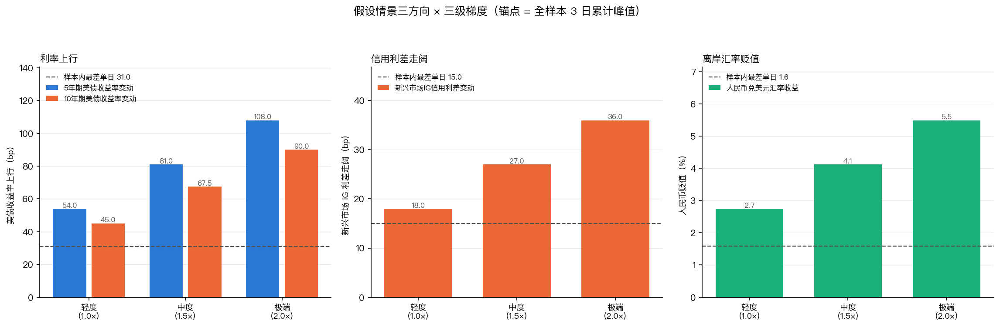

# 实习周报（第 3 周）

**项目**：中资投资级美元债市场风险计量与压力测试预研工具
**阶段**：第三阶段 · 压力测试框架构建与测算分析
**周期**：2026 年 9 月 21 日 — 9 月 25 日
**组合代理**：华夏亚洲美元投资级债券 ETF（9141.HK）
**数据区间**：2021-08 起（因子表），压力测算参照分布为 2022-08-03 — 2026-09-04

> **本版为 1 日持有期重做版。** 本版在「9 月反馈修订版」基础上，按老师指示把主情景库的持有期统一到 1 日并重做全库：假设情景锚点由全样本滚动 3 日累计极值改为**单日极值**；历史与补充情景的基准损失改用**窗内最差单日**，窗内最大回撤降为同行伴随列（原「9 月反馈修订版」以窗内最大回撤为基准）；判定阈值与偏差缓冲同步降到 1 日档；信用区间上端的 2022 残差标定量改用 1 日值；多期（3 / 5 / 6 日）结果移入附录「多期近似」并标注不参与判定。原版的三处变更——信用路径**双口径输出区间**、其上端由 2022 年未解释残差极值标定、**√t 缩放参考值**——在本版中继续保留。全部变更对结论的影响已逐处标注；其中**三条已发布结论被本轮重做翻转**，逐条记于 §五 第 12 条。

---

## 一、本周工作概述

本周完成第三阶段的主体工作：为组合代理搭建压力测试框架，构建压力情景库并完成测算分析。

具体分为五部分：一是构建压力情景库，含 3 个历史情景、2 个补充情景与 10 个假设情景；二是为利率、信用、汇率三类冲击分别建立到组合损失的映射路径，三条路径不共用同一套系数；三是完成潜在损失与最大回撤测算，并以 1 日 99% 期望损失为判定线识别尾部风险点；四是做因子贡献度分解，把无法归因的部分单列为残差；五是做五项稳健性检验，并据此把结论分成「稳健」与「不稳健」两档。最终形成需求文档要求的两项交付物：《压力情景库》与《压力测试分析报告》。在收到 9 月反馈后，本周另按反馈完成三项口径修订；此后按老师指示把主情景库的持有期统一到 1 日，重做全库并重跑全部测算。因此**本报告的全部损失读数、判定阈值与结论均为 1 日持有期口径**。

本周的核心结论有五条，**全部按 1 日持有期口径给出**（重做理由与来源见 §五 第 11 条）。

第一，库内最深损失来自假设情景的极端梯度，而非历史情景——最深为离岸人民币贬值极端档在人民币口径下的 3.1708%，主口径最深为利率与信用组合档的 2.5363%；历史情景最深为 X2 的窗内最差单日 1.0349%（伴随列窗内最大回撤 2.9562%）。

第二，美元主口径与人民币次口径的尾部主源不同：主口径是利率（组合档极端 2.5363%），次口径是汇率（极端档 3.1708%）。该结论与重做前一致，不随持有期口径改变。

第三，信用利差三个方向的传导区间，**在平静样本口径下与纳入 2022 年残差标定后，两端均已触及 1 日 99% 期望损失**。这一点与上一版的结论相反：上一版为「平静样本端加缓冲后 1.2743% 仍未触及阈值 1.6274%，只有纳入外推风险后才越过」，即结论依赖是否计入外推假设；1 日口径下两条路径都越过（0.8528% 与 1.6310%，阈值降为 0.6659%），**口径依赖消失**。须同时说明：这不代表信用维度变得更危险，而是判定阈值随持有期同步下降、缓冲相对阈值的杠杆相应放大（详见 §2.4 与 §五 第 12 条）。信用维度整体仍标注为**参考项**——项目核心的验证维度是利率与汇率，且 2022 年残差受制于数据缺失只能作代理量。

第四，覆盖度结论按期限分层：**1 日主口径的库级覆盖成立**（库内最深 2.5363% / 3.1708%，均高于样本内实测最差单日 1.3449% / 1.4739%）；而上一版报告的 5 日主口径 0.5330 个百分点、6 日主口径 1.5261 个百分点缺口，是拿 3 日锚点的情景去比 5/6 日历史分布，**1 日重做后情景侧已无对应期限的量，该比较不再成立**，已移入附录并标注为不同量纲、不构成覆盖度结论。此处仅陈述事实，不主张缺口「已修补」或「已消失」。

第五，五项稳健性检验中，两项支持「稳健」、三项要求带条件引用，与上一版的比例相同但成员有变。相对稳健的两项是：**1 日口径下的库级覆盖成立**，以及**历史情景的损失比多期口径更抗窗口平移**（十个「情景 × 口径」组合中有三个读数在 ±2 日平移下完全不动——H1 双口径与 H2 主口径）。必须带条件引用的三项是：**假设情景的绝对水平**高度依赖锚点窗长（极端档极差：利率 1.8262pp、汇率 3.9580pp），**历史情景的个别读数**仍会随窗口移动（H3 主口径极差 0.5766pp），以及**尾部判定名单的边际成员**——超限条数随缓冲档位由 17 条升至 23 条，与上一版「名单不随缓冲改变」的结论相反（详见 §2.6）。其中缓冲敏感性这一条是本轮最需要提示使用者的：判定名单对缓冲的档位选择敏感，故应以「相当于几倍 99% 期望损失」的连续读数为准，不宜只看命中的条数。

---

## 二、本周主要工作内容

### 2.1 压力情景库构建

**工作背景**：需求文档第四章第三阶段要求，历史情景取 3 次典型冲击并提取风险因子的最大波动幅度；假设情景按三类冲击方向、每类轻度/中度/极端三个梯度设置，幅度取历史极端值的 1、1.5、2 倍。

**工作目标**：把上述要求落成一份可复用的情景库长表，每个情景的因子冲击、幅度测度、数据来源与可得性边界都落盘，供后续测算直接消费。

**具体实施**：

1. 历史情景从 `events/risk_events_timeline.csv`（85 条事件）中筛选，选取标准为「对组合三类因子均有实际冲击、且事件本身有公开记录可查」，最终取 2022 年美联储快速加息、2023 年美国银行业风波、2025 年关税冲击三段。
2. 每个历史情景同时给出六种幅度测度：**单日极值**、3 日累计峰值、窗内累计、窗内实现（即组合实际收益）、**窗内最差单日**、窗内最大回撤。之所以并列给出，是因为「最大波动幅度」在需求文档中未指定测度口径，单一测度容易被误读；其中单日极值用于假设情景的锚点，窗内最差单日用于历史情景的损失基准，3 日峰值保留作附录对照。
3. 假设情景的锚点取**历史单日极值**（1 日持有期口径，与阶段二 VaR 对齐）：利率取 5 年期美债单日峰值 **+31bp**（2022-06-13，同向极值）、10 年期 **+28bp**（同日）；信用取新兴市场投资级公司债利差单日峰值 **+15bp**（2023-12-13）；汇率取人民币兑美元单日贬值 **1.5854%**（2022-11-14）。三梯度按 1、1.5、2 倍线性放大。重做前的 3 日口径锚点为 +54bp / +45bp / +18bp / 2.7459%，该组读数现以 `peak_3d` 行（15 行）保留在 `results/stress_scenarios.csv` 中，仅作对照、不参与任何判定。
4. 另设一个组合档 S10，把利率极端档与信用极端档同时施加，用于回答需求文档中「利率与信用同时恶化」的情形。

**实际结果**：

**表 3-1 压力情景库构成**

| 类别 | 编号 | 情景 | 因子冲击（历史=窗内累计；假设=单日锚点 × 倍率） |
|---|---|---|---|
| 历史 | H1 | 2022 美联储快速加息（2022-06-09 ~ 06-16） | Δ5Y +32bp、Δ10Y +25bp、汇率 +0.3063% |
| 历史 | H2 | 2023 美国银行业风波（2023-03-10 ~ 03-17） | Δ5Y −78bp、Δ10Y −54bp、汇率 −1.0975% |
| 历史 | H3 | 2025 关税冲击（2025-04-07 ~ 04-11） | Δ5Y +43bp、Δ10Y +47bp、ΔOAS +3bp |
| 补充 | X1 | 2022 离岸人民币贬值（2022-11-29 ~ 12-05） | Δ5Y −8bp、Δ10Y −9bp、汇率 −3.4785% |
| 补充 | X2 | 2022 俄乌与加息周期开启（2022-03-08 ~ 03-15） | Δ5Y +39bp、Δ10Y +37bp、汇率 +0.7912% |
| 假设 | S01–S03 | 利率上行 · 轻/中/极端 | Δ5Y +31 / +46.5 / +62bp，Δ10Y +28 / +42 / +56bp |
| 假设 | S04–S06 | 信用利差走阔 · 轻/中/极端 | ΔOAS +15 / +22.5 / +30bp |
| 假设 | S07–S09 | 离岸汇率贬值 · 轻/中/极端 | 汇率 −1.5854% / −2.3781% / −3.1708% |
| 假设 | S10 | 利率+信用同时恶化 · 极端 | Δ5Y +62bp、Δ10Y +56bp、ΔOAS +30bp |

表 3-1 数据来源：`results/stress_scenarios.csv`（**112 行 × 15 列**，15 个情景；9/21 产出，9/24 补入 X2，本次 1 日重做后由 87 行增至 112 行）。行数增加来自两个测度：假设情景新增 `peak_1d`（15 行，1 日锚点，供 `results/stress_impact.csv` 消费）与 `peak_3d` 保留为附录对照（15 行）；历史与补充情景新增 `worst_day`（10 行，1 日损失基准）。X1 与 X2 为补充情景，加入理由见 §2.7。

表 3-1 的读法须注意假设情景一行的口径：**倍率是线性施加在单日锚点上的**，故中度档为 1.5 倍、极端档为 2 倍，数值即为锚点的等比例放大（如 ΔOAS +15 → +22.5 → +30bp）。历史情景一行给出的是窗内累计冲击，与假设情景的单日锚点**不是同一测度**——这正是需要并列六种测度的原因。

两个需要说明的构造选择。其一，**H2 的方向与其他情景相反**：2023 年美国银行业风波中，5 年期美债收益率累计下行 78bp，组合主口径实际收益为正 1.9981%，即该情景对本组合是收益而非损失。这是真实结果，已照实记录，未做符号翻转充作损失。其二，**汇率不叠加到利率与信用情景上**，因为汇率冲击在这三条路径中是独立的一维，叠加会制造一个历史上未同时出现的组合；汇率情景单独设三档，供人民币次口径使用。

**图 3-1 情景库三方向幅度：历史实际与假设三梯度**



图 3-1 数据来源：`results/stress_scenarios.csv`。图中为三类方向的分面，柱为假设情景的三个梯度，横线为对应的历史实际极值（即 1 倍锚点），点线为样本内史上最差单日参照。

图 3-1 显示，假设情景的极端档（2 倍）明显超出历史实际极值，这是需求文档「历史极端值的 2 倍」的直接体现，属于外推档而非对已发生事件的复述。图中也可见信用方向的三个梯度绝对值远小于利率与汇率方向——这不代表信用风险小，而是利差本身的波动幅度就以十几个基点计。

### 2.2 三条映射路径的建立

**工作背景**：阶段二的验证结论指出，现行因子暴露 δ 的信用项是利率双因子回归的残差本身、系数按构造恒为 1，属于代数恒等式。用这一项做信用情景的传导，等于用残差解释残差，会得到虚假的零偏差。

**工作目标**：为三类冲击分别建立可解释、边界明确的传导路径，且不共用同一套系数。

**具体实施**：

1. **利率路径**沿用阶段二定案的基准 δ（`results/factor_exposure.csv`）：Δ5Y 为 −0.007714 %/bp、Δ10Y 为 −0.029303 %/bp，等效久期 3.70 年。该路径在阶段二已验证偏差不随冲击幅度恶化，可作外推。
2. **信用路径**另建 M3 模型，以 ΔOAS 为解释变量重新估计，得到 δ(ΔOAS) = −0.013902 %/bp，95% 置信区间 [−0.017208, −0.010596]，R² 0.8087，样本量 749（2023-09-06 ~ 2026-09-03）。**该系数以区间出具**，因为其估计样本不含 2022 年的信用冲击。本次修订后，该区间按两条口径并列披露：**口径①**为平静样本自身的 95% 置信区间；**口径②**保留①的下端，上端改由 2022 年未解释残差极值标定。**信用维度整体标注为参考项**——项目核心的验证维度是利率与汇率，信用作敏感性参考（理由见 §2.4 信用区间小节）。
3. **汇率路径**是口径搬运，不是估计：美元主口径下组合不含汇率项，系数恒为 0；人民币次口径下汇率完全暴露，系数恒为 +1。阶段二已验证该路径的逐值差为 0.000e+00，不存在估计误差，因此**不需要偏差缓冲**。

**实际结果**：

**表 3-2 三条映射路径的系数与可外推边界**

| 路径 | 系数 | 单位 | 来源 | 可外推边界 |
|---|---|---|---|---|
| 利率 | Δ5Y −0.007714、Δ10Y −0.029303 | % / bp | `factor_exposure.csv`（阶段二基准 δ） | 偏差不随幅度恶化，可外推 |
| 信用 | δ(ΔOAS) −0.013902，95% CI [−0.017208, −0.010596]（口径①）；口径②上端另由 2022 残差标定 | % / bp | 本周新建 M3（R² 0.8087，n = 749） | **仅 2023-09 之后**，不含 2022 信用冲击；OAS 为代理序列；**参考项** |
| 汇率 | 主口径 0；次口径 +1 | % / % | 口径定义 | 恒等式，无估计误差 |

表 3-2 数据来源：`code/stress_impact.py` 运行输出与 `results/stress_impact.csv` 的 `credit_range_lo_pct` / `credit_range_hi_pct` 两列。表中信用的区间宽度约为点估计的 ±24%，这一宽度不是估计噪声，而是「换一个置信水平下界会得到不同结论」的提示。

**图 3-2 三条传导路径**


图 3-2 数据来源：`results/stress_impact.csv`。图中分面展示利率沿用 δ、信用给 95% 区间、汇率口径搬移三条路径，信用面板的阴影带为区间宽度。

图 3-2 中信用的区间带是**等宽**的，这一点需要说明：它反映的是系数估计的置信区间，而非冲击幅度变化下的传导不确定性。因此该带无法覆盖「换一个信用环境后系数本身会变」的外推风险——这正是把信用结论限定在 2023-09 之后的原因。

### 2.3 潜在损失与最大回撤测算

**工作目标**：按需求文档要求，对每个情景给出潜在损失与最大回撤，并说明损失相对于 VaR 基线的位置。

**具体实施**：

1. **历史与补充情景取窗内实际路径**（组合的真实收益序列），**假设情景走 δ 映射路径**。两者的损失口径不同，在表中分列，不混算。
2. **最大回撤以事件前一个交易日的净值为起点**（NAV = 1.0）。若从窗口首日起算，会漏掉「事件首日即大跌」这一情形下的回撤深度。
3. 损失以对数收益直接求和得出。阶段一已确认主口径、次口径与汇率三者的对数收益满足可加性（`max|rmb − tr − fx| < 1e-9`），因此累计收益等于逐日收益之和。
4. **亏损侧偏差缓冲 0.3365 个百分点**，取自阶段二 `results/delta_transmission_summary.csv` 中 M2 × 主口径 × **1 日** × 事件前 δ 的 90 分位绝对偏差（重做前为 3 日档 0.6548）。该缓冲**只施加于假设情景**：历史情景的损失是已发生的实现值，不含 δ 估算误差，给它加缓冲等于对已知结果重复计一次模型误差。施加上按情景一次，不按路径累加。
5. **历史与补充情景的损失读数取「窗内最差单日」，不取窗内累计、也不取窗内最大回撤**（本次 1 日重做）。事件窗仍定义情景，但损失读数须与 1 日持有期同口径。窗内最大回撤按需求文档要求保留为伴随列 `mdd_pct`，窗内累计保留为伴随列 `loss_realized_pct`（用于判断方向性质与计算残差）。
6. **符号约定**：本表全部损失类列一律**正值 = 损失、负值 = 收益**，`loss_realized_pct`（窗内累计）也不例外——H1 的 +1.5368 是损失，H2 的 −1.9981 与 X1 的 −1.4370 是收益，情景的方向性质由**符号本身**表达，不再为该列另设一套约定。重做前 `mdd_pct` 以负值落库，是历史遗留，本次已在写入处取负统一。

**实际结果**：

**表 3-3 情景损失与最大回撤（1 日口径）**

| 情景 | 类别 | 事件窗日数 | 主口径损失读数 | 次口径损失读数 | 主口径窗内最差单日 | 主口径窗内最大回撤 | 主口径窗内累计 | 次口径窗内累计 |
|---|---|---|---|---|---|---|---|---|
| S09 汇率贬值·极端 | 假设 | 1 日 | 0.0000% | **3.1708%** | — | 0.0000% | 0.0000% | 3.1708% |
| S10 利率+信用·极端 | 假设 | 1 日 | **2.5363%** | **2.5363%** | — | 2.5044% | 2.5363% | 2.5363% |
| S08 汇率贬值·中度 | 假设 | 1 日 | 0.0000% | **2.3781%** | — | 0.0000% | 0.0000% | 2.3781% |
| S03 利率上行·极端 | 假设 | 1 日 | **2.1193%** | **2.1193%** | — | 2.0970% | 2.1193% | 2.1193% |
| S02 利率上行·中度 | 假设 | 1 日 | **1.5895%** | **1.5895%** | — | 1.5769% | 1.5895% | 1.5895% |
| S07 汇率贬值·轻度 | 假设 | 1 日 | 0.0000% | **1.5854%** | — | 0.0000% | 0.0000% | 1.5854% |
| X1 人民币贬值 | 补充 | 5 日 | 0.3084% | **1.1382%** | 0.3084%（12-05） | 0.3079% | −1.4370% | 2.0415% |
| S01 利率上行·轻度 | 假设 | 1 日 | **1.0596%** | **1.0596%** | — | 1.0540% | 1.0596% | 1.0596% |
| H1 2022 快速加息 | 历史 | 6 日 | **1.3449%** | 0.8019% | 1.3449%（06-13） | 2.6784% | 1.5368% | 1.2305% |
| H3 2025 关税冲击 | 历史 | 5 日 | **1.1491%** | 0.7680% | 1.1491%（04-07） | 2.2636% | 2.2896% | 2.1359% |
| X2 俄乌叠加加息 | 补充 | 6 日 | **1.0349%** | 0.6388% | 1.0349%（03-14） | 2.9562% | 3.0008% | 2.2096% |
| H2 2023 银行业风波 | 历史 | 6 日 | **0.5620%** | 0.5576% | 0.5620%（03-14） | 0.5604% | −1.9981% | −0.9006% |
| S06 信用走阔·极端 | 假设 | 1 日 | **0.4171%** | **0.4171%** | — | 0.4162% | 0.4171% | 0.4171% |
| S05 信用走阔·中度 | 假设 | 1 日 | 0.3128% | 0.3128% | — | 0.3123% | 0.3128% | 0.3128% |
| S04 信用走阔·轻度 | 假设 | 1 日 | 0.2085% | 0.2085% | — | 0.2083% | 0.2085% | 0.2085% |

表 3-3 数据来源：`results/stress_impact.csv`（30 行 × 38 列，每情景 × 双口径一行）。**「损失读数」一列的口径按情景类别分两种**：假设情景为「δ 映射的 1 日损失 + 亏损侧偏差缓冲」，历史与补充情景为「**窗内最差单日**」（不含缓冲）。假设情景的「窗内最差单日」列为「—」，因为其路径只有锚点日一天，该列与损失读数恒等、不含额外信息。**「事件窗日数」列取自 `event_window_days`，是定义情景用的窗口长度，不是损失读数的持有期**——全表损失读数的持有期一律为 1 日（`horizon_days` 全表恒为 1），历史与补充情景的 5 ~ 6 日仅表示其事件窗跨度，窗内累计与窗内最大回撤两列按该窗长计算。

表 3-3 的读法有四点。其一，主口径的「0.0000%」仅出现在纯汇率情景上，是口径事实：美元计价组合在美元本位下不含汇率项。其二，**历史情景的损失读数与最大回撤是两把不同的尺子**：H1 的窗内最差单日 1.3449% 明显小于其窗内最大回撤 2.6784%，因为该窗口先深跌后反弹，单日最深的一天并非净值最低的一天；反过来 H2 主口径 0.5620% 略大于回撤 0.5604%，这不是矛盾，而是**对数收益与净值回撤的换算差**（`1 − exp(−0.5620%) = 0.5604%`，两者在该位上恒等）。其三，**窗内累计一列与损失读数一列在 H2、X1 上方向相反**：两者窗内累计皆为收益，损失读数却都是正数。这不是矛盾，而是两个口径回答两个问题——窗内累计答「持有整窗的净结果」，窗内最差单日答「期间最深的一天跌了多少」。其四，假设情景的最大回撤是**退化值**：1 日锚点路径只有一天，`回撤 ≡ 1 − exp(损失)`，与损失是同一信息的单调换形，该列仍按需求文档要求落库，但在 `mdd_note` 列显式标注为退化、不参与严重度解读。

其中 **X1 的双口径分化值得单独说明**：同一段 2022 年 11 月末的人民币贬值行情，美元主口径下组合窗内累计收益为正 1.4370%，人民币次口径下为损失 2.0415%。美元资产本身上涨，但人民币贬值的折算效应超过了资产涨幅；两个视角都是真实的。在 1 日口径下，主口径的最差单日为 0.3084%（12-05）、次口径为 1.1382%（同日）。

**表 3-4 三个损失口径的对照（主口径，仅历史与补充情景）**

| 情景 | 窗内累计 | 窗内最差单日（1 日基准） | 窗内最大回撤（伴随） |
|---|---|---|---|
| H1 2022 快速加息 | 1.5368% | 1.3449% | 2.6784% |
| H3 2025 关税冲击 | 2.2896% | 1.1491% | 2.2636% |
| X2 俄乌叠加加息 | 3.0008% | 1.0349% | 2.9562% |
| X1 人民币贬值 | −1.4370% | 0.3084% | 0.3079% |
| H2 2023 银行业风波 | −1.9981% | 0.5620% | 0.5604% |

表 3-4 数据来源：`results/stress_impact.csv` 的 `benchmark_loss_pct`、`worst_day_loss_pct` 与 `mdd_pct` 三列。表 3-4 说明三个口径回答三个不同的问题，且**三者的排序并不一致**：按窗内累计，最深是 X2 的 3.0008%；按窗内最大回撤，最深是 X2 的 2.9562%；按 1 日基准（窗内最差单日），最深却是 H1 的 1.3449%。原因是 H1 的跌幅集中在单日、X2 的跌幅则摊在数日——**同一段行情在不同持有期口径下会给出不同的「最深情景」**，这正是本次把基准统一到 1 日的意义所在。

**本次据此把历史与补充情景的损失读数由「窗内最大回撤」改为「窗内最差单日」。** 重做前的口径是窗内最大回撤，其 H1 主口径读数 2.6784% 现降为 1.3449%。附带后果有三条，一并如实说明：一是**主口径前三名的位次整体倒转**——按窗内最大回撤为 X2 > H1 > H3，按窗内最差单日为 H1 > H3 > X2（X2 由第 1 位降至第 3 位，H1 由第 2 位升至第 1 位）。这不是数据变化，而是 X2 的跌幅摊在数日、H1 的跌幅集中在单日所致；二是**因子贡献度的分解对象同步改为窗内最差单日**，取该日当天的因子变动乘以 δ，使分解与判定处在同一口径上（详见 §2.5）；三是**最大回撤按需求文档要求保留**（需求文档 §4 第三阶段执行参考第 2 条要求「测算各情景下的潜在损失与最大回撤」），只是不再充当基准列，改作同行伴随列。

### 2.4 风险承受能力评估与尾部风险点识别

**工作目标**：回答「给定情景下组合能否承受」，并识别需要重点关注的尾部风险点。

**具体实施**：

1. **主判定线取阶段二已登记的 1 日 99% 期望损失**。理由：老师要求主情景库与 VaR 口径对齐，而这个数就是阶段二定案的 VaR 口径本身（`results/backtest_results.csv` 中 HS250 模型、common773 样本，已被 `code/stress_impact.py` 的硬断言钉住）。期限不匹配的问题由此消除——情景损失与阈值同为 1 日量。
2. 判定标准为「含缓冲后的情景损失 > 1 日 99% 期望损失」。
3. **同源交叉核对列**：同时给出全样本（2021-08 起）经验 1 日 99% 期望损失。两个数来自不同样本与不同统计量（前者是滚动 250 日窗口的**条件**期望损失，即违规日的平均实际损失；后者是全样本**无条件**经验分位数），故数值不等。二者若差异大，须在结论中披露判定对该选择的敏感度（见 §2.6）。
4. 作为严重度的主导统计量，同时计算「情景损失 ÷ 1 日 99% 期望损失」的倍数。

**实际结果**：

**表 3-5 1 日 99% 期望损失参照线（并附多期限 √t 缩放的参考值）**

| 口径 | 期限 | 主判定线：1 日 99% ES（阶段二登记） | 交叉核对：全样本经验 99% ES（同期限） | √t × 1 日 99% ES | 缩放值 / 经验值 |
|---|---|---|---|---|---|
| 主口径 | 1 日 | **0.6659%** | 0.8573% | 0.6659% | 1.00 |
| 次口径 | 1 日 | **0.7024%** | 1.0646% | 0.7024% | 1.00 |
| 主口径 | 3 日 | — | 1.6274% | 1.1534% | 0.71 |
| 次口径 | 3 日 | — | 1.4111% | 1.2166% | 0.86 |
| 主口径 | 5 日 | — | 2.0671% | 1.4890% | 0.72 |
| 次口径 | 5 日 | — | 1.7419% | 1.5706% | 0.90 |
| 主口径 | 6 日 | — | 2.3002% | 1.6311% | 0.71 |
| 次口径 | 6 日 | — | 1.8447% | 1.7205% | 0.93 |

表 3-5 数据来源：主判定线取自 `results/stress_impact.csv` 的 `es_1d_99_pct` 列（`es_1d_99_pct` 与 `es_1d_95_pct` / `var_1d_*` 同源，来自阶段二 `results/backtest_results.csv`）；交叉核对列对 1 日一行取自**现**`results/stress_impact.csv` 的 `es_hd_99_pct` 列，3 / 5 / 6 日各行取自**本次重做前**的同一列（重做后该列只保留 1 日档）；附录六行（3 / 5 / 6 日 × 双口径）的 √t 值取自 `results/stress_shift_coverage.csv` 的 `sqrt_t_es99_ref_pct` 列。**3 / 5 / 6 日六行不出判定线**——本次重做后主情景库已无多日的损失量，这六行只用于量化 √t 的近似误差，不参与任何判定。

表 3-5 有两点必须说明。其一，**交叉核对列比主判定线大 29% ~ 52%**（主口径 0.8573 vs 0.6659，高 28.7%；次口径 1.0646 vs 0.7024，高 51.6%）。差异来源是样本与统计量两重不同：主判定线来自滚动 250 日窗口，随波动状态变化，且是「已违规日的平均损失」这一条件量；交叉核对来自 2021-08 起的全样本无条件分位数。二者都能各自辩护，本报告取前者为主判定线（因其是阶段二登记口径），但**判定对阈值口径敏感**——同一份损失改用交叉核对列作阈值，超限条数由 19 条降为 15 条。该敏感性不隐藏，与结论一并给出。

其二，**√t 缩放系统性低于经验值**：附录六行（3 / 5 / 6 日 × 双口径）的比值在主口径为 0.71 ~ 0.72、次口径 0.86 ~ 0.93，缩放值一致低于同期限经验值。这不是随机误差，而是波动聚集的直接后果——样本内的多日极端损失往往由连续几个交易日的同向冲击叠加而成，累计幅度超过「单日极端值 × √h」所能刻画的水平。若拿缩放值当阈值，会把真实存在的尾部系统性判为「未超限」，漏报方向明确。需要说明的是，**本报告没有为验证该缩放单独跑一次 5 日回测**，故它只能读作「若强行用 √t 会得到什么量级」，不能读作「√t 已被检验为可用或不可用」。

还要说明一个**随期限反向**的现象：**1 日期限上，次口径的期望损失高于主口径**（0.7024% vs 0.6659%），而 5 日、6 日期限上反之（1.7419% vs 2.0671%、1.8447% vs 2.3002%）。原因是汇率收益与组合收益的相关系数为 −0.225：负相关确实压低了人民币组合的尾部，但这一效应需要多个交易日累积才能盖过汇率项自身的方差，在单日尺度上尚未显现。这一点在 §四 问题五中详述，因为它同时推翻了「次口径风险必然更大」与「次口径尾部必然更薄」两个方向上的简化判断。

**表 3-6 尾部风险点判定结果（1 日口径）**

| 判定 | 条数 | 涉及情景 |
|---|---|---|
| 超出 1 日 99% 期望损失 | 19 / 30 | 主口径 8 条：H1、H3、S01、S02、S03、S06、S10、X2；次口径 11 条：H1、H3、S01、S02、S03、S06、S07、S08、S09、S10、X1 |
| 未超出 | 11 / 30 | 主口径 7 条：S04、S05、S07、S08、S09、H2、X1；次口径 4 条：S04、S05、H2、X2 |

（「未超出」的 11 条中有 3 条的窗内累计为收益——H2 双口径、X1 主口径——已单列，未并入损失统计。）

表 3-6 数据来源：`results/stress_impact.csv` 的 `tail_flag` 列。两行合计 30 条，无重叠。表 3-6 的读法是：**超限集中在假设情景的利率与汇率梯度、以及两个补充情景**。值得注意的是主口径的三个纯汇率情景（S07–S09）损失恒为 0、必不命中，而它们在次口径下全部命中且倍数极高——这正说明汇率风险在主口径下被口径搬运完全剥离，只在次口径中被计量。

**判定框架本身在 1 日口径下需要改读法。** 超限条数为 19 / 30（重做前 16 / 30，数量相近但成员不同：S06 信用极端档由「仅在人为 +1pp 压力档出现」变为在报告取值档即超限）。关键是**命中的比例已高到二值判定失去区分度**——30 条里 19 条命中，若再叠加缓冲则更多。这不是「风险变大了」的结论，而是压力情景按构造本就应当超过 VaR：压力测试问的是「极端情景下会亏多少」，不是「是否超出日常风险度量」。因此本报告在 1 日口径下**以「相当于几倍 99% 期望损失」为主导统计量**，二值的超限标记退为辅助。倍数读数见表 3-6b 之后的一段。

**信用方向的两个口径现在给出相同答案。** 表 3-6 显示信用极端档 S06 双口径均已超限。须同时说明这与上一版结论相反：上一版为「平静样本口径下信用三档均未超限（最不利端加缓冲 1.2743% < 阈值 1.6274%），只有并入 2022 残差后才越过」，即该维度结论依赖是否计入外推风险。1 日口径下两条路径都越过阈值。**这不代表信用维度变得更危险**——判定阈值随持有期同步下降（3 日 1.6274% → 1 日 0.6659%，降 59%），而缓冲占阈值的比例由 40.2% 升至 50.5%，判定线离损失更近。信用维度整体仍标注为**参考项**，理由见 §五 第 3 条。信用传导系数 δ(ΔOAS) 估计自 2023-09 之后的平静子样本，其 OLS 95% 置信区间只反映**估计误差**，不反映「平静期系数外推到危机」这一更主要的风险。本周按反馈意见对该维度改为**输出区间**，并分两段陈述：

**表 3-6b 信用传导区间下的损失（模型路径，1 日，%）**

| 情景 | 弱传导 | 点估计 | 平静强传导 | ① 强传导 + 缓冲 | ② 上端（+2022 残差） | 1 日 99% 期望损失 |
|---|---|---|---|---|---|---|
| S04 信用 · 轻度 | 0.1589 | 0.2085 | 0.2581 | 0.5946 | 1.3728 | 0.6659 |
| S05 信用 · 中度 | 0.2384 | 0.3128 | 0.3872 | 0.7237 | 1.5019 | 0.6659 |
| S06 信用 · 极端 | 0.3179 | 0.4171 | 0.5163 | **0.8528** | **1.6310** | 0.6659 |
| S10 组合 · 极端 | 2.4372 | 2.5363 | 2.6355 | 2.9720 | 3.7502 | 0.6659 |
| H3（历史情景） | 0.5192 | 0.5291 | 0.5390 | — | **1.6537** | 0.6659 |

表 3-6b 数据来源：`results/stress_impact.csv` 的 `credit_range_lo_pct`（= 弱传导端）与 `credit_range_hi_pct`（= 上端）两列；「点估计」列取 `worst_day_modeled_pct`（模型路径的**窗内最差单日**，1 日口径）——假设情景的路径本身即单日，该列与 `loss_modeled_pct` 恒等；H3 为历史情景，其路径跨 5 个交易日，故取单日值 0.5291 而不取窗末累计的 1.7507。「平静强传导」「①」两列由 `code/stress_impact.py` 的中间量重算（`credit_range_hi_pct − 1.1147` 与 `+0.3365`）。② 列 = 平静强传导 + 2022 年未解释残差极值 **1.1147 个百分点**（1 日窗，2022-11-14，取自 `results/delta_transmission_events.csv`，`window == "1日"`）。H3 为历史情景，损失走实际路径，**不加缓冲**（缓冲只给假设情景），故 ① 列为「—」。

**表 3-6b 全表已统一为 1 日口径（9/21 修订）。** 历史情景的 `credit_range_lo_pct` / `hi_pct` 两列此前按**整段事件窗**（5 个交易日）计算，与同表其余各行的 1 日量不可比；本次改取**模型路径的窗内最差单日**，五行期限由此一致，H3 的阈值列也一并给出。H3 主口径区间由 [1.7408, 2.8753] 变为 **[0.5192, 1.6537]**，次口径由 [1.5871, 2.7216] 变为 [0.6274, 1.7421]；假设情景（S04–S06、S10）的路径本即单日，其区间**逐值未变**。该改动使 §四 那处独立性检验重新可复现。原未对齐项已从 §五 第 13 条结项。

- **口径①（平静样本）**：S04–S06 在强传导端加缓冲后的最高损失为 **0.8528%**，**已超过** 1 日 99% 期望损失 0.6659%，触及尾部。S04 的 0.5946% 与 S05 的 0.7237% 分别落在阈值两侧，说明该判定在信用轻度档上仍处在临界带内。
- **口径②（纳入外推风险）**：上端 = 平静强传导 + 2022 年未解释残差极值 1.1147 个百分点。据此 S06 上端为 **1.6310%**，**亦越过**参照线，幅度约为参照线的 2.45 倍。

两者回答的是不同问题：① 问「在平静期的系数不确定性范围内，信用冲击有多大」；② 问「如果把 2022 年那种『模型没解释掉的信用冲击』按实际发生过的幅度补回来，会有多大」。**口径②仍是参考项、不参与尾部判定**——它本身就是对被判定量的修正，计入判定等于用已知会低估的量去证明「没有低估」。它的作用是把原本只在文字上承认的风险量化。

**「两条口径都触及尾部」不等于「信用维度已可靠达标」。** 这里必须交代清楚变化的原因，否则会读出错误的乐观：判定阈值随持有期同步下移（3 日 1.6274% → 1 日 0.6659%，降幅 59%），而 S06 的平静强传导加缓冲损失由 1.2743% 降至 0.8528%（降幅 33%）——**阈值降得比损失快**，故原本被挡在门外的信用极端档现在越线。真正决定这一结果的量是缓冲占比：0.3365 / 0.6659 = **50.5%**，而 3 日口径下为 0.6548 / 1.6274 = 40.2%。也就是说，1 日口径下判定线的一半由缓冲构成，判定比以前更靠近损失读数。这与口径①此前「在 +1pp 人为压力档才越线」的性质差别，是**阈值口径变化**而非信用基本面变化。

须同时说明口径②的**限度**：`doas_bp` 序列 2022 年全部缺失（首值 2023-09-06），故 2022 年的残差**无法拆解为纯信用维度**，此处使用的是「未解释残差（信用维度）」这一**代理量**，不得表述为「已用 2022 年信用维度残差标定」。另须注意，该上端**不再叠加** 0.3365 个百分点的缓冲：2022 残差标定本身就是用实际偏差幅度修正上限，再叠一层等于对同一个风险重复计提。

**主导统计量：情景损失相当于几倍 1 日 99% 期望损失。**

| 情景 | 口径 | 加缓冲后损失 | 相当于 1 日 99% ES | 命中 |
|---|---|---|---|---|
| S10 利率+信用同时恶化 · 极端 | 主 | 2.8728% | 4.31 倍 | 是 |
| S03 汇率贬值 · 极端 | 主 | 2.4558% | 3.69 倍 | 是 |
| S02 利率上行 · 极端 | 主 | 1.9260% | 2.89 倍 | 是 |
| S01 利率上行 · 中度 | 主 | 1.3961% | 2.10 倍 | 是 |
| H1 2022 快速加息 | 主 | 1.3449% | 2.02 倍 | 是 |
| H3 2025 关税冲击 | 主 | 1.1491% | 1.73 倍 | 是 |
| X2 俄乌叠加加息 | 主 | 1.0349% | 1.55 倍 | 是 |
| S06 信用利差走阔 · 极端 | 主 | 0.7536% | 1.13 倍 | 是 |
| S05 信用利差走阔 · 中度 | 主 | 0.6493% | 0.98 倍 | 否 |
| H2 2023 银行业风波 | 主 | 0.5620% | 0.84 倍 | 否 |
| S04 信用利差走阔 · 轻度 | 主 | 0.5450% | 0.82 倍 | 否 |
| X1 人民币贬值 | 主 | 0.3084% | 0.46 倍 | 否 |
| S07 / S08 / S09 汇率情景 | 主 | 0.0000% | 0.00 倍 | 否 |
| S09 汇率贬值 · 轻/中/极端 | 次 | 1.5854% / 2.3781% / 3.1708% | 2.26 / 3.39 / **4.51 倍** | 是 |

表格数据来源：`results/stress_impact.csv` 的 `loss_after_buffer_pct ÷ es_1d_99_pct`（主口径全 15 行；次口径行只列倍数最高的三个纯汇率情景作对照）。

这张表取代了「是否超限」成为主结论。读法有三点。**第一，最严重的三个假设情景（S10、S03、S02）的损失是日常 99% 尾部损失的 2.9 ~ 4.3 倍**——这是「如果这些情景真的发生，一天内的损失相当于平时最坏 1% 交易日的数倍」，也是压力测试应当给出的量级答案。**第二，最下面的四个情景倍数不足 1**，其中 X1 主口径（人民币贬值）与三个纯汇率情景在主口径下为 0，这不是「安全」，而是**美元本位口径把汇率项整体剥离**的结果，须与次口径并读。**第三，主口径倍数最高的情景是 S10（利率+信用同时恶化）而非任一单因子极端情景**，说明因子的同时恶化确实产生了叠加效应，而非简单线性相加。

必须同时指出这张表**不能**支持的结论：倍数高不等于「该情景发生的概率高」，压力情景是构造出来的最坏情形，其概率不由本报告估计；也不等于「银行的资本应覆盖该损失」，因为本报告没有损失分布之外的资产、负债与资本数据。

**图 3-3 情景损失与 1 日 99% 期望损失**


图 3-3 数据来源：`results/stress_impact.csv` 的 `loss_after_buffer_pct` 与 `es_1d_99_pct` 两列。图中菱形为各情景加缓冲后的损失，横线为 1 日 99% 期望损失阈值（主口径 0.6659%、次口径 0.7024%）。

图 3-3 中两个面板的情景集合不同，因此未共享纵轴：主口径下纯汇率情景的损失恒为 0、不进入上图。可以看到主口径面板中排在前列的是利率与组合情景（S10、S02、S01）以及历史情景 H1、H3，次口径面板中纯汇率情景 S07–S09 则跃居前列。**两个面板的排序差异本身就是结论**：同一批情景在两种口径下的风险严重度排序不同，说明汇率因子的口径搬运对结论有实质影响，不能只看其中一个面板。

### 2.5 因子贡献度分析

**工作目标**：把情景损失分解到各风险因子上，并**把无法归因的部分单列**，不与因子混计。

**具体实施**：对假设情景，按 δ 映射的路径直接分解为 Δ5Y、Δ10Y、ΔOAS、汇率四项，残差为 0；对历史与补充情景，**分解对象与判定基准取同一口径**——即窗内最差单日，取该日当天各因子的实际变动乘以 δ，剩余无法归因的部分单列为「未解释残差」。最差单日随口径而变（主口径看 USD 复权收益、次口径另叠汇率项），故贡献度也按口径分别计算。

**实际结果**：

**表 3-7 因子贡献占比（按口径，%）**

| 情景 | 口径 | Δ10Y | Δ5Y | ΔOAS | 汇率 | 未解释残差 |
|---|---|---|---|---|---|---|
| H1 2022 快速加息 | 主 | 61.0 | 17.8 | 0.0 | 0.0 | 21.2 |
| H1 2022 快速加息 | 次 | 21.9 | 4.8 | 0.0 | 25.0 | 48.3 |
| H2 2023 银行业风波 | 主 | 46.9 | 13.7 | 0.0 | 0.0 | 39.4 |
| H2 2023 银行业风波 | 次 | 26.3 | 18.0 | 0.0 | 10.4 | 45.3 |
| H3 2025 关税冲击 | 主 | 35.7 | 6.7 | 3.6 | 0.0 | 54.0 |
| H3 2025 关税冲击 | 次 | 26.8 | 5.0 | 2.7 | 24.9 | 40.5 |
| X1 人民币贬值 | 主 | 62.9 | 23.9 | 0.0 | 0.0 | 13.3 |
| X1 人民币贬值 | 次 | 21.1 | 8.0 | 0.0 | 66.4 | 4.5 |
| X2 俄乌叠加加息 | 主 | 39.6 | 10.4 | 0.0 | 0.0 | 49.9 |
| X2 俄乌叠加加息 | 次 | 36.7 | 10.9 | 0.0 | 4.0 | 48.5 |
| S01–S03 利率三档 | 双 | 77.4 | 22.6 | 0.0 | 0.0 | 0.0 |
| S04–S06 信用三档 | 双 | 0.0 | 0.0 | 100.0 | 0.0 | 0.0 |
| S10 组合档 | 双 | 64.7 | 18.9 | 16.4 | 0.0 | 0.0 |
| S07–S09 汇率三档 | 主 | 0.0 | 0.0 | 0.0 | 0.0 | 0.0 |
| S07–S09 汇率三档 | 次 | 0.0 | 0.0 | 0.0 | 100.0 | 0.0 |

表 3-7 数据来源：`results/stress_factor_contrib.csv`（150 行 × 10 列）的 `share_pct` 列。表中假设情景的「双」表示主口径与次口径数值逐值相同——这些情景的路径不含汇率分量，故汇率项在两种口径下都不出现。假设情景的残差为 0 是构造使然——它们走纯 δ 映射，没有实测路径可比。S07–S09 主口径整行为 0 而非缺测：它们的损失在主口径下恒为 0（美元本位下纯汇率情景不含汇率项），分母为零，各分量占比按定义为 0。

表 3-7 的分解口径在本次重做中**发生了改变，并因此改变了残差的排序**，须如实说明。重做前的分解对象是**窗内累计**损失，当时得到的结论是两个 2022 年事件的残差最大（X1 77.35%、X2 53.84%），2023/2025 年事件较小（H2 7.85%、H3 23.54%）。重做后分解对象改为**窗内最差单日**，排序**几乎倒转**：残差最大的是 H3（2025 关税冲击，主口径 54.0%），最小的是 X1（13.3%）。

这一变化有两个来源，都不是数据变化。其一是**分子分母同时换了口径**——残差是「当天实际损失 − 当天因子映射」，窗口内其他日子的解释误差不再进入这个数；其二是**最差单日的日期随口径而变**：H1 主口径的最差日是 06-13、次口径是 06-14，H2 是 03-14 与 03-16，X2 是 03-14 与 03-08。同一天在两个口径下的因子变动不同，残差自然不同。因此**上一版「2022 年事件残差更大，与阶段二『高波动段 δ 误差更大』方向一致」的表述已不再成立**，本报告不再沿用，改为按上表读数逐情景陈述。

另须注意一个**读数稳定性**问题：`share_pct` 的分母是各分量绝对值之和，当各分量相互抵消（分子小而分母也小）时，占比会被放大或压缩。X1 主口径即为这种情形——该最差日的因子映射合计 0.36 个百分点，略大于当日实际损失 0.3084 个百分点，残差为 **−0.05 个百分点**（模型略微高估了损失），占比 13.3% 是在总量仅约 0.41 个百分点的小分母上算出的。此类数值只宜作方向性参考，不宜参与排名。表中同时给出的 `contribution_pct` 绝对值列（见 `results/stress_factor_contrib.csv`）可作对照。

**图 3-4 因子贡献度分解**


图 3-4 数据来源：`results/stress_factor_contrib.csv`。残差以纹理单列，不与因子混计。

图 3-4 中假设情景的柱子只有纯色、没有纹理段，这是设计使然而非绘图遗漏——它们的残差为 0。

### 2.6 稳健性分析

**工作目标**：检验本周的各项结论对关键口径选择的敏感程度，把结论分成「稳健」与「不稳健」两档，避免把构造选择的产物当成数据发现。

**具体实施**：共做五项检验——情景覆盖度、窗口敏感性、缓冲敏感性、信用区间敏感性、锚点窗长敏感性。前三项分别回答「情景库够不够深」「历史情景的窗口起止差一天会怎样」「缓冲取多大才影响结论」；后两项回答「信用结论对传导系数取值的敏感度」与「假设情景的绝对水平对锚点窗长的敏感度」。

**实际结果**：

**表 3-8 五项稳健性检验结论（1 日口径）**

| 检验 | 变动范围 | 结论 | 判定 |
|---|---|---|---|
| 缓冲敏感性 | 0 / 0.1997 / 0.3365 / 0.8390 / 1.0000pp 五档 | 超限条数 **17 → 17 → 19 → 23 → 23**，情景数 11 → 11 → 12 → 14 → 14 | **不稳健** |
| 信用区间敏感性 | ① 平静样本 95% 置信区间两端 / ② 上端并入 2022 残差 | ① 强传导加缓冲 0.8528% 已越过阈值 0.6659%；② 上端 1.6310% 亦越过 | 双口径同向 |
| 覆盖度 | 1 日期限（主口径 / 次口径） | 库内最深 2.5363% / 3.1708%，均深于实测最差单日 1.3449% / 1.4739% | 覆盖 |
| 窗口敏感性 | 起止各平移 ±1 / ±2 日 | 窗内最差单日极差 **0.0000 ~ 0.5766pp**；同窗最大回撤极差 0.1800 ~ 1.3338pp | 单日口径较稳健 |
| 锚点窗长敏感性 | 锚点由 1 日改 3 / 5 / 6 日 | 极端档极差：利率 **1.8262pp**、信用 0.2224pp、**汇率 3.9580pp** | 不稳健 |

表 3-8 数据来源：`results/stress_buffer_sens.csv`（150 行：5 档缓冲 × 30 情景—口径）、`results/stress_coverage.csv`（30 行）、`results/stress_window_sens.csv`（50 行：5 情景 × 5 平移 × 2 口径）、`results/stress_anchor_sens.csv`（12 行）、`results/stress_shift_coverage.csv`（8 行）。**五张表均为本次 1 日重做后重算**（`stress_coverage.csv` 的 `horizon_days` 现全为 1，其 `loss_cum_pct` 列仍保留窗内累计值供方向性陈述使用）。

表 3-8 中最重要的是**缓冲敏感性**这一行，它的结论在本次重做中**由「稳健」翻转为「不稳健」**，须完整交代。重做前的判定是「0 ~ 0.8390pp 四档，超限名单完全不变（均 16 / 30，同样 10 个情景），只有人为加到 1.0000pp 的压力档才多出 S06 一条 → 判定是数据驱动而非缓冲驱动」。1 日口径下同一检验给出 **17 / 17 / 19 / 23 / 23**，情景数 **11 / 11 / 12 / 14 / 14**（末档 1.0000pp 与 0.8390pp 档结果相同）——从完全不缓冲到 0.8390 档，新增了 S06、S04、S05 三个信用情景越线，超限条数增加 6 条。

翻转的原因是**缓冲占阈值的比例被放大**。缓冲本身随持有期缩小（3 日 0.6548pp → 1 日 0.3365pp），但判定阈值缩小得更快（3 日 1.6274pp → 1 日 0.6659pp），于是缓冲占比由 0.6548 / 1.6274 = **40.2%** 升至 0.3365 / 0.6659 = **50.5%**，放大约 1.6 倍。缓冲在 1 日口径下已经构成判定线的一半，判定自然对它的取值敏感。**这不说明「缓冲取错了」，而说明 1 日口径下「超限 / 未超限」这一二值判定比 3 日口径更脆弱**——这也是 §2.4 主张改用「× 99% 期望损失倍数」作主导统计量的又一个理由：倍数是连续量，不会因为缓冲的档位选择而整块翻面。

**信用区间敏感性**这一行在本次重做中**由「口径依赖」变为「双口径同向」**。重做前：① 平静样本口径下最不利端加缓冲 1.2743% 低于阈值 1.6274%、② 并入 2022 残差后 2.0549% 越过，两个口径给出相反答案，故判定「口径依赖」。重做后：① 为 0.8528%、② 为 1.6310%，**两者都越过阈值 0.6659%**。变化的机制已在 §2.4 说明——阈值降幅（59%）大于 S06 平静强传导端加缓冲损失的降幅（33%），加上缓冲占阈值比例上升（40.2% → 50.5%）。「双口径同向」不等于「结论更可靠」，因为同向是由判定线向损失靠拢造成的，而信用维度作为**参考项**的定性（δ 估计自 2023-09 之后的平静子样本，不反映外推到危机的主要风险）并未改变。本报告仍主张两个口径并列披露、不取其一。

**覆盖度**这一行改为只报 1 日期限：主口径库内最深为 S10 的 2.5363%，深于实测最差单日 1.3449%；次口径库内最深为 S09 的 3.1708%，深于 1.4739%。**库级覆盖在 1 日口径下成立。** 3 / 5 / 6 日的覆盖度检验已移入附录，原因见 §2.7。

**窗口敏感性**这一行在 1 日口径下给出了本次重做的一个**正面发现**。改用窗内最差单日作损失读数后，各情景在 ±1 / ±2 日平移下的极差为 **0.0000 ~ 0.5766 个百分点**；作为对照，同一批窗口的同窗最大回撤极差为 0.1800 ~ 1.3338 个百分点。十个「情景 × 口径」组合中有**三个**（H1 主口径、H1 次口径、H2 主口径）的最差单日读数在全部五个平移位置上**完全不动**，因为最差的那一天始终落在窗口内；其余七个的极差为 0.0069 ~ 0.5766 个百分点，最大者即 H3 主口径（平移 +1 / +2 后最差日被移出窗口，读数由 1.1491% 降至 0.5725%），其次为 X2 主口径 0.4214 与 X1 次口径 0.4223。**结论是：1 日口径下的情景损失比窗内最大回撤对窗口起止更稳健**，这直接回答了本节开头提出的「历史情景的读数是否可靠」这一问题。但引用纪律仍然成立——H3 是明确的例外，故历史情景的损失仍应给出平移区间而非单点值。

**锚点窗长敏感性**这一行的口径在重做后需要重新解读。重做前它比较的是「锚点由 3 日改 5 / 6 日」三个多日锚点之间的差异（利率 0.4751pp、信用 0.1390pp、汇率 1.6370pp）；1 日主口径确立后，同一张表给出的是「1 日锚点与多日锚点之间」的差异，范围因此显著变宽：利率极端档由 2.1193%（1 日锚点 2022-06-13，双因子合计 59bp）到 3.9455%（5 日锚点 2022-06-14，113bp），极差 **1.8262pp**；汇率由 3.1708%（1 日 2022-11-14）到 7.1288%（6 日），极差 **3.9580pp**；信用由 0.4171% 到 0.6395%，极差 0.2224pp。**假设情景的绝对水平高度依赖锚点窗长的选择**，其中汇率方向最甚。这一结果的含义不是「1 日锚点选错了」，而是：**假设情景的损失读数只能作量级参考，不能当作点估计精确引用**——引用时应同时给出所采用的锚点定义。

**图 3-5 情景覆盖度检验**


图 3-5 数据来源：`results/stress_coverage.csv` 与 `stress_worst_windows.csv`。图中标注各情景的 1 日损失在历史单日损失分布中的位置，含 99% 与 99.9% 分位线与实测最差单日损失线。

图 3-5 回答的是「情景库够不够深」这一层问题。单条情景的损失低于历史最差是正常的，真正的要求是**库内最深的那条**要够深——这正是下一小节要报告的检验。

### 2.7 情景覆盖度检验与补充情景 X2

**工作背景**：构建完情景库后，需要一个「情景库是否覆盖了样本内实际发生过的最差情况」的检验。如果库内最深的情景还不及历史真实最差，那么这份情景库在「最坏能坏到什么程度」这个问题上是没有回答力的。

**工作目标**：比较库内最深情景的 1 日损失与样本内实测最差单日损失，判断是否覆盖。

**具体实施与发现**：

1. 实测样本内最差单日损失：主口径 **1.3449%（2022-06-13）**、次口径 **1.4739%（2022-09-29）**。主口径的最深那一天（2022-06-13）**正好落在 H1 的窗口内**，故该读数同时就是 H1 的最差单日读数；次口径的最深日 2022-09-29 不在任何一个历史情景的窗口内，是情景库**未收录**的一天，因此次口径的库内最深必须靠假设情景（S09）来覆盖。
2. 库内最深情景：主口径为 S10（利率+信用同时恶化·极端）的 **2.5363%**，次口径为 S09（离岸汇率贬值·极端）的 **3.1708%**，两者分别比实测最差单日深 1.1914 与 1.6969 个百分点。
3. 追查补充情景 X2 的来历：历史情景的窗口当初是按「3 日累计峰值日」挑选的（本次重做只改锚点测度，不动已定的窗口）。该规则正确识别了 2022-06-14——Δ5Y 在该日的 **3 日累计**峰值为 +54bp（同日 Δ10Y +45bp），但它系统性地漏掉了**幅度中等、但持续更久**的冲击。2022 年 3 月的俄乌冲突叠加加息周期开启即属后者：其 Δ5Y 单日极值仅 14bp（2022-03-14）、3 日累计峰值 23bp（Δ10Y 分别为 14bp 与 20bp），按峰值排序都排不进前列，可窗内累计达到 **+39bp**（Δ10Y +37bp）——持续时间把幅度补了回来。三档测度均见 `results/stress_scenarios.csv` 中 X2 的 `single_extreme` / `peak_3d` / `cum_window` 行。
4. 该事件**本来就在** `events/risk_events_timeline.csv` 里，是选型规则没把它筛出来，不是数据缺失。
5. 补入补充情景 **X2（2022-03-08 ~ 03-15）**。该情景在 1 日口径下照常参与测算（见 §2.3 表 3-3，主口径窗内最差单日 1.0349%、次口径 0.6388%）。当初衡量它补得及不及时的指标是 **6 日期限**的库级缺口：由 1.5261 个百分点收窄至 0.0621 个百分点。这组数字属多期口径，随本次重做一并移入附录「多期近似」并标注为不参与判定，此处仅作为该情景来历的记录。

**实际结果**：

**表 3-9 库级覆盖度检验结果（1 日口径）**

| 口径 | 库内最深情景 | 库内最深损失 | 实测最差单日 | 实测最差发生日 | 残余缺口 | 是否覆盖 |
|---|---|---|---|---|---|---|
| 主 | S10 利率+信用同时恶化 · 极端 | 2.5363% | 1.3449% | 2022-06-13 | 库内更深 1.1914pp | **是** |
| 次 | S09 离岸汇率贬值 · 极端 | 3.1708% | 1.4739% | 2022-09-29 | 库内更深 1.6969pp | **是** |

表 3-9 数据来源：`results/stress_shift_coverage.csv` 中 `is_main_horizon == True` 的两行（`deepest_scenario`、`deepest_loss_shifted`、`hist_worst_pct`、`residual_gap_pct` 各列）。实测最差单日的日期取自 `results/stress_coverage.csv` 的 `hist_worst_end` 列。**次口径的库内最深是汇率情景 S09 而非历史情景**，与此前多期口径下的结论不同，原因是 1 日口径下汇率单日冲击的极值（−1.5854%）比利率单日极值（+31bp 等效）更大。

表 3-9 有三点须如实说明。

第一，**1 日期限的库级覆盖成立**，且两个口径都成立。这与此前多期口径下的结论不同——修订前是 3 日与 6 日覆盖、5 日期限主口径**不**覆盖（缺口 0.5330 个百分点）、5 日次口径恰好持平（缺口 0.0000）。**但不能把这一变化写成「覆盖度改善」**：多期口径下 5 日主口径之所以不覆盖，是因为当时拿 3 日锚点的情景损失去比 5 / 6 日的实测最差，两侧期限不匹配；1 日重做后已无情景侧的多日损失量，那个比较根本不存在了，因而既不能说改善，也不能说恶化。多期覆盖度检验的原有读数（含各期限的库内最深情景、缺口与平移量）一并移入附录表 A-2，并标注为不参与判定。

第二，**1 日口径下「实测最差」与「库内最深」是同一种统计量**（都是单日损失），故本表的对账是直接的，不再有此前「两侧不是同一统计量、缺口是偏乐观下界」的问题。这是 1 日重做带来的一个实质改善：判定不再需要附加口径警告。

第三，缺口**没有修补**，也不存在可补的缺口——库内最深已在两个口径上都超过实测最差。但需要保留一条纪律：若日后样本延长、出现更深的单日损失，覆盖度检验必须重跑；本表的结论只在 2021-08 至 2026-09 的样本区间内成立。

---

## 三、关键技术实现

### 3.1 情景完整性硬断言

压力测算的关键输入是「情景库里有哪几个情景」。如果这个清单以硬编码形式写在测算脚本里，那么日后情景库扩容时，新增的情景不会进入测算，而且**不会报错**——脚本会安静地产出一份看起来正常、实际漏算的结果。本周实际发生了这件事：新增的补充情景 X2 被硬编码的清单挡在测算之外，直到覆盖度检验才暴露。

**代码 3-1：从数据源派生清单并加完整性断言**

```python
# 情景清单从 CSV 读，不在此硬编码——否则情景库扩容（如 9/24 补入 X2）会被静默漏算。
HIST_IDS = (S[(S.measure == "cum_window") & (S.scenario_class.isin(["历史", "补充"]))]
            .scenario_id.drop_duplicates().tolist())
for sid in HIST_IDS:
    ...

# 完整性断言：情景库里的每个情景都必须被测算到，缺一个即终止。
_missing = set(S.scenario_id.unique()) - set(I.scenario_id.unique())
assert not _missing, (f"情景库有 {S.scenario_id.nunique()} 个情景，"
                      f"以下未进入测算：{sorted(_missing)}")
```

代码 3-1 的做法是把「清单」从代码里挪到数据里，并用断言把「漏算」从静默失效变成显式失败。这条经验可以一般化为：**凡是列举式的清单都不要硬编码，并加断言保证它与数据源同步**。

### 3.2 同期限经验分布替代窗口平方根缩放

多日压力损失需要与多日基线比较。常规做法是把 1 日 VaR 乘以窗口长度的平方根，但这要求收益独立同分布且方差有限。本项目的实测结果不满足这个前提：

**代码 3-2：同期限经验分布**

```python
def horizon_es(ret: pd.Series, h: int) -> dict:
    """按 h 日滚动累计收益的经验分布取 95% / 99% VaR 与 99% ES。

    不用 1 日 VaR × sqrt(h)：阶段二实测 GARCH 的 alpha+beta 在 0.996 上下
    （近 IGARCH），长期方差不收敛，平方根缩放没有依据。
    """
    acc = pd.Series(ret).dropna().rolling(h).sum().dropna()
    ...
```

代码 3-2 的效果是让情景损失与参照线处在同一量纲上。**本次重做后，主口径两侧都是 1 日量，时间缩放问题在正文中已不存在**——情景损失是 1 日的，判定阈值也是阶段二登记的 1 日 99% 期望损失，无需任何期限换算。`horizon_es()` 仍保留在代码中，用于产出同期限经验分布，作为 1 日期限的交叉核对列（表 3-5 第二列）与附录的多期参照。

**多期（3 / 5 / 6 日）结果已移入附录「多期近似」。** 移出的原因不是多期不成立，而是：本次重做把主情景库统一到 1 日持有期后，情景侧已不再产出多日损失量，因此**无法再拿情景损失去比多日期限的经验分布**——原先 5 日、6 日覆盖度的比较（重做前曾报告 5 日主口径 0.5330pp、6 日主口径 1.5261pp 的缺口）在 1 日口径下不再存在可比对象。这一比较随之作废，既不能说缺口收窄，也不能说扩大。附录中保留的是另一件事：**对 √t 缩放本身的检验**，即「1 日 99% 期望损失 × √h」与「同期限经验 99% 期望损失」的差距，用来说明若日后需要多期近似，直接乘平方根会低估多少。

### 3.3 结果表的负零规整与基线档对账

这一类问题不影响数值，但影响可读性与可信度，本周一并处理。

**代码 3-3：写盘时规整负零**

```python
def write_table(df: pd.DataFrame, path: Path) -> None:
    """写出结果表：utf-8-sig、不带索引，并把 IEEE 负零规整为 0.0。

    负零来自 round(-0.0, 4)（如纯汇率情景主口径那个恒为零的分量）。
    它在数值上等于 0，但会打印成 "-0.0000"，与文档中「恒为 0」的表述冲突。
    """
    out = df.copy()
    for c in out.columns:
        if pd.api.types.is_float_dtype(out[c]):
            out[c] = out[c] + 0.0   # -0.0 + 0.0 = 0.0；NaN 不受影响
    out.to_csv(path, index=False, encoding="utf-8-sig")
```

代码 3-3 处理的是 78 处负零。与之配套的一条纪律是：**凡标为「本报告取值 / 基线」的对照档，必须在脚本内对账，保证它真的等于基线本身**。本周的缓冲敏感性网格一度违反了这条——它对纯汇率情景也施加了缓冲，使标着「本报告取值」的那一档复现不出报告基线。修正后已加入逐条对账（现为「0.3365 本报告取值」档），30 / 30 通过；本次重做另加一条断言，保证该标签所指的档位值与常量 `BUFFER` 一致，避免标签与数值再次脱钩。

---

## 四、遇到的问题与解决

### 问题一：情景库漏掉了样本内最差的一段冲击

**问题现象**：构建完情景库后做覆盖度检验，发现 6 日期限上库内最深情景（H1，窗内累计 1.5368%）远不及样本内实测最差（3.0629%，2022-03-14），缺口 1.5261 个百分点。

**原因分析**：历史情景按「3 日累计峰值日」挑窗。该规则对「单日或连续三日幅度极大」的冲击有效，但会系统性漏掉「幅度中等、但持续更久」的冲击——后者的 3 日峰值不突出，却因持续时间长而累计效应更大。2022 年 3 月的俄乌冲突叠加加息周期开启正是后者。该事件本身已登记在 `events/risk_events_timeline.csv` 中，问题出在选型规则，不在数据。

**解决过程**：补入补充情景 X2，6 日期限的缺口由 1.5261 个百分点收窄至 0.0621 个百分点；若把 X2 的窗口整体平移 −1 日，库内最深为 3.0629%，与实测最差 3.0629% 持平，缺口归零。发现与修补的完整过程记录在《压力情景库》§2.4，未作静默处理。本段的各读数均为**窗内累计**口径的 6 日期限量，已随本次重做移入附录表 A-2。

**1 日重做对该问题的影响**：本次重做把主情景库统一到 1 日持有期后，**上述多期缺口数字已不再作为结论引用**。原因是那一组比较拿 3 日锚点的情景损失去比 5 / 6 日的实测最差，两侧期限本就不匹配；1 日口径下情景侧已无多日损失量，比较对象不存在。多期覆盖度的原有读数与这一口径不匹配问题，一并移入附录「多期近似」并标注不参与判定。**但本次重做并没有「修复」这个缺口**——1 日期限的库级覆盖成立（见 §2.7 表 3-9），那是另一件事；把「1 日覆盖成立」读成「原本的多期缺口被补上了」是错的。

### 问题二：新增情景被静默漏算

**问题现象**：补入 X2 后发现，该情景在情景库 CSV 中存在，但压力测算结果表中没有它的行。

**原因分析**：`stress_impact.py` 的情景清单被硬编码为 `["H1", "H2", "H3", "X1"]`。新增情景不会进入测算，且**不产生任何报错或警告**。

**解决过程**：改为从情景库 CSV 派生清单，并加入完整性硬断言（情景库中每个情景都须进入测算，缺一即终止）。同时修正了脚本中一处写死的分母——该分母用于打印「超出阈值的情景条数 / 总数」，情景库扩容后会静默变成错的分母。详见 §3.1。

### 问题三：覆盖度标记把收益情景判为「超限」

**问题现象**：覆盖度检验的初版把 H2（窗内累计为 +1.9981%）与汇率事件 X1 标为「被实测最差超越」，看起来像严重问题。

**原因分析**：判定条件写成了「情景损失 > 历史最差损失」，未限制损失为正。对收益情景而言，损失为负，必然小于任何正的阈值，于是恒被判为「超越」——这是一个对收益情景恒真的同义反复，不构成任何信息。

**解决过程**：把标记限制在损失为正的行上。同一轮还修正了一个更基础的错误：覆盖度检查初版是逐情景把历史情景与「同长度的全局最差窗口」比较，这属于类别错误——例如把避险性质的 H2 拿去和一段利率冲击的窗口比。改写为**库级检验**：比较「库内最深情景」与「样本内实测最差」，这才是「情景库够不够深」的正确问法。

**口径重做对该修正的影响**：损失读数改用窗内最差单日后，**判定条件所依赖的前提并未消失**——H2 与 X1 主口径的窗内累计仍是收益（−1.9981% 与 −1.4370%），只是判定的对象换成了窗内最差单日。本次重做保留该条件（`loss_pct > 0`）作为防御性写法，并保留 `loss_cum_pct` 伴随列，使「H2 的窗内累计是收益」这一事实在交付表中仍然可查。

另须记明一处**符号约定的统一**：重做前 `results/stress_impact.csv` 的 `mdd_pct` 列是全表唯一以**负值**表示损失的列，与同行的 `loss_*` / `worst_day` 正值列并存，极易对错。本次在写入处取负，使全表所有损失类列一律**正值 = 损失、负值 = 收益**，`loss_realized_pct` 亦然——H2 与 X1 的避险方向由该列的**负号**表达（H2 −1.9981、X1 −1.4370），无须再为该列单列一套符号。该列语义变化对下游文档的影响已逐处核对。

### 问题四：信用区间与实现值比错了对象

**问题现象**：稳健性脚本初版把信用传导区间与 `loss_realized_pct`（窗内实现损失）比较，得到「实现损失落在区间之外」的结论。

**原因分析**：信用区间是对**模型隐含损失**（δ 映射值）的区间估计，不是对实际损失的预测区间，两者不是同一个量。以 H3 为例，其模型隐含损失为 1.7507%，平静样本口径下的信用区间为 [1.7408%, 1.7606%]，区间正确地包住了模型值；而实现损失为 2.2896%，本就落在区间之外。

**解决过程**：改为与 `loss_modeled_pct` 比较，并加入落在区间内的合法性标记。这一修正同时带来一个独立发现：**H3 的实现损失超出其平静样本口径的信用传导区间上端 0.5290 个百分点**（窗内累计口径：实现 2.2896% vs 区间上端 1.7606%）。该检验不依赖阶段二的样本内偏差统计，但指向同一方向（阶段二测得亏损侧平均低估 0.1219 个百分点、58% 的情形低估），构成一次独立的交叉验证。

**9 月修订对该结论的影响**：修订后信用区间另有一条口径 ② ——上端并入 2022 年未解释残差极值，H3 在该口径下的上端为 2.8753%，略高于实现损失 2.2896%。因此「实现损失超出整条信用区间」这一表述**只在平静样本口径 ① 下成立**，在口径 ② 下不成立。两个口径并列披露的理由见 §2.4。

**1 日重做对该结论的影响**：该交叉验证一度**在 1 日口径下不可复现**，本报告当时不再把它列为支撑证据。原因是两侧口径已不匹配：H3 的 `credit_range_lo_pct` / `hi_pct` 两列当时仍是按**整段事件窗**的路径计算的窗口量（1.7408% / 1.7606%），而 H3 的基准损失已改为 **1 日的窗内最差单日** 1.1491%，拿 1 日实现值去比窗口级区间正是本报告在别处反复警示的口径错配。

**9/21 修订对该结论的影响（本轮结项）**：把 H3 的信用区间一并改为 1 日量后，两侧期限对齐，**该交叉验证重新成立，且结论方向相反**。H3 主口径的 1 日区间为 [0.5192%, 1.6537%]，其 1 日实现损失 1.1491% **落在区间之内**；次口径同样落在 [0.6274%, 1.7421%] 之内。因此**不支持**「实现损失超出信用区间」的说法——旧读数（1.1491% 对 1.7606%）是拿 1 日值比窗口级端点得出的，属口径错配的产物，现予更正。

这次反复本身是本报告方法论的一个实例：**口径不可比时不下结论，对齐后再下，并对新旧结论的差异留痕**——先如实记明「不可复现」，再修口径，最后更正方向，而不是让旧结论随数据变化继续流通。该检验不影响任何尾部判定——`tail_flag` 由 `loss_after_buffer_pct` 与 `es_1d_99_pct` 得出，不经过 `credit_range_*` 两列。§五 第 13 条已据此结项。

### 问题五：把次口径期望损失更低的原因判断错了

**问题现象**：测算结果显示次口径的 99% 期望损失在 3 / 5 / 6 日三个期限上都低于主口径（3 日 1.4111% vs 1.6274%），与「人民币口径风险更大」的直觉相反。初版文档把原因写为汇率「同时贡献收益与损失两个方向，摊薄了单侧尾部」。

**原因分析**：该表述是未经检验的推断。实测后发现相关关系是明确的单向影响：汇率收益与组合收益的相关系数为 **−0.225**，负相关使多日口径下的人民币组合尾部变薄——3 日期限上，次口径的期望损失与 VaR 之比为 1.2169，低于主口径的 1.4391，峰度由 2.66 降至 1.16。

**解决过程**：改用实测结果重写该段，并同时澄清一个容易连带出错的地方——**次口径的方差并没有变小**，其 3 日 99% VaR 反而略高于主口径（1.1596% vs 1.1308%）。也就是说，在 3 日期限上，次口径是「VaR 更高但尾部更薄」的组合，不能简化成「次口径风险更大」或「次口径风险更小」。

**1 日重做对该结论的影响：方向在上述期限上出现反转，须整段重述。** 下表按期限实测两个口径的经验 99% 期望损失（全样本无条件分位数）：

| 期限 | 主口径 99% ES | 次口径 99% ES | 差值（次 − 主） | 主口径标准差 | 次口径标准差 |
|---|---|---|---|---|---|
| 1 日 | 0.8573% | **1.0646%** | **+0.2073pp** | 0.2660 | **0.3221** |
| 3 日 | **1.6274%** | 1.4111% | −0.2163pp | 0.4907 | 0.5058 |
| 5 日 | **2.0671%** | 1.7419% | −0.3252pp | **0.6488** | 0.6281 |
| 6 日 | **2.3002%** | 1.8447% | −0.4555pp | **0.7184** | 0.6853 |

表数据来源：`factors/factor_table_nav_tr.csv` 的 `etf_ret_tr_pct`（主口径）与 `etf_ret_rmb_pct`（次口径），按 h 日滚动累计后取经验 99% 期望损失（n = 1268，2021-08 起）。1 日一行的 ES 值与 `results/stress_impact.csv` 的 `es_hd_99_pct` 逐值一致。

**在 1 日口径下，次口径的期望损失不再更低，而是更高**：1.0646% vs 0.8573%，差 +0.2073 个百分点；阶段二登记的 1 日判定线同向（次 0.7024% > 主 0.6659%）。标准差也在 1 日上表现为次口径更大（0.3221 vs 0.2660），到 5 日、6 日才反转为次口径更小。**因此「次口径尾部更薄」这一表述只适用于多日期限，在 1 日口径上不成立，本报告不再沿用。** 需要注意的是，这**不是**说负相关不起作用——相关系数 −0.225 不变，只是它的方差削减效应需要多个交易日累积才能盖过汇率项自身的方差；在单日尺度上，汇率项的标准差（0.2506）与复权债项（0.2660）量级相当，叠加后人民币组合的离散度反而更大。这一反转同时说明：**任何「哪个口径更保守」的结论都必须绑定持有期陈述，不能跨期限搬运。**

### 问题六：交付表中的汇率注释贴错了行

**问题现象**：核对交付 CSV 时发现，`fx_horizon_note` 列在 H1、H2、H3、X1、X2 的主口径行上全部写着「纯汇率情景，主口径按口径恒为 0」，而这五个情景都不是纯汇率情景。

**原因分析**：判定条件写成 `has_fx and cal == "主"`，而 `has_fx` 的含义只是「该情景含汇率分量」。历史情景的窗内都含汇率项，因此该条件对它们全部成立。

**解决过程**：改为要求汇率是**唯一**驱动（不含利率项且不含信用项）。该列不参与任何计算，但它是交付 CSV 里的事实性错误陈述，会直接误导读表者。

---

## 五、目前存在的问题

1. **尾部判定对阈值口径敏感**。本报告的主判定线取阶段二登记的 1 日 99% 期望损失（主口径 0.6659%、次口径 0.7024%，滚动 250 日窗口的条件量）；若改用全样本无条件经验分位数（0.8573% / 1.0646%），同一份损失下的超限条数由 **19 条降为 15 条**。两个阈值各有依据，本报告取前者的理由是它是阶段二已登记、已被硬断言钉住的 VaR 口径本身。该敏感性已在 §2.4 披露，未隐藏。
2. **假设情景的绝对水平对锚点窗长敏感**。三类方向的极端档在 1 / 3 / 5 / 6 日窗长下的极差分别为：利率 **1.8262 个百分点**、信用 0.2224 个百分点、**汇率 3.9580 个百分点**。汇率的敏感性显著高于另两类。需求文档未指定窗长——文档只写「冲击幅度参考历史极端值的 1 倍、1.5 倍、2 倍」，未定义「历史极端值」取多长窗口；取单日极值是本次按老师指示与 VaR 对齐的结果，属自定口径。**假设情景的损失因此只能作量级参考，引用时须一并给出锚点定义。**
3. **信用路径的绝对量级不可外推**。M3 的验证样本起于 2023-09-06，不含 2022 年的信用冲击；OAS 序列为新兴市场投资级公司债利差，与中资美元债利差并非同一序列，且该序列另有约 16% 的交易日取值为零。本次修订虽以 2022 年未解释残差极值标定了信用区间上端，但受制于 `doas_bp` 在 2022 年**全部缺失**（首值 2023-09-06），该残差**无法拆解为纯信用维度**，此处只能以未解释残差作**代理量**，因此信用维度整体标注为**参考项**，不是与利率、汇率并列的验证维度。另须说明：1 日口径下 S06 的双口径判定都变为「超限」，**这一变化来自阈值下降快于损失下降（阈值降 59%、损失降 33%）与缓冲占阈值比例由 40.2% 升至 50.5%，不是信用基本面发生了变化**，不能读作「信用维度已可靠达标」。
4. **历史情景的损失数值对窗口起止仍敏感，但比多期口径稳健**。1 日口径下窗内最差单日的平移 ±2 日极差为 0.0000 ~ 0.5766 个百分点，明显小于同窗最大回撤的 0.1800 ~ 1.3338 个百分点；十个「情景 × 口径」组合中有**三个**读数完全不动（H1 主、H1 次、H2 主），其余七个的极差在 0.0069 ~ 0.5766 个百分点之间。但 H3 主口径的极差仍达 0.5766 个百分点，故历史情景的损失仍应以区间引用，单点值只作示例。
5. **事件窗样本不独立**。H1、H2、H3、X1、X2 五个窗口在时间上部分重叠或邻近，本周只作描述性对比，不做显著性检验。
6. **2020 年疫情冲击超出样本范围**。数据窗自 2021-08 起，情景库未包含该事件，已在《压力情景库》中记明。
7. **因子贡献度对分解口径与窗口起止均敏感**。分解对象在本次重做中由窗内累计改为窗内最差单日，残差排序随之几乎倒转（重做前为 2022 年事件残差最大，重做后为 H3 最大、X1 最小）。此外 H3 的信用贡献仅 3.6%，这是窗口起点截去了 OAS 走阔前半段的产物，不是「信用不重要」的证据。另有一个读数稳定性问题：X1 主口径最差日的各分量合计 0.36 个百分点、略大于当日实际损失 0.3084 个百分点，残差为 −0.05 个百分点的**负值**，其 13.3% 的占比是在小分母上算出的，只宜作方向性参考。
8. **「避险」情景的方向差异未做进一步分解**。H2 的窗内累计为收益（−1.9981%），说明美债避险属性压过了信用利差走阔，但本周未分解这两个方向的相对贡献大小。**目前资料不足，无法确认**二者的量级关系。另需注意，本次口径重做后该情景的损失读数（窗内最差单日）为 0.5620%，即「H2 是收益」这一表述只在**窗内累计**口径下成立。
9. **阶段一事件表的计数不一致尚未订正**。`docs/phase1_data_description.md` 记 83 条，而 `events/risk_events_timeline.csv` 实为 85 条。按仓库惯例不改写阶段一文档，本周在此记录待统一。**目前资料不足，无法确认**差异是后续追加所致还是当初计数有误。
10. **√t 参考值未做独立回测**。附录中的 √t 缩放列来源是 1 日 VaR 与 ES 乘 √h，**未做独立的 5 日回测**，仅作量级参考。附录表显示该参考值系统性低于同期限经验值二到三成（主口径 0.71 ~ 0.72、次口径 0.86 ~ 0.93），因此即便日后要做多期判定，也不宜直接采用 √t 结果。
11. **主情景库的持有期已于本次重做中改为 1 日**。本次重做的依据是**老师口头给出的指示**（「主情景库保持 1 日持有期，与 VaR 口径对齐」），就口径回问后老师再次答复为 1 日，故不再存在歧义，已按 1 日重做全库。**须说明来源**：需求文档全文没有出现「持有期」一词。文档对压力测试只写了历史情景取「事件期间风险因子的最大波动幅度」、假设情景冲击幅度「参考历史极端值的 1 倍、1.5 倍、2 倍」，**未规定持有期**——1 日持有期是老师口头给出的指示，不是需求文档对压力测试的成文要求。文档中确实出现「日度」（PDF 中以兼容字形「⽇度」呈现，全文 11 处），但除一处外均属数据频率与因子构造的描述（如「建议取用近 5 年的日度数据」「提取 5 年期、10 年期国债收益率的日度变化值」）；唯一与计量口径有关的一处位于第二阶段 VaR：「计算 95%、99% 两个置信水平下的**日度** VaR」——它约束的是 VaR 而非压力情景。（阶段二 VaR 的「持有期 1 日」标注来源为需求文档，依据即这一句，属可接受的转写，未改动。）本次重做同时按需求文档 §4 第三阶段执行参考第 2 条「测算各情景下的潜在损失与最大回撤」，把最大回撤保留为伴随列，未因基准改为 1 日而删除。重做的全部后果见第 12 条。
12. **1 日重做翻转了三条已发布结论，须逐条记明**。（a）**缓冲敏感性由「稳健」翻为「不稳健」**：重做前 0 ~ 0.8390pp 四档的超限名单完全不变（均 16 / 30、同样 10 个情景），只有人为加到 1.0000pp 的压力档才多出 S06 一条（17 / 30、11 个情景）；1 日口径下为 **17 / 17 / 19 / 23 / 23**、情景数 11 / 11 / 12 / 14 / 14；原因是缓冲占阈值的比例由 40.2% 升至 50.5%。（b）**信用口径依赖消失**：重做前平静样本口径「未触及」而并入 2022 残差后「触及」，两个口径给出相反答案；1 日口径下两者都触及（0.8528% 与 1.6310% vs 阈值 0.6659%），口径依赖不再存在——但这是阈值靠拢损失的结果，不代表信用维度更可靠。（c）**次口径尾部更薄的方向只在多日期限成立**：1 日期限上次口径的期望损失反而更高（1.0646% vs 0.8573%）。此外，重做后 30 条组合中有 19 条命中，**二值「是否超限」判定的区分度下降**，本报告因此改以「相当于几倍 99% 期望损失」为主导统计量（见表 3-6b 之后）。以上四条均已写入正文，未作静默替换。
13. ~~历史情景的信用区间仍为窗口级量，与 1 日基准口径未对齐。~~ **该条已于 9/21 修复结项，保留编号以维持与其他章节的引用一致。** 原问题：`results/stress_impact.csv` 的 `credit_range_lo_pct` / `credit_range_hi_pct` 两列，对假设情景（S04–S10）是 1 日量，对历史与补充情景则按**整段事件窗**的路径计算，两者不可比。修复方式：历史与补充情景改取**模型路径的窗内最差单日**，与同表 `es_1d_99_pct` 判定线同期限。实测只有 H3 带信用区间（H1 / H2 / X1 / X2 的 `doas_bp` 在各自窗口内为空或恒零），主口径由 [1.7408, 2.8753] 变为 [0.5192, 1.6537]、次口径由 [1.5871, 2.7216] 变为 [0.6274, 1.7421]，假设情景逐值未变。表 3-6b 全表由此统一为 1 日口径、H3 的阈值列一并给出。连带地，§四 问题四中那处交叉验证**重新可复现且结论方向相反**（H3 的 1 日实现损失落在同期限区间之内），旧读数为口径错配的产物，已在正文更正。脚本内已加断言防止该口径再次退回。

---

## 六、本周成果总结

**完成的工作**：

- 压力情景库构建：3 个历史情景 + 2 个补充情景 + 10 个假设情景，共 15 个情景
- 利率、信用、汇率三条映射路径的建立，信用路径以区间出具（双口径）
- 潜在损失与最大回撤测算，含亏损侧偏差缓冲的施加规则
- 风险承受能力评估与尾部风险点识别，以 1 日 99% 期望损失为判定线
- 因子贡献度分解，未解释残差单列
- 五项稳健性检验：覆盖度、窗口、缓冲、信用区间、锚点窗长
- 情景覆盖度检验并据此补入补充情景 X2
- **按老师指示完成的主情景库 1 日持有期重做**：假设情景锚点由全样本滚动 3 日累计极值改为单日极值并落库（`peak_1d`）、历史与补充情景的损失读数改为窗内最差单日、判定阈值与缓冲同步降到 1 日、信用区间上限的 2022 残差标定量由 1.4354pp 改为 1.1147pp、多期结果移入附录并标注不参与判定
- 重做过程中同步统一了全表的损失符号约定（`mdd_pct` 由负值改为正值表示损失）

**形成的成果**：

- 3 个压力测试脚本，从因子表与阶段二结果一键重跑，9 个产物 CSV 的 md5 逐字节一致
- 9 个结果 CSV、5 张图
- 《压力情景库》与《压力测试分析报告》两份阶段交付物
- 三项硬断言：对数收益可加性、基准配置对账、情景完整性；本次重做另新增 5 条口径一致性断言（窗敏表与基准列对账、回撤伴随列对账、缓冲网格与判定列对账、缓冲档位标签与常量对账、期限读数为 1 日的断言），共 8 条断言在最终运行中全部通过

**技术上的收获**：

- 一个情景库的价值不只在于它收录了什么，更在于它**漏掉了什么**——覆盖度检验应当作为情景库的常规验收步骤，而不是可选项
- 凡是列举式的清单都不要硬编码，并加断言让漏算无法静默通过；写死的分母同样会在数据扩容后静默变错
- 「同期限比较」是压力测试判定中的关键纪律：期限不匹配会让几乎所有情景都显得超限，判定随之失去区分度；反过来，把持有期统一之后，原本需要附加口径警告的比较就变成直接可比的了
- **持有期是一个必须集中管理的参数，不能散落在代码里**。本次重做前，「3 日」这个概念在三个脚本里被表达了四次且没有共同来源（锚点窗长、假设情景循环的默认参数、汇率路径的切片长度、窗口敏感性脚本的取样窗口），改一处不会带动其余。重做时把它们收敛到共享常量，并加断言确保读到的期限就是 1 日
- **口径切换必须连带核算它对既有判定的影响，并逐条列出被翻转的结论**。把历史情景的基准由窗末累计换成窗内最差单日，不只是换一个数——它使 H2、X1 的窗内累计口径与损失读数分道，使信用维度的「口径依赖」消失，使缓冲敏感性的判定由「稳健」翻为「不稳健」。本次在动手前先跑了一遍新旧对比、逐条列明哪些行与哪些判定发生变化，四条翻转全部写进正文，不做静默替换
- **一个结论的成立可能依赖于持有期，跨期限搬运会出错**：「次口径的期望损失更低」在 3 日、5 日、6 日都成立，在 1 日却是相反的。凡涉及口径间比较的结论，都必须绑定持有期陈述
- **判定线靠近损失读数时，二值判定的区分度会下降**。1 日口径下 30 条组合有 19 条命中，缓冲占判定线的比例达到 51%。此时应改用连续型统计量（本报告改用「相当于几倍 99% 期望损失」）作为主导指标，二值标记退为辅助
- 对收益情景施加「损失是否超限」的判定会产生恒真的同义反复，判定条件必须先限定在损失为正的样本上
- 当一个区间的定义对象是模型值而非实现值时，用实现值去比对会得到看似严重、实则错位的结论
- 与直觉相反的数值结果（次口径期望损失反而更低）应当先去测量其成因（相关系数），而不是先写一个听起来合理的解释
- **同一张表里混用不同口径的列，即使每列单独看都对，也会在跨界比较时出错**。本次重做统一了基准损失列，但历史情景的信用区间仍是窗口级量，与同行其他列不同口径。这类不一致不会自动暴露，需要在表下主动标注并列入待办
- **换一种说法保留原有结论**：放弃 √t 作判定阈值，与保留 √t 作参考值并不矛盾。区分「拒绝用它做判断」与「承认它给出量级」，既回应了反馈，也不推翻阶段二的实测依据

**下一步计划**：

第 4 周进入工具整合与终期成果输出。具体计划：

1. 把三个阶段的计算链整合为一个可复现的原型工具，输入因子表即可产出全部计量与测算结果。
2. 编写终期预研报告，汇总三阶段的方法、结论与适用边界，重点说明本工具在什么条件下可用、在什么条件下不可用。
3. 制作汇报材料，把风险计量、回测验证、压力测试三部分的结论压缩到一页可读的层次。
4. 把本周识别出的待展示项放进原型界面：尾部判定对阈值口径的敏感性、信用路径的可外推边界（2023-09 起、OAS 为代理）、历史情景损失须以区间引用。
5. 把 `results/stress_impact.csv` 中历史与补充情景的信用区间列由窗口级量重算为 1 日量，消除 §五 第 13 条记录的口径未对齐。

---

## 附录：多期近似

**本附录的内容不参与任何判定。** 主情景库已按老师指示统一到 1 日持有期，正文的损失表、阈值与结论全部为 1 日口径。本附录保留两类多期材料，仅供日后若要扩展到多期时参考。

**附录表 A-1 √t 参考值与同期限经验值对照**

| 口径 | 期限 | √t 参考值（√h × 1 日 99% ES） | 同期限经验 99% ES | 参考值 / 经验值 |
|---|---|---|---|---|
| 主 | 1 日 | 0.6659% | 0.8573% | 0.78 |
| 次 | 1 日 | 0.7024% | 1.0646% | 0.66 |
| 主 | 3 日 | 1.1534% | 1.6274% | 0.71 |
| 次 | 3 日 | 1.2166% | 1.4111% | 0.86 |
| 主 | 5 日 | 1.4890% | 2.0671% | 0.72 |
| 次 | 5 日 | 1.5706% | 1.7419% | 0.90 |
| 主 | 6 日 | 1.6311% | 2.3002% | 0.71 |
| 次 | 6 日 | 1.7205% | 1.8447% | 0.93 |

附录表 A-1 数据来源：`results/stress_shift_coverage.csv` 的 `sqrt_t_es99_ref_pct` 列（1 / 3 / 5 / 6 日各档均在该列）。同期限经验 99% 期望损失一列的取数分两处：1 日一行取自**现**`results/stress_impact.csv` 的 `es_hd_99_pct` 列（主 0.8573%、次 1.0646%），3 / 5 / 6 日各行取自**本次重做前**的同一列——重做后该列只保留 1 日档，多期行需用 `git show 8e537c7:results/stress_impact.csv` 复核。1 日一行的「√t 参考值」即 1 日 ES 本身（√1 = 1），与经验值之差反映的是**阶段二判定线（滚动 250 日条件量）与全样本无条件经验分位数**两个统计量之差，不是时间缩放误差——见 §2.4 表 3-5 的说明。

附录表 A-1 说明：除 1 日一行外，√t 缩放值一致**低于**同期限经验值二到三成。这与阶段二近 IGARCH（α+β ≈ 0.996）的实测结果方向一致——波动具有持续性时，长期方差的增长速度慢于线性时间缩放。**该表未做独立的 5 日回测**，故只能读作「若强行用 √t 会得到什么量级」，不能读作「√t 已被检验为可用或不可用」。

**附录表 A-2 多期覆盖度检验的原有读数（口径不匹配，已作废）**

| 期限 | 口径 | 库内最深情景 | 库内最深损失 | 实测最差 | 残余缺口 | 最优平移 | 是否覆盖 |
|---|---|---|---|---|---|---|---|
| 3 日 | 主 | S10 利率+信用·极端 | 3.9709% | 2.6448% | 库内更深 1.3261pp | 0 日 | 是 |
| 3 日 | 次 | S09 汇率贬值·极端 | 5.4918% | 1.9300% | 库内更深 3.5618pp | 0 日 | 是 |
| 5 日 | 主 | H3 关税冲击 | 2.2896% | 2.8226% | 0.5330pp | 0 日 | 否 |
| 5 日 | 次 | H3 关税冲击 | 2.1359% | 2.1359% | 0.0000pp | 0 日 | 是 |
| 6 日 | 主 | X2 俄乌叠加加息 | 3.0629% | 3.0629% | 0.0000pp | −1 日 | 是 |
| 6 日 | 次 | X2 俄乌叠加加息 | 2.3423% | 2.3423% | 0.0000pp | −1 日 | 是 |

附录表 A-2 数据来源：**本次重做前**的 `results/stress_shift_coverage.csv`，即已发布的第 3 周版本（`deepest_scenario`、`deepest_loss_shifted`、`hist_worst_pct`、`residual_gap_pct`、`best_shift_days`、`shift_covered` 各列），可用 `git show 8e537c7:results/stress_shift_coverage.csv` 逐值复核。**现文件中「库内最深」一侧已无数值**——1 日重做后情景侧不再产出多日损失量，该二列改为留空，并在 `ref_note` 列标注「[附录] √t 缩放 vs 经验 ES 的近似误差；出结论需情景侧的同期限损失，1 日重做后已无此量，故不作判定」。表中 6 日期限的两行是**窗口整体平移 −1 日**后的读数，「最优平移」列即记录此事。本表的「库内最深损失」在原分析中取**窗内累计**口径，与本次重做后正文的「窗内最差单日」不是同一测度，这也是它不可与正文表 3-9 并列比较的原因之一。

附录表 A-2 必须连同它的**口径缺陷**一起读，否则会被误用。原表的比较是拿**3 日锚点的情景损失**去比**5 日或 6 日的实测最差窗口损失**，两侧期限不匹配；在 1 日重做后，情景侧已不再产出任何多日损失量，这个比较**不再有可比对象**。因此：表中的缺口数字（0.5330pp 等）只能读作「当时用两把不同尺子量出来的差」，**不能读作真实的覆盖缺口，也不能说它已被 1 日重做修复或恶化**。1 日期限的库级覆盖是否成立，见正文 §2.7 表 3-9。若要重新做多期覆盖度检验，需要先为情景库补一套与目标期限同口径的多期损失量，本周未做这项工作。
